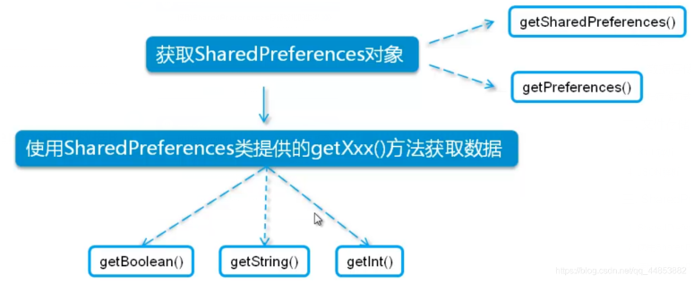

# 四大组件
- Activity：  
   Activity 是与用户交互的入口点。它表示拥有界面的单个屏幕。例如，电子邮件应用可能有一个显示新电子邮件列表的 Activity、一个用于撰写电子邮件的 Activity 以及一个用于阅读电子邮件的 Activity。尽管这些 Activity 通过协作在电子邮件应用中形成一种紧密结合的用户体验，但每个 Activity 都独立于其他 Activity 而存在。因此，其他应用可以启动其中任何一个 Activity（如果电子邮件应用允许）。例如，相机应用可以启动电子邮件应用内用于撰写新电子邮件的 Activity，以便用户共享图片。Activity 有助于完成系统和应用程序之间的以下重要交互：
   + 追踪用户当前关心的内容（屏幕上显示的内容），以确保系统继续运行托管 Activity 的进程。
   + 了解先前使用的进程包含用户可能返回的内容（已停止的 Activity），从而更优先保留这些进程。
   + 帮助应用处理终止其进程的情况，以便用户可以返回已恢复其先前状态的 Activity。
   + 提供一种途径，让应用实现彼此之间的用户流，并让系统协调这些用户流。（此处最经典的示例是共享。）  
    您需将 Activity 作为 Activity 类的子类来实现。

- service：  
   服务是一个通用入口点，用于因各种原因使应用在后台保持运行状态。它是一种在后台运行的组件，用于执行长时间运行的操作或为远程进程执行作业。服务不提供界面。例如，当用户使用其他应用时，服务可能会在后台播放音乐或通过网络获取数据，但这不会阻断用户与 Activity 的交互。诸如 Activity 等其他组件可以启动服务，使该服务运行或绑定到该服务，以便与其进行交互。事实上，有两种截然不同的语义服务可以告知系统如何管理应用：已启动服务会告知系统使其运行至工作完毕。此类工作可以是在后台同步一些数据，或者在用户离开应用后继续播放音乐。在后台同步数据或播放音乐也代表了两种不同类型的已启动服务，而这些服务可以修改系统处理它们的方式：
   + 音乐播放是用户可直接感知的服务，因此，应用会向用户发送通知，表明其希望成为前台，从而告诉系统此消息；在此情况下，系统明白它应尽全力维持该服务进程运行，因为进程消失会令用户感到不快。
   + 通常，用户不会意识到常规后台服务正处于运行状态，因此系统可以更自由地管理其进程。如果系统需要使用 RAM 来处理用户更迫切关注的内容，则其可能允许终止服务（然后在稍后的某个时刻重启服务）。  
       绑定服务之所以能运行，原因是某些其他应用（或系统）已表示希望使用该服务。从根本上讲，这是为另一个进程提供 API 的服务。因此，系统会知晓这些进程之间存在依赖关系，所以如果进程 A 绑定到进程 B 中的服务，系统便知道自己需使进程 B（及其服务）为进程 A 保持运行状态。此外，如果进程 A 是用户关心的内容，系统随即也知道将进程 B 视为用户关心的内容。由于存在灵活性（无论好坏），服务已成为非常有用的构建块，并且可实现各种高级系统概念。动态壁纸、通知侦听器、屏幕保护程序、输入方法、无障碍功能服务以及众多其他核心系统功能均可构建为在其运行时由应用实现、系统绑定的服务。
       您需将服务作为 Service 的子类来实现。

- Content Provider：    
   内容提供程序管理一组共享的应用数据，您可以将这些数据存储在文件系统、SQLite 数据库、网络中或者您的应用可访问的任何其他持久化存储位置。其他应用可通过内容提供程序查询或修改数据（如果内容提供程序允许）。例如，Android 系统可提供管理用户联系人信息的内容提供程序。因此，任何拥有适当权限的应用均可查询内容提供程序（如 ContactsContract.Data），以读取和写入特定人员的相关信息。我们很容易将内容提供程序看作数据库上的抽象，因为其内置的大量 API 和支持时常适用于这一情况。但从系统设计的角度看，二者的核心目的不同。对系统而言，内容提供程序是应用的入口点，用于发布由 URI 架构识别的已命名数据项。因此，应用可以决定如何将其包含的数据映射到 URI 命名空间，进而将这些 URI 分发给其他实体。反之，这些实体也可使用分发的 URI 来访问数据。在管理应用的过程中，系统可以执行以下特殊操作：
   + 分配 URI 无需应用保持运行状态，因此 URI 可在其所属的应用退出后继续保留。当系统必须从相应的 URI 检索应用数据时，系统只需确保所属应用仍处于运行状态。
   + 这些 URI 还会提供重要的细粒度安全模型。例如，应用可将其所拥有图像的 URI 放到剪贴板上，但将其内容提供程序锁定，以便其他应用程序无法随意访问它。当第二个应用尝试访问剪贴板上的 URI 时，系统可允许该应用通过临时的 URI 授权来访问数据，这样便只能访问 URI 后面的数据，而非第二个应用中的其他任何内容。  
       内容提供程序也适用于读取和写入您的应用不共享的私有数据。  
       内容提供程序作为 ContentProvider 的子类实现，并且其必须实现一组标准 API，以便其他应用能够执行事务。

- BroadCast Receiver：  
   借助广播接收器组件，系统能够在常规用户流之外向应用传递事件，从而允许应用响应系统范围内的广播通知。由于广播接收器是另一个明确定义的应用入口，因此系统甚至可以向当前未运行的应用传递广播。例如，应用可通过调度提醒来发布通知，以告知用户即将发生的事件。而且，通过将该提醒传递给应用的广播接收器，应用在提醒响起之前即无需继续运行。许多广播均由系统发起，例如，通知屏幕已关闭、电池电量不足或已拍摄照片的广播。应用也可发起广播，例如，通知其他应用某些数据已下载至设备，并且可供其使用。尽管广播接收器不会显示界面，但其可以创建状态栏通知，在发生广播事件时提醒用户。但广播接收器更常见的用途只是作为通向其他组件的通道，旨在执行极少量的工作。例如，它可能会根据带 JobScheduler 的事件调度 JobService 来执行某项工作.  
    广播接收器作为 BroadcastReceiver 的子类实现，并且每条广播都作为 Intent 对象进行传递。  

- 五种布局
一、FrameLayout：所有东西依次都放在左上角，会重叠，这个布局比较简单，也只能放一点比较简单的东西。

二、LinearLayout：线性布局，每一个LinearLayout里面又可分为垂直布局（android:orientation="vertical"）和水平布局（android:orientation="horizontal" ）。当垂直布局时，每一行就只有一个元素，多个元素依次垂直往下；水平布局时，只有一行，每一个元素依次向右排列。

三、AbsoluteLayout：绝对布局用X,Y坐标来指定元素的位置，这种布局方式也比较简单，但是在屏幕旋转时，往往会出问题，而且多个元素的时候，计算比较麻烦。

四、RelativeLayout：相对布局可以理解为某一个元素为参照物，来定位的布局方式。主要属性有：相对于某一个元素android:layout_below、android:layout_toLeftOf相对于父元素的地方android:layout_alignParentLeft、android:layout_alignParentRigh；

五、TableLayout：表格布局，每一个TableLayout里面有表格行TableRow，TableRow里面可以具体定义每一个元素。每一个布局都有自己适合的方式，这五个布局元素可以相互嵌套应用，做出美观的界面。

# Activity的启动模式
**“standard” (默认)**  
默认值。系统在启动该 Activity 的任务中创建 Activity 的新实例，并将 intent 传送给该实例。Activity 可以多次实例化，每个实例可以属于不同的任务，一个任务可以拥有多个实例。

**“singleTop”**  
如果当前任务的顶部已存在 Activity 的实例，则系统会通过调用其 onNewIntent() 方法来将 intent 转送给该实例，而不是创建 Activity 的新实例。Activity 可以多次实例化，每个实例可以属于不同的任务，一个任务可以拥有多个实例（但前提是返回堆栈顶部的 Activity 不是该 Activity 的现有实例）。

**“singleTask”**  
系统会创建新任务，并实例化新任务的根 Activity。但是，如果另外的任务中已存在该 Activity 的实例，则系统会通过调用其 onNewIntent() 方法将 intent 转送到该现有实例，而不是创建新实例。Activity 一次只能有一个实例存在。

**“singleInstance”**  
与 "singleTask" 相似，唯一不同的是系统不会将任何其他 Activity 启动到包含该实例的任务中。该 Activity 始终是其任务唯一的成员；由该 Activity 启动的任何 Activity 都会在其他的任务中打开。

它们主要有如下不同：

1. 如何决定所属task

“standard”和”singleTop”的activity的目标task，和收到的Intent的发送者在同一个task内，除非intent包括参数FLAG_ACTIVITY_NEW_TASK。如果提供了FLAG_ACTIVITY_NEW_TASK参数，会启动到别的task里。“singleTask”和”singleInstance”总是把activity作为一个task的根元素，他们不会被启动到一个其他task里。

2. 是否允许多个实例

“standard”和”singleTop”可以被实例化多次，并且存在于不同的task中，且一个task可以包括一个activity的多个实例；“singleTask”和”singleInstance”则限制只生成一个实例，并且是task的根元素。 singleTop要求如果创建intent的时候栈顶已经有要创建的Activity的实例，则将intent发送给该实例，而不发送给新的实例。

3. 是否允许其它activity存在于本task内

“singleInstance”独占一个task，其它activity不能存在那个task里；如果它启动了一个新的activity，不管新的activity的launch mode 如何，新的activity都将会到别的task里运行（如同加了FLAG_ACTIVITY_NEW_TASK参数）。而另外三种模式，则可以和其它activity共存。

4. 是否每次都生成新实例

“standard”对于没一个启动Intent都会生成一个activity的新实例；“singleTop”的activity如果在task的栈顶的话，则不生成新的该activity的实例，直接使用栈顶的实例，否则，生成该activity的实例。比如现在task栈元素为A-B-C-D（D在栈顶），这时候给D发一个启动intent，如果D是 “standard”的，则生成D的一个新实例，栈变为A－B－C－D－D。如果D是singleTop的话，则不会生产D的新实例，栈状态仍为A-B-C-D。如果这时候给B发Intent的话，不管B的launchmode是”standard” 还是 “singleTop” ，都会生成B的新实例，栈状态变为A-B-C-D-B。
“singleInstance”是其所在栈的唯一activity，它会每次都被重用。“singleTask”如果在栈顶，则接受intent，否则，该intent会被丢弃，但是该task仍会回到前台。当已经存在的activity实例处理新的intent时候，会调用onNewIntent()方法 如果收到intent生成一个activity实例，那么用户可以通过back键回到上一个状态；如果是已经存在的一个activity来处理这个intent的话，用户不能通过按back键返回到这之前的状态。

# Intent标记启动Activity

- FLAG_ACTIVITY_NEW_TASK

  如果设置，这个Activity会成为历史stack中一个新Task的开始。一个Task（从启动它的Activity到下一个Task中的 Activity）定义了用户可以迁移的Activity原子组。Task可以移动到前台和后台；在某个特定Task中的所有Activity总是保持相同的次序。

  这个标志一般用于呈现“启动”类型的行为：它们提供用户一系列可以单独完成的事情，与启动它们的Activity完全无关。使用这个标志，如果正在启动的Activity的Task已经在运行的话，那么，新的Activity将不会启动；代替的，当前Task会简单的移入前台。参考FLAG_ACTIVITY_MULTIPLE_TASK标志，可以禁用这一行为。

  这个标志不能用于调用方对已经启动的Activity请求结果。

- FLAG_ACTIVITY_CLEAR_TOP

  如果设置，并且这个Activity已经在当前的Task中运行，因此，不再是重新启动一个这个Activity的实例，而是在这个Activity上方的所有Activity都将关闭，然后这个Intent会作为一个新的Intent投递到老的Activity（现在位于顶端）中。

  例如，假设一个Task中包含这些Activity：A，B，C，D。如果D调用了startActivity()，并且包含一个指向Activity B的Intent，那么，C和D都将结束，然后B接收到这个Intent，因此，目前stack的状况是：A，B。

  上例中正在运行的Activity B既可以在onNewIntent()中接收到这个新的Intent，也可以把自己关闭然后重新启动来接收这个Intent。如果它的启动模式声明为 “multiple”(默认值)，并且你没有在这个Intent中设置FLAG_ACTIVITY_SINGLE_TOP标志，那么它将关闭然后重新创建；对于其它的启动模式，或者在这个Intent中设置FLAG_ACTIVITY_SINGLE_TOP标志，都将把这个Intent投递到当前这个实例的onNewIntent()中。

  这个启动模式还可以与FLAG_ACTIVITY_NEW_TASK结合起来使用：用于启动一个Task中的根Activity，它会把那个Task中任何运行的实例带入前台，然后清除它直到根Activity。这非常有用，例如，当从Notification Manager处启动一个Activity。

- FLAG_ACTIVITY_RESET_TASK_IF_NEEDED

    如果设置这个标志，这个activity不管是从一个新的栈启动还是从已有栈推到栈顶，它都将以the front door of the task的方式启动。这就讲导致任何与应用相关的栈都讲重置到正常状态（不管是正在讲activity移入还是移除），如果需要，或者直接重置该栈为初始状态。

- FLAG_ACTIVITY_SINGLE_TOP

  如果设置，当这个Activity位于历史stack的顶端运行时，不再启动一个新的。

- FLAG_ACTIVITY_BROUGHT_TO_FRONT

  这个标志一般不是由程序代码设置的，如在launchMode中设置singleTask模式时系统帮你设定。

- FLAG_ACTIVITY_CLEAR_WHEN_TASK_RESET

  如果设置，这将在Task的Activity stack中设置一个还原点，当Task恢复时，需要清理Activity。也就是说，下一次Task带着 FLAG_ACTIVITY_RESET_TASK_IF_NEEDED标记进入前台时（典型的操作是用户在主画面重启它），这个Activity和它之上的都将关闭，以至于用户不能再返回到它们，但是可以回到之前的Activity。

  这在你的程序有分割点的时候很有用。例如，一个e-mail应用程序可能有一个操作是查看一个附件，需要启动图片浏览Activity来显示。这个 Activity应该作为e-mail应用程序Task的一部分，因为这是用户在这个Task中触发的操作。然而，当用户离开这个Task，然后从主画面选择e-mail app，我们可能希望回到查看的会话中，但不是查看图片附件，因为这让人困惑。通过在启动图片浏览时设定这个标志，浏览及其它启动的Activity在下次用户返回到mail程序时都将全部清除。

- FLAG_ACTIVITY_EXCLUDE_FROM_RECENTS

  如果设置，新的Activity不会在最近启动的Activity的列表中保存。

- FLAG_ACTIVITY_FORWARD_RESULT

  如果设置，并且这个Intent用于从一个存在的Activity启动一个新的Activity，那么，这个作为答复目标的Activity将会传到这个新的Activity中。这种方式下，新的Activity可以调用setResult(int)，并且这个结果值将发送给那个作为答复目标的 Activity。

- FLAG_ACTIVITY_LAUNCHED_FROM_HISTORY

  这个标志一般不由应用程序代码设置，如果这个Activity是从历史记录里启动的（常按HOME键），那么，系统会帮你设定。

- FLAG_ACTIVITY_MULTIPLE_TASK

  不要使用这个标志，除非你自己实现了应用程序启动器。与FLAG_ACTIVITY_NEW_TASK结合起来使用，可以禁用把已存的Task送入前台的行为。当设置时，新的Task总是会启动来处理Intent，而不管这是是否已经有一个Task可以处理相同的事情。

  由于默认的系统不包含图形Task管理功能，因此，你不应该使用这个标志，除非你提供给用户一种方式可以返回到已经启动的Task。

  如果FLAG_ACTIVITY_NEW_TASK标志没有设置，这个标志被忽略。

- FLAG_ACTIVITY_NO_ANIMATION

  如果在Intent中设置，并传递给Context.startActivity()的话，这个标志将阻止系统进入下一个Activity时应用 Acitivity迁移动画。这并不意味着动画将永不运行——如果另一个Activity在启动显示之前，没有指定这个标志，那么，动画将被应用。这个标志可以很好的用于执行一连串的操作，而动画被看作是更高一级的事件的驱动。

- FLAG_ACTIVITY_NO_HISTORY

  如果设置，新的Activity将不再历史stack中保留。用户一离开它，这个Activity就关闭了。这也可以通过设置noHistory特性。

- FLAG_ACTIVITY_NO_USER_ACTION

  如果设置，作为新启动的Activity进入前台时，这个标志将在Activity暂停之前阻止从最前方的Activity回调的onUserLeaveHint()。

  典型的，一个Activity可以依赖这个回调指明显式的用户动作引起的Activity移出后台。这个回调在Activity的生命周期中标记一个合适的点，并关闭一些Notification。

  如果一个Activity通过非用户驱动的事件，如来电或闹钟，启动的，这个标志也应该传递给Context.startActivity，保证暂停的Activity不认为用户已经知晓其Notification。

- FLAG_ACTIVITY_PREVIOUS_IS_TOP

  If set and this intent is being used to launch a new activity from an existing one, the current activity will not be counted as the top activity for deciding whether the new intent should be delivered to the top instead of starting a new one. The previous activity will be used as the top, with the assumption being that the current activity will finish itself immediately.

- FLAG_ACTIVITY_REORDER_TO_FRONT

  如果在Intent中设置，并传递给Context.startActivity()，这个标志将引发已经运行的Activity移动到历史stack的顶端。

  例如，假设一个Task由四个Activity组成：A,B,C,D。如果D调用startActivity()来启动Activity B，那么，B会移动到历史stack的顶端，现在的次序变成A,C,D,B。如果FLAG_ACTIVITY_CLEAR_TOP标志也设置的话，那么这个标志将被忽略。

# Activity的启动过程


- ⾸先还是得当前系统中有没有拥有这个 Application 的进程。如果没有，则需要处理APP 的启动过程。在经过创建进程、绑定 Application 步骤后，才真正开始启动Activity 的⽅法。startActivity() 方法最终还是调⽤startActivityForResult()。
- 在 startActivityForResult() 中，真正去打开 Activity 的实现是在Instrumentation 的 execStartActivivity() ⽅法中。
- 在 execStartActivity() 中采⽤ checkStartActivityResult() 检查在 manifest 中是否已经注册，如果没 有注册则抛出异常。否则把打开 Activity 的任务交给ActivityThread 的内部类 ApplicationThread， 该类实现了IApplicationThread接⼝。这个类完全搞定了onCreate()、onStart() 等 Activity 的⽣命 周期回调⽅法。
- 在 ApplicationThread 类中，有⼀个⽅法叫 scheduleLaunchActivity()，它可以构造⼀个 Activity 记 录，然后发送⼀个消息给事先定义好的 Handler。 这个 Handler负责根据 LAUNCH_ACTIVITY 的类型来做不同的 Activity 启动⽅式。其中有⼀个要的 ⽅法 handleLaunchActivity() 。
- 在 handleLaunchActivity() 中，会把启动 Activity 交给 performLaunchActivity()⽅法。 在 performLaunchActivity() ⽅法中，⾸先从 Intent 中解析出⽬标 Activity的启动参数，然后⽤ ClassLoader 将⽬标 Activity 的类通过类名加载出来并⽤newInstance() 来实例化⼀个对象。 创建完毕后， 开始调⽤ Activity 的 onCreate()⽅法，⾄此，Activity 被成功启动。


具体方法调用：
第一阶段： Launcher通知AMS要启动新的Activity（在Launcher所在的进程执行）
Launcher.startActivitySafely //首先Launcher发起启动Activity的请求
Activity.startActivity
Activity.startActivityForResult
Instrumentation.execStartActivity //交由Instrumentation代为发起请求
ActivityManager.getService().startActivity //通过IActivityManagerSingleton.get()得到一个AMP代理对象
ActivityManagerProxy.startActivity //通过AMP代理通知AMS启动activity

第二阶段：AMS先校验一下Activity的正确性，如果正确的话，会暂存一下Activity的信息。然后，AMS会通知Launcher程序pause Activity（在AMS所在进程执行）
ActivityManagerService.startActivity
ActivityManagerService.startActivityAsUser
ActivityStackSupervisor.startActivityMayWait
ActivityStackSupervisor.startActivityLocked ：检查有没有在AndroidManifest中注册
ActivityStackSupervisor.startActivityUncheckedLocked
ActivityStack.startActivityLocked ：判断是否需要创建一个新的任务来启动Activity。
ActivityStack.resumeTopActivityLocked ：获取栈顶的activity，并通知Launcher应该pause掉这个Activity以便启动新的activity。
ActivityStack.startPausingLocked
ApplicationThreadProxy.schedulePauseActivity

第三阶段： pause Launcher的Activity，并通知AMS已经paused（在Launcher所在进程执行）
ApplicationThread.schedulePauseActivity
ActivityThread.queueOrSendMessage
H.handleMessage
ActivityThread.handlePauseActivity
ActivityManagerProxy.activityPaused

第四阶段：检查activity所在进程是否存在，如果存在，就直接通知这个进程，在该进程中启动Activity；不存在的话，会调用Process.start创建一个新进程（执行在AMS进程）
ActivityManagerService.activityPaused
ActivityStack.activityPaused
ActivityStack.completePauseLocked
ActivityStack.resumeTopActivityLocked
ActivityStack.startSpecificActivityLocked
ActivityManagerService.startProcessLocked
Process.start //在这里创建了新进程，新的进程会导入ActivityThread类，并执行它的main函数
第五阶段： 创建ActivityThread实例，执行一些初始化操作，并绑定Application。如果Application不存在，会调用LoadedApk.makeApplication创建一个新的Application对象。之后进入Loop循环。（执行在新创建的app进程）
ActivityThread.main
ActivityThread.attach(false) //声明不是系统进程
ActivityManagerProxy.attachApplication

第六阶段：处理新的应用进程发出的创建进程完成的通信请求，并通知新应用程序进程启动目标Activity组件（执行在AMS进程）
ActivityManagerService.attachApplication //AMS绑定本地ApplicationThread对象，后续通过ApplicationThreadProxy来通信。
ActivityManagerService.attachApplicationLocked
ActivityStack.realStartActivityLocked //真正要启动Activity了！
ApplicationThreadProxy.scheduleLaunchActivity //AMS通过ATP通知app进程启动Activity

第七阶段： 加载MainActivity类，调用onCreate声明周期方法（执行在新启动的app进程）
ApplicationThread.scheduleLaunchActivity //ApplicationThread发消息给AT
ActivityThread.queueOrSendMessage
H.handleMessage //AT的Handler来处理接收到的LAUNCH_ACTIVITY的消息
ActivityThread.handleLaunchActivity
ActivityThread.performLaunchActivity
Instrumentation.newActivity //调用Instrumentation类来新建一个Activity对象
Instrumentation.callActivityOnCreate
MainActivity.onCreate
ActivityThread.handleResumeActivity
AMP.activityResumed
AMS.activityResumed(AMS进程)
————————————————
原文链接：https://blog.csdn.net/u012267215/article/details/91406211

链接：https://blog.csdn.net/qq_30379689/article/details/79611217
# Activity的生命周期


+ onCreate  
    您必须实现此回调，它会在系统首次创建 Activity 时触发。Activity 会在创建后进入“已创建”状态。在 onCreate() 方法中，您需执行基本应用启动逻辑，该逻辑在 Activity 的整个生命周期中只应发生一次。

+ onStart  
    当 Activity 进入“已开始”状态时，系统会调用此回调。onStart() 调用使 Activity 对用户可见，因为应用会为 Activity 进入前台并支持互动做准备。

+ onResume  
    Activity 会在进入“已恢复”状态时来到前台，然后系统调用 onResume() 回调。这是应用与用户互动的状态。应用会一直保持这种状态，直到某些事件发生，让焦点远离应用。此类事件包括接到来电、用户导航到另一个 Activity，或设备屏幕关闭。

+ onPause  
   系统将此方法视为用户将要离开您的 Activity 的第一个标志（尽管这并不总是意味着 Activity 会被销毁）；此方法表示 Activity 不再位于前台（尽管在用户处于多窗口模式时 Activity 仍然可见）。 

+ onStop  
  如果您的 Activity 不再对用户可见，说明其已进入“已停止”状态，因此系统将调用 onStop() 回调。例如，当新启动的 Activity 覆盖整个屏幕时，可能会发生这种情况。如果 Activity 已结束运行并即将终止，系统还可以调用 onStop()。

+ onDestroy  
  销毁 Activity 之前，系统会先调用 onDestroy()。系统调用此回调的原因如下：Activity 即将结束（由于用户彻底关闭 Activity 或由于系统为 Activity 调用 finish()，或者由于配置变更（例如设备旋转或多窗口模式），系统暂时销毁 Activity当 Activity 进入已销毁状态时，与 Activity 生命周期相关联的所有生命周期感知型组件都将收到 ON_DESTROY 事件。这时，生命周期组件可以在 Activity 被销毁之前清理所需的任何数据。

# Activity在旋转屏幕时的生命周期
不设置Activity的android:configChanges时，切屏会重新调用各个生命周期，切横屏时会执行一次，切竖屏时会执行两次；  
设置Activity的android:configChanges="orientation"时，切屏还是会重新调用各个生命周期，切横、竖屏时只会执行一次；  
设置Activity的android:configChanges="orientation|keyboardHidden"时，切屏不会重新调用各个生命周期，只会执行onConfigurationChanged方法.

# onSaveInstanceState方法什么时候被调用？
在 Activity 被销毁之前被调用来保存每个实例的状态，这样就可以保证该状态能够从 onCreate(Bundle) 或者onRestoreInstanceState(Bundle)恢复过来。 本方法在 Activity 可能被销毁前调用，这样当该 Activity 在将来某个时刻重新回来时可以恢复其之前的状态。
例如，如果 Activity B 启用后位于 Activity A 的前端，在某个时刻 Activity A 因为系统回收资源的原因要被销毁，Activity A 有机会通过 onSaveInstanceState() 来保存其用户界面状态，使得将来用户返回到 Activity A 的时候能够通过 onCreate(Bundle) 或者onRestoreInstanceState(Bundle) 来恢复其界面状态。

此方法和onPause、onStop方法的区别：
onPause() 在 Activtiy 被放置到后台或者自行销毁时总会被调用，onStop() 在 Activity 被销毁时被调用。一个会调用 onPause() 和 onStop() 但不会触发 onSaveInstanceState() 的例子是当用户从 Activity B 返回到 Activity A 时：没有必要调用 B 的 onSaveInstanceState(Bundle)方法，因为此时的 B 实例永远不会被恢复，因此系统会避免调用它。一个调用 onPause() 但不调用 onSaveInstanceState(Bundle) 方法的例子是当 Activity B 启动后处在 Activity A 的前端：如果在B的整个生命周期里 A 的用户界面状态都没有被破坏的话，系统是不会调用 Activity A 的onSaveInstanceState(Bundle)方法。默认的实现负责了大部分 UI 实例状态的保存，采用的方式是调用 UI 层上每个拥有 id 的 view 的 onSaveInstanceState()方法 ，并且保存当前获得焦点的 view 的 id （所有保存的状态信息都会在默认的 onRestoreInstanceState(Bundle) 实现中恢复)。如果你覆写这个方法来保存额外的没有被各个view保存的信息，你可能想要在默认实现过程中调用或者自己保存每个视图的所有状态。如果被调用，这个方法会在 onStop() 前被触发，但系统并不保证是否在 onPause() 之前或者之后触发。

# view、window、activity
- Activity工作过程是什么样的？
以Activity启动过程为例，Activity启动时是通过Binder向AMS(ActivityManagerService)发请求，通过PIC启动Activity的。

- Window是什么？它的职能是什么？
Activity要管理View需要通过Window来间接管理的。Window通过addView()、removeView()、updateViewLayout()这三个方法来管理View的。

- View跟Window有什么联系？
View需要通过Window来展示在Activity上。

- Activity、View、Window三者如何关联？
Activity包含了一个PhoneWindow，而PhoneWindow就是继承于Window的，Activity通过setContentView将View设置到了PhoneWindow上，而View通过WindowManager的addView()、removeView()、updateViewLayout()对View进行管理。Window的添加过程以及Activity的启动流程都是一次IPC的过程。Activity的启动需要通过AMS完成；Window的添加过程需要通过WindowSession完成。

链接：https://cloud.tencent.com/developer/article/1179345

# Fragment
  
- onAttach() ：
当Fragment与Activity发生关联时调用。
- onCreate()：
创建Fragment时被回调。
- onCreateView()：
每次创建、绘制该Fragment的View组件时回调该方法，Fragment将会显示该方法返回的View 组件。
- onActivityCreated()：
当 Fragment 所在的Activity被启动完成后回调该方法。
- onStart()：
启动 Fragment 时被回调，此时Fragment可见。
- onResume()：
恢复 Fragment 时被回调，获取焦点时回调。
- onPause()：
暂停 Fragment 时被回调，失去焦点时回调。
- onStop()：
停止 Fragment 时被回调，Fragment不可见时回调。
- onDestroyView()：
销毁与Fragment有关的视图，但未与Activity解除绑定。
- onDestroy()：
销毁 Fragment 时被回调。
- onDetach()：
与onAttach相对应，当Fragment与Activity关联被取消时调用。

add与replace的区别：
add不会重新初始化fragment，replace每次都会。所以如果在fragment生命周期内获
取获取数据,使用replace会重复获取；
添加相同的fragment时，replace不会有任何变化，add会报IllegalStateException异
常；
replace先remove掉相同id的所有fragment，然后在add当前的这个fragment，而add
是覆盖前一个fragment。所以如果使用add一般会伴随hide()和show()，避免布局重
叠；
使用add，如果应用放在后台，或以其他方式被系统销毁，再打开时，hide()中引用的
fragment会销毁，所以依然会出现布局重叠bug，可以使用replace或使用add时，添
加一个tag参数

**生命周期调用**  
1）创建Fragment
onAttach() —> onCreate() —> onCreateView() —> onActivityCreated() —> onStart() —> onResume()

2）按下Home键回到桌面 / 锁屏
onPause() —> onStop()

3）从桌面回到Fragment / 解锁
onStart() —> onResume()

4）切换到其他Fragment
onPause() —> onStop() —> onDestroyView()

5）切换回本身的Fragment
onCreateView() —> onActivityCreated() —> onStart() —> onResume()

6） 按下Back键退出
onPause() —> onStop() —> onDestroyView() —> onDestroy() —> onDetach()


# RecyclerView
RecyclerView 会回收这些单个的元素。当列表项滚动出屏幕时，RecyclerView 不会销毁其视图。相反，RecyclerView 会对屏幕上滚动的新列表项重用该视图。这种重用可以显著提高性能，改善应用响应能力并降低功耗。

1. 关键类

   - RecyclerView 是包含与您的数据对应的视图的 ViewGroup。它本身就是视图，因此，将 RecyclerView 添加到布局中的方式与添加任何其他界面元素相同。

   - 列表中的每个独立元素都由一个 ViewHolder 对象进行定义。创建 ViewHolder 时，它并没有任何关联的数据。创建 ViewHolder 后，RecyclerView 会将其绑定到其数据。您可以通过扩展 RecyclerView.ViewHolder 来定义 ViewHolder。

   - RecyclerView 会请求这些视图，并通过在 Adapter 中调用方法，将视图绑定到其数据。您可以通过扩展 RecyclerView.Adapter 来定义 Adapter。

   - 布局管理器负责排列列表中的各个元素。您可以使用 RecyclerView 库提供的某个布局管理器，也可以定义自己的布局管理器。布局管理器均基于库的 LayoutManager 抽象类。
2. 步骤
   - 首先，确定列表或网格的外观。一般来说，您可以使用 RecyclerView 库的某个标准布局管理器。

    - 设计列表中每个元素的外观和行为。根据此设计，扩展 ViewHolder 类。您的 ViewHolder 版本提供了列表项的所有功能。您的 ViewHolder 是 View 的封装容器，且该视图由 RecyclerView 管理。

    - 定义用于将您的数据与 ViewHolder 视图相关联的 Adapter。
3. Adapter和ViewHolder  
   - 定义 Adapter 时，您需要替换三个关键方法：

        onCreateViewHolder()：每当 RecyclerView 需要创建新的 ViewHolder 时，它都会调用此方法。此方法会创建并初始化 ViewHolder 及其关联的 View，但不会填充视图的内容，因为 ViewHolder 此时尚未绑定到具体数据。

        onBindViewHolder()：RecyclerView 调用此方法将 ViewHolder 与数据相关联。此方法会提取适当的数据，并使用该数据填充 ViewHolder 的布局。例如，如果 RecyclerView 显示的是一个名称列表，该方法可能会在列表中查找适当的名称，并填充 ViewHolder 的 TextView widget。

        getItemCount()：RecyclerView 调用此方法来获取数据集的大小。例如，在通讯簿应用中，这可能是地址总数。RecyclerView 使用此方法来确定什么时候没有更多的列表项可以显示。


# 广播（BroadcastReceiver）

应用场景：
- Android不同组件间的通信（含 ：应用内 / 不同应用之间）
- 多线程通信
- 与 Android 系统在特定情况下的通信

## 广播接收器注册
1. 静态注册  
   注册方式：在AndroidManifest.xml里通过<receive>标签声明
  ```xml
    <receiver 
      android:enabled=["true" | "false"]
  //此broadcastReceiver能否接收其他App的发出的广播
  //默认值是由receiver中有无intent-filter决定的：如果有intent-filter，默认值为true，否则为false
      android:exported=["true" | "false"]
      android:icon="drawable resource"
      android:label="string resource"
  //继承BroadcastReceiver子类的类名
      android:name=".mBroadcastReceiver"
  //具有相应权限的广播发送者发送的广播才能被此BroadcastReceiver所接收；
      android:permission="string"
  //BroadcastReceiver运行所处的进程
  //默认为app的进程，可以指定独立的进程
  //注：Android四大基本组件都可以通过此属性指定自己的独立进程
      android:process="string" >

  //用于指定此广播接收器将接收的广播类型
  //本示例中给出的是用于接收网络状态改变时发出的广播
  <intent-filter>
  <action android:name="android.net.conn.CONNECTIVITY_CHANGE" />
      </intent-filter>
  </receiver>
  ```
2. 动态注册  
   注册方式：在代码中调用Context.registerReceiver（）方法
```java
// 选择在Activity生命周期方法中的onResume()中注册
@Override
  protected void onResume(){
      super.onResume();

    // 1. 实例化BroadcastReceiver子类 &  IntentFilter
     mBroadcastReceiver mBroadcastReceiver = new mBroadcastReceiver();
     IntentFilter intentFilter = new IntentFilter();

    // 2. 设置接收广播的类型
    intentFilter.addAction(android.net.conn.CONNECTIVITY_CHANGE);

    // 3. 动态注册：调用Context的registerReceiver（）方法
     registerReceiver(mBroadcastReceiver, intentFilter);
 }


// 注册广播后，要在相应位置记得销毁广播
// 即在onPause() 中unregisterReceiver(mBroadcastReceiver)
// 当此Activity实例化时，会动态将MyBroadcastReceiver注册到系统中
// 当此Activity销毁时，动态注册的MyBroadcastReceiver将不再接收到相应的广播。
 @Override
 protected void onPause() {
     super.onPause();
      //销毁在onResume()方法中的广播
     unregisterReceiver(mBroadcastReceiver);
}
```
注意：  
对于动态广播，有注册就必然得有注销，否则会导致内存泄露，最好在Activity 的 onResume()注册、onPause()注销。


## 广播的发送
- 普通广播（Normal Broadcast）
```java
Intent intent = new Intent();
//对应BroadcastReceiver中intentFilter的action
intent.setAction(BROADCAST_ACTION);
//发送广播
sendBroadcast(intent);
```
```xml
<receiver 
    //此广播接收者类是mBroadcastReceiver
    android:name=".mBroadcastReceiver" >
    //用于接收网络状态改变时发出的广播
    <intent-filter>
        <action android:name="BROADCAST_ACTION" />
    </intent-filter>
</receiver>
```
- 系统广播（System Broadcast）  
Android中内置了多个系统广播：只要涉及到手机的基本操作（如开机、网络状态变化、拍照等等），都会发出相应的广播。

  监听网络变化	android.net.conn.CONNECTIVITY_CHANGE  
  关闭或打开飞行模式	Intent.ACTION_AIRPLANE_MODE_CHANGED  
  充电时或电量发生变化	Intent.ACTION_BATTERY_CHANGED  
  电池电量低	Intent.ACTION_BATTERY_LOW  
  电池电量充足（即从电量低变化到饱满时会发出广播	Intent.ACTION_BATTERY_OKAY  
  系统启动完成后(仅广播一次)	Intent.ACTION_BOOT_COMPLETED  
  按下照相时的拍照按键(硬件按键)时	Intent.ACTION_CAMERA_BUTTON  
  屏幕锁屏	Intent.ACTION_CLOSE_SYSTEM_DIALOGS  
  设备当前设置被改变时(界面语言、设备方向等)	Intent.ACTION_CONFIGURATION_CHANGED  
  插入耳机时	Intent.ACTION_HEADSET_PLUG  
  未正确移除SD卡但已取出来时(正确移除方法:设置--SD卡和设备内存--卸载SD卡)	Intent.ACTION_MEDIA_BAD_REMOVAL  
  插入外部储存装置（如SD卡）	Intent.ACTION_MEDIA_CHECKING  
  成功安装APK	Intent.ACTION_PACKAGE_ADDED  
  成功删除APK	Intent.ACTION_PACKAGE_REMOVED  
  重启设备	Intent.ACTION_REBOOT  
  屏幕被关闭	Intent.ACTION_SCREEN_OFF  
  屏幕被打开	Intent.ACTION_SCREEN_ON  
  关闭系统时	Intent.ACTION_SHUTDOWN  
  重启设备	Intent.ACTION_REBOOT  

- 有序广播（Ordered Broadcast）  
  规则：   
  按照Priority属性值从大-小排序；  
  Priority属性相同者，动态注册的广播优先；  
  特点：  
  接收广播按顺序接收;  
  先接收的广播接收者可以对广播进行截断，即后接收的广播接收者不再接收到此广播；  
  先接收的广播接收者可以对广播进行修改，那么后接收的广播接收者将接收到被修改后的广播 
`sendOrderedBroadcast(intent);`

- App应用内广播（Local Broadcast）  
  App应用内广播可理解为一种局部广播，广播的发送者和接收者都同属于一个App。相比于全局广播（普通广播），App应用内广播优势体现在：安全性高 & 效率高。  

```java
//注册应用内广播接收器
//步骤1：实例化BroadcastReceiver子类 & IntentFilter mBroadcastReceiver 
mBroadcastReceiver = new mBroadcastReceiver(); 
IntentFilter intentFilter = new IntentFilter(); 

//步骤2：实例化LocalBroadcastManager的实例
localBroadcastManager = LocalBroadcastManager.getInstance(this);

//步骤3：设置接收广播的类型 
intentFilter.addAction(android.net.conn.CONNECTIVITY_CHANGE);

//步骤4：调用LocalBroadcastManager单一实例的registerReceiver（）方法进行动态注册 
localBroadcastManager.registerReceiver(mBroadcastReceiver, intentFilter);

//取消注册应用内广播接收器
localBroadcastManager.unregisterReceiver(mBroadcastReceiver);

//发送应用内广播
Intent intent = new Intent();
intent.setAction(BROADCAST_ACTION);
localBroadcastManager.sendBroadcast(intent);

```
广播的底层实现原理：https://www.jianshu.com/p/02085150339c
# 数据持久化
+ 文件存储
该存储方式是一种较常见的方法，在Android中读取/写入文件的方法，与Java中实现I/O程序是完全一样的，提供了openFileInput()方法和openFileOutput()方法来读取设备上的文件。

可以存储大数据，如文本、图片、音频；通过java 的I/O流读取磁盘上的文件。存储在data/data/<包名>/files/目录下。


+ SharedPreferences
它是Android提供的，用来以最简单的方式对数据进行永久保存的方法

用来存储一些简单的配置信息的一种机制，采用了XML格式将数据存储到设备中
可以存储应用程序的各种配置信息，如用户名和密码、自定义参数.
通过key、value的形式存储数据在xml文件中,
value值只能是：float、int、boolean、string、stringset.
存储在data/data/<包名>/shared_prefs/目录下。

- 存数据：
  
- 读数据
  

+ SQLite数据库
是Android自带的一个轻量级的数据库，支持基本的SQL语法，利用很少的内存，就有很好的性能，一般使用它作为复杂数据的存储引擎，可以存储用户信息

优点：占用资源少 运行效率高 安全可靠 可移植性强。


# 内容提供器
链接：https://juejin.cn/post/6964964726040494117
进程间 进行数据交互 & 共享，即跨进程通信。

ContentProvider 是一个抽象类，如果我们需要开发自己的内容提供者我们就需要继承这个类并复写其方法，需要实现的主要方法如下：
```java
public boolean onCreate() ：在创建 ContentProvider 时使用
public Cursor query() ：用于查询指定 uri 的数据返回一个 Cursor
public Uri insert()： 用于向指定uri的 ContentProvider 中添加数据
public int delete() ：用于删除指定 uri 的数据
public int update() ：用户更新指定 uri 的数据
public String getType() ：用于返回指定的 Uri 中的数据 MIME 类型
```

- 说说ContentProvider、ContentResolver、ContentObserver 之间的关系？
参考回答：
ContentProvider：管理数据，提供数据的增删改查操作，数据源可以是数据库、文件、XML、网络等，ContentProvider为这些数据的访问提供了统一的接口，可以用来做进程间数据共享。
ContentResolver：ContentResolver可以为不同URI操作不同的ContentProvider中的数据，外部进程可以通过ContentResolver与ContentProvider进行交互。
ContentObserver：观察ContentProvider中的数据变化，并将变化通知给外界。

- contentProvider实现原理：
  https://juejin.cn/post/6844904062173839368#heading-0
- uri
  其它应用可以通过 ContentResolver 来访问 ContentProvider 提供的数据，而 ContentResolver 通过 uri 来定位自己要访问的数据，所以我们要先了解 uri。URI（Universal Resource Identifier）统一资源定位符，如果您使用过安卓的隐式启动就会发现，在隐式启动的过程中我们也是通过 uri 来定位我们需要打开的 Activity 并且可以在 uri 中传递参数。
  ```xml
  // 规则
  [scheme:][//host:port][path][?query]
  // 示例
  content://com.wang.provider.myprovider/tablename/id：
  ```
  标准前缀（scheme）——content://，用来说明一个Content Provider控制这些数据；
  URI 的标识 (host:port)—— com.wang.provider.myprovider，用于唯一标识这个 ContentProvider，外部调用者可以根据这个标识来找到它。对于第三方应用程序，为了保证 URI 标识的唯一性，它必须是一个完整的、小写的类名。这个标识在元素的authorities属性中说明，一般是定义该 ContentProvider 的包.类的名称；
  路径(path)——tablename，通俗的讲就是你要操作的数据库中表的名字，或者你也可以自己定义，记得在使用的时候保持一致就可以了；
  记录ID(query)——id，如果URI中包含表示需要获取的记录的 ID，则返回该id对应的数据，如果没有ID，就表示返回全部；
- mime
  MIME 是指定某个扩展名的文件用一种应用程序来打开，就像你用浏览器查看 PDF 格式的文件，浏览器会选择合适的应用来打开一样。Android 中的工作方式跟 HTTP 类似，ContentProvider 会根据 URI 来返回 MIME 类型，ContentProvider 会返回一个包含两部分的字符串。
  每个内容类型的 Android MIME 类型有两种形式：多条记录（集合）和单条记录。

  集合记录（dir）：vnd.android.cursor.dir/自定义 
  单条记录(item)：vnd.android.cursor.item/自定义 
- 监听数据变化
  如果ContentProvider的访问者需要知道数据发生的变化，可以在ContentProvider发生数据变化时调用getContentResolver().notifyChange(uri, null)来通知注册在此URI上的访问者。
  而访问者必须使用 ContentObserver 对数据（数据采用 uri 描述）进行监听，当监听到数据变化通知时，系统就会调用 ContentObserver 的 onChange() 方法。

链接：https://blog.csdn.net/carson_ho/article/details/76101093


# 服务


# Binder

## 基本概念
Binder机制是​ Android系统中进程间通讯（IPC）的一种方式，连接 两个进程，实现了mmap()系统调用，主要负责 创建数据接收的缓存空间 & 管理数据接收缓存。Android中ContentProvider、Intent、aidl都是基于Binder。

模型：

各组成部分的说明


## 具体实现原理

注：Client进程、Server进程 & Service Manager 进程之间的交互 都必须通过Binder驱动（使用 open 和 ioctl文件操作函数），而非直接交互.

链接：https://blog.csdn.net/carson_ho/article/details/73560642

