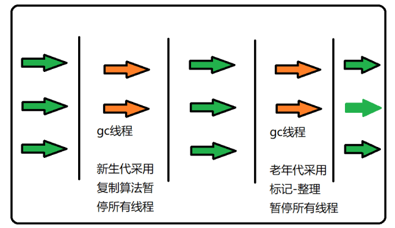
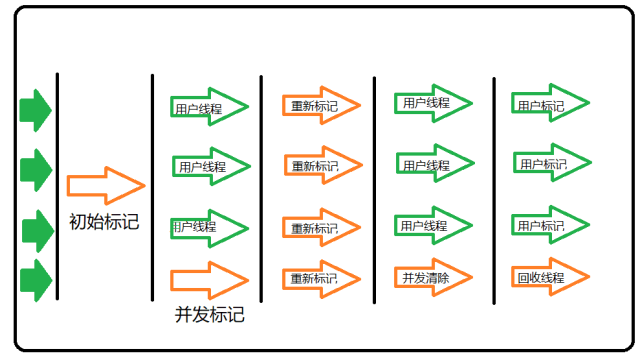

## JVM内存模型

1、Java堆（Heap）,是Java虚拟机所管理的内存中最大的一块。Java堆是被所有线程共享的一块内存区域，在虚拟机启动时创建。此内存区域的唯一目的就是存放对象实例，几乎所有的对象实例都在这里分配内存。
而通过new关键字和构造器创建的对象则放在堆空间，堆是垃圾收集器管理的主要区域，由于现在的垃圾收集器都采用分代收集算法，所以堆空间还可以细分为新生代和老生代，再具体一点可以分为Eden、Survivor（又可分为From Survivor和To Survivor）、Tenured；

2、方法区（Method Area）,方法区（Method Area）与Java堆一样，是各个线程共享的内存区域，它用于存储已被虚拟机加载的类信息、常量、静态变量、即时编译器编译后的代码等数据。
程序中的字面量（literal）如直接书写的100、”hello”和常量都是放在常量池中，常量池是方法区的一部分。

3、程序计数器（Program Counter Register）,程序计数器（Program Counter Register）是一块较小的内存空间，它的作用可以看做是当前线程所执行的字节码的行号指示器。

4、JVM栈（JVM Stacks）,与程序计数器一样，Java虚拟机栈（Java Virtual Machine Stacks）也是线程私有的，它的生命周期与线程相同。虚拟机栈描述的是Java方法执行的内存模型：每个方法被执行的时候都会同时创建一个栈帧（Stack Frame）用于存储局部变量表、操作栈、动态链接、方法出口等信息。每一个方法被调用直至执行完成的过程，就对应着一个栈帧在虚拟机栈中从入栈到出栈的过程。
通常我们定义一个基本数据类型的变量，一个对象的引用，还有就是函数调用的现场保存都使用JVM中的栈空间；

5、本地方法栈（Native Method Stacks）,本地方法栈（Native Method Stacks）与虚拟机栈所发挥的作用是非常相似的，其区别不过是虚拟机栈为虚拟机执行Java方法（也就是字节码）服务，而本地方法栈则是为虚拟机使用到的Native方法服务

## JVM中对象的生命周期
- 创建阶段

    在对象创建阶段，系统要通过下面的步骤，完成对象的创建过程：

    （1）为对象分配存储空间。

    （2）开始构造对象。

    （3）递归调用其超类的构造方法。

    （4）进行对象实例初始化与变量初始化。

    （5）执行构造方法体。

- 应用阶段
  当对象的创建阶段结束之后，该对象通常就会进入对象的应用阶段。这个阶段是对象得以表现自身能力的阶段。也就是说对象的应用阶段是对象整个生命周期中证明自身“存在价值”的时期。在对象的应用阶段，对象具备下列特征：

  + 系统至少维护着对象的一个强引用（StrongReference）；

  + 所有对该对象的引用全部是强引用（除非我们显式地使用了：软引用（SoftReference）、弱引用（WeakReference）或虚引用（PhantomReference））。

- 不可视阶段
  在一个对象经历了应用阶段之后，那么该对象便处于JVM对象生命周期的不可视阶段，说明我们在其他区域的代码中已经不可以再引用它，其强引用已经消失，例如，本地变量超出了其可视范围，
- 不可达阶段
  处于JVM对象生命周期不可到达阶段的对象，在虚拟机所管理的对象引用根集合中再也找不到直接或间接的强引用，这些对象通常是指所有线程栈中的临时变量，所有已装载的类的静态变量或者对本地代码接口（JNI）的引用。这些对象都是要被垃圾回收器回收的预备对象，但此时该对象并不能被垃圾回收器直接回收。其实所有垃圾回收算法所面临的问题是相同的——找出由分配器分配的，但是用户程序不可到达的内存块。
- 可收集阶段、终结阶段与释放阶段
  开始垃圾回收

## 介绍一下Java的垃圾回收机制
1、哪些内存需要回收  
在Java内存运行时区域的各个部分中，堆和方法区这两个区域则有着很显著的不确定性。  
2、怎么定义垃圾  
a)引用计数算法：在对象中添加一个引用计数器，每当有一个地方引用它时，计数器值就加一；当引用失效时，计数器值就减一；任何时刻计数器为零的对象就是不可能再被使用的。  
b)可达性分析：这个算法的基本思路就是通过一系列称为“GC Roots”的根对象作为起始节点集，从这些节点开始，根据引用关系向下搜索，搜索过程所走过的路径称为“引用链”（Reference Chain），如果某个对象到GC Roots间没有任何引用链相连，或者用图论的话来说就是从GC Roots到这个对象不可达时，则证明此对象是不可能再被使用的。

可以当作根对象的：  
在虚拟机栈（栈帧中的本地变量表）中引用的对象，譬如各个线程被调用的方法堆栈中使用到的参数、局部变量、临时变量等。    
在方法区中类静态属性引用的对象，譬如Java类的引用类型静态变量。  
在方法区中常量引用的对象，譬如字符串常量池（String Table）里的引用。    
在本地方法栈中JNI（即通常所说的Native方法）引用的对象。   
Java虚拟机内部的引用，如基本数据类型对应的Class对象，一些常驻的异常对象（比如
NullPointExcepiton、OutOfMemoryError）等，还有系统类加载器。    
所有被同步锁（synchronized关键字）持有的对象。    
反映Java虚拟机内部情况的JMXBean、JVMTI中注册的回调、本地代码缓存等。  

回收方法区：方法区的垃圾收集主要回收两部分内容：废弃的常量和不再使用的类型。回收废弃常量与回收Java堆中的对象非常类似。举个常量池中字面量回收的例子，假如一个字符串“java”曾经进入常量池中，但是当前系统又没有任何一个字符串对象的值是“java”，换句话说，已经没有任何字符串对象引用常量池中的“java”常量，且虚拟机中也没有其他地方引用这个字面量。如果在这时发生内存回收，而且垃圾收集器判断确有必要的话，这个“java”常量就将会被系统清理出常量池。常量池中其他类（接口）、方法、字段的符号引用也与此类似。

垃圾回收算法：
1、标记 -清除算法，“标记-清除”（Mark-Sweep）算法，如它的名字一样，算法分为“标记”和“清除”两个
阶段：首先标记出所有需要回收的对象，在标记完成后统一回收掉所有被标记的对象。
2、复制算法，“复制”（Copying）的收集算法，它将可用内存按容量划分为大小相等的两块，每次只使用其中的一块。当这一块的内存用完了，就将还存活着的对象复制到另外一块上面，然后再把已使用过的内存空间一次清理掉。
3、标记-压缩算法，标记过程仍然与“标记-清除”算法一样，但后续步骤不是直接对可回收对象进行清理，而是让所有存活的对象都向一端移动，然后直接清理掉端边界以外的内存

### 垃圾回收算法（分代）
对象只会存在于 Eden 区和名为“From” 的Survivor 区， Survivor 区“To” 是空的。紧接着进行 GC， Eden 区中所有存活的对象都会被复制到“To” ，而在“From” 区中，仍存活的对象会根据他们的年龄值来决定去向。 年龄达到一定值(年龄阈值，可以通过-XX:MaxTenuringThreshold 来设置)的对象会被移动到年老代中，没有达到阈值的对象会被复制到“To” 区域。经过这次 GC 后，Eden 区和 From 区已经被清空。 这个时候，“From” 和“To” 会交换他们的角色，也就是新的“To” 就是上次 GC 前的“From” ，新的“From”就是上次 GC 前的“To”。 不管怎样，都会保证名为 To 的 Survivor 区域是空的。Minor GC 会一直重复这样的过程，直到“To”区被填满，“To”区被填满之后， 会将所有对象移动到年老代中。

Ex：复制算法中的空间分配担保
在执行Minor GC前, VM会首先检查老年代是否有足够的空间存放新生代尚存活对象, 由于新生代使用复制收集算法, 为了提升内存利用率, 只使用了其中一个Survivor作为轮换备份, 因此当出现大量对象在Minor GC后仍然存活的情况时, 就需要老年代进行分配担保, 让Survivor无法容纳的对象直接进入老年代,但前提是老年代需要有足够的空间容纳这些存活对象.
但存活对象的大小在实际完成GC前是无法明确知道的, 因此Minor GC前, VM会先首先检查老年代连续空间是否大于新生代对象总大小或历次晋升的平均大小, 如果条件成立, 则进行Minor GC, 否则进行FullGC(让老年代腾出更多空间).

## 垃圾收集器

1. Serial  
   Serial收集器是Hotspot运行在Client模式下的默认新生代收集器, 它在进行垃圾收集时，会暂停所有的工作进程，用一个线程去完成GC工作。  
   
2. Parnew  
   ParNew收集器其实是Serial的多线程版本，回收策略完全一样。
   
3. CMS  
   CMS(Concurrent Mark Sweep)收集器是一款具有划时代意义的收集器, 一款真正意义上的并发收集器,它是基于标记-清除算法实现的。整个过程分4个步骤：1. 初始标记(CMS initial mark):仅只标记一下GC Roots能直接关联到的对象, 速度很快  2. 并发标记(CMS concurrent mark: GC Roots Tracing过程)  3. 重新标记(CMS remark):修正并发标记期间因用户程序继续运行而导致标记产生变动的那一部分对象的标记记录  4. 并发清除(CMS concurrent sweep: 已死对象将会就地释放)

   
   优点：
   - 适合应用在互联网站或者B/S系统的服务器上，这类应用尤其重视服务器的响应速度，希望系统停顿时间最短。
   - CMS非常适合堆内存大、CPU核数多的服务器端应用，也是G1出现之前大型应用的首选收集器。
   缺点：
   - 浮动垃圾：由于CMS并发清理阶段用户线程还在运行着，伴随程序运行自然会有新垃圾产生，这部分垃圾得标记过程之后，所以CMS无法在当收集中处理掉他们，只好留待下一次GC清理掉，这一部分垃圾称为浮动垃圾。在jdk1.5默认设置下，CMS收集器当老年代使用了68%的空间就会被激活，可以通过-XX:CMSInitialOccupancyFraction的值来提高触发百分比，在jdk1.6中CMS启动阈值提升到了92%，要是CMS运行期间预留的内存无法满足程序的需要，就会出现”Concurrent Mode Failure“，然后降级临时启用Serial Old收集器进行老年代的垃圾收集，这样停顿时间就很长了。所以-XX:CMSInitialOccupancyFraction设置太高容易导致大量”Concurrent Mode Failure“。

   - 有空间碎片：CMS是一款基于“标记-清除”算法实现的，所以会产生空间碎片。为了解决这个问题，CMS提供了-XX:UseCMSCompactAtFullCollection开发参数用于开启内存碎片的合并整理，由于内存整理是无法并行的，所以停顿时间会变长。还有-XX:CMSFullGCBeforeCompaction，这个参数用于设置多少次不压缩Full GC后，跟着来一次带压缩的(默认为0)。

   - 对CPU资源敏感。在并发标记和并发清除阶段虽然不会停止用户线程，但是会因为占用一部分cpu资源进行垃圾回收导致用户程序变慢。

1. G1  
   G1最大的特点是引入分区的思路，弱化分代的概念，合理利用垃圾收集各个周期的资源，解决了其他收集器甚至CMS的众多缺陷。
   1) 新生代收集：G1的新生代收集跟ParNew类似，如果存活时间超过某个阈值，就会被转移到S/O区。年轻代内存由一组不连续的heap区组成, 这种方法使得可以动态调整各代区域的大小。  
   2) 老年代收集：
      1. **初始标记** (Initial Mark: Stop the World Event)在G1中, 该操作附着一次年轻代GC, 以标记Survivor中有可能引用到老年代对象的Regions.
      2. **扫描根区域** (Root Region Scanning: 与应用程序并发执行)扫描Survivor中能够引用到老年代的references. 但必须在Minor GC触发前执行完
      3. **并发标记** (Concurrent Marking : 与应用程序并发执行)在整个堆中查找存活对象, 但该阶段可能会被Minor GC中断
      4. **重新标记** (Remark : Stop the World Event)完成堆内存中存活对象的标记. 使用snapshot-at-the-beginning(SATB, 起始快照)算法, 比CMS所用算法要快得多(空Region直接被移除并回收, 并计算所有区域的活跃度).
      5. **清理** (Cleanup : Stop the World Event and Concurrent)在含有存活对象和完全空闲的区域上进行统计(STW)、擦除Remembered Sets(使用RememberedSet来避免扫描全堆，每个区都有对应一个Set用来记录引用信息、读写操作记录)(STW)、重置空regions并将他们返还给空闲列表(free list)(Concurrent)。

   优势：
   G1垃圾收集器也是以关注延迟为目标、服务器端应用的垃圾收集器，被HotSpot团队寄予取代CMS的使命，也是一个非常具有调优潜力的垃圾收集器。虽然G1也有类似CMS的收集动作：初始标记、并发标记、重新标记、清除、转移回收，并且也以一个串行收集器做担保机制，但单纯地以类似前三种的过程描述显得并不是很妥当。事实上，G1收集与以上三组收集器有很大不同：

   - G1的设计原则是"首先收集尽可能多的垃圾(Garbage First)"。因此，G1并不会等内存耗尽(串行、并行)或者快耗尽(CMS)的时候开始垃圾收集，而是在内部采用了启发式算法，在老年代找出具有高收集收益的分区进行收集。同时G1可以根据用户设置的暂停时间目标自动调整年轻代和总堆大小，暂停目标越短年轻代空间越小、总空间就越大；
   - G1采用内存分区(Region)的思路，将内存划分为一个个相等大小的内存分区，回收时则以分区为单位进行回收，存活的对象复制到另一个空闲分区中。由于都是以相等大小的分区为单位进行操作，因此G1天然就是一种压缩方案(局部压缩)；
   - G1虽然也是分代收集器，但整个内存分区不存在物理上的年轻代与老年代的区别，也不需要完全独立的survivor(to space)堆做复制准备。G1只有逻辑上的分代概念，或者说每个分区都可能随G1的运行在不同代之间前后切换；
   - G1的收集都是STW的，但年轻代和老年代的收集界限比较模糊，采用了混合(mixed)收集的方式。即每次收集既可能只收集年轻代分区(年轻代收集)，也可能在收集年轻代的同时，包含部分老年代分区(混合收集)，这样即使堆内存很大时，也可以限制收集范围，从而降低停顿。

   详细原理：https://cloud.tencent.com/developer/article/1459638

## JVM性能调优
设定堆内存大小
-Xmx：堆内存最大限制。

设定新生代大小。 新生代不宜太小，否则会有大量对象涌入老年代
-XX:NewSize：新生代大小
-XX:NewRatio 新生代和老生代占比
-XX:SurvivorRatio：伊甸园空间和幸存者空间的占比

设定垃圾回收器 年轻代用 -XX:+UseParNewGC 年老代用-XX:+UseConcMarkSweepGC 

调优指令：
1、jps，JVM Process Status Tool,显示指定系统内所有的HotSpot虚拟机进程。
2、jstat，JVM statistics Monitoring是用于监视虚拟机运行时状态信息的命令，它可以显示出虚拟机进
程中的类装载、内存、垃圾收集、JIT编译等运行数据。
3、jmap，JVM Memory Map命令用于生成heap dump文件
4、jhat，JVM Heap Analysis Tool命令是与jmap搭配使用，用来分析jmap生成的dump，jhat内置了一
个微型的HTTP/HTML服务器，生成dump的分析结果后，可以在浏览器中查看
5、jstack，用于生成java虚拟机当前时刻的线程快照。
6、jinfo，JVM Configuration info 这个命令作用是实时查看和调整虚拟机运行参数
## Java中的四种引用
1. 强引用  
   强引用是平常中使用最多的引用，强引用在程序内存不足（OOM）的时候也不会被回收，使用方式：String str = new String("str");
2. 软引用
   软引用在程序内存不足时，会被回收，使用方式：  
   // 注意：wrf这个引用也是强引用，它是指向SoftReference这个对象的，  
   // 这里的软引用指的是指向new String("str")的引用，也就是SoftReference类中T  
   SoftReference<String> wrf = new SoftReference<String>(new String("str"));
3. 弱引用
   弱引用就是只要JVM垃圾回收器发现了它，就会将之回收，使用方式：WeakReference<String> wrf = new WeakReference<String>(str);
4. 虚引用
   虚引用的回收机制跟弱引用差不多，但是它被回收之前，会被放入 ReferenceQueue 中。注意哦，其它引用是被JVM回收后才被传入 ReferenceQueue 中的。由于这个机制，所以虚引用大多被用于引用销毁前的处理工作。
   PhantomReference<String> prf = new PhantomReference<String>(new String("str"),new ReferenceQueue<>());

## 内存泄漏
内存泄露就是指一个不再被程序使用的对象或变量一直被占据在内存中。java中有垃圾回收机制，它可以保证当对象不再被引用的时候，对象将自动被垃圾回收器从内存中清除掉。由于Java使用有向图的方式进行垃圾回收管理，可以消除引用循环的问题，例如有两个对象，相互引用，只要它们和根进程不可达，那么GC也是可以回收它们的。
java中的内存泄露的情况：
长生命周期的对象持有短生命周期对象的引用就很可能发生内存泄露，尽管短生命周期对象已经不再需要，但是因为长生命周期对象持有它的引用而导致不能被回收，这就是java中内存泄露的发生场景，通俗地说，就是程序员可能创建了一个对象，以后一直不再使用这个对象，这个对象却一直被引用，即这个对象无用但是却无法被垃圾回收器回收的，这就是java中可能出现内存泄露的情况，例如，缓存系统，我们加载了一个对象放在缓存中(例如放在一个全局map对象中)，然后一直不再使用它，这个对象一直被缓存引用，但却不再被使用。

## AOP与IOC
1. AOP是一种编程思想,是通过预编译方式和运行期动态代理的方式实现不修改源代码的情况下给程序动态统一添加功能的技术。面向对象编程将程序抽象成各个层次的对象,而面向切面编程是将程序抽象成各个切面。所谓切面,相当于应用对象间的横切点,我们可以将其单独抽象为单独的模块。 AOP技术利用一种称为“横切”的技术,剖解开封装对象的内部,将影响多个类的公共行为封装到一个可重用的模块中,并将其命名为切面。所谓的切面,简单来说就是与业务无关,却为业务模块所共同调用的逻辑,将其封装起来便于减少系统的重复代码,降低模块的耦合度,有利用未来的可操作性和可维护性。 利用AOP可以对业务逻辑各个部分进行隔离,从而使业务逻辑各部分之间的耦合度降低,提高程序的可重用性,同时提高开发效率。  

2. IoC是控制反转的意思,是一种面向对象编程的设计思想。在不采用这种思想的情况下,我们需要自己维护对象与对象之间的依赖关系,很容易造成对象之间的耦合度过高,在一个大型的项目中这十分的不利于代码的维护。IoC则可以解决这种问题,它可以帮我们维护对象与对象之间的依赖关系,并且降低对象之间的耦合度。 说到IoC就不得不说DI,DI是依赖注入的意思,它是IoC实现的实现方式。由于IoC这个词汇比较抽象而DI比较直观,所以很多时候我们就用DI来代替它,在很多时候我们简单地将IoC和DI划等号,这是一种习惯。实现依赖注入的关键是IoC容器,它的本质就是一个工厂。 