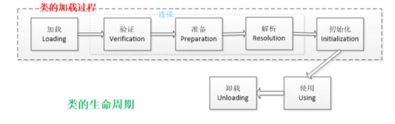

## Java访问权限
private：该成员可以被该类内部成员访问；  
default：该成员可以被该类内部成员访问，也可以被同一包下其他的类访问；  
protected：该成员可以被该类内部成员访问，也可以被同一包下其他的类访问，还可以被它的子类访问；  
public：该成员可以被任意包下，任意类的成员进行访问； 
## 面向对象的三大特性
面向对象的程序设计方法具有三个基本特征：封装、继承、多态。  
其中，封装指的是将对象的实现细节隐藏起来，然后通过一些公用方法来暴露该对象的功能；  
继承是面向对象实现软件复用的重要手段，当子类继承父类后，子类作为一种特殊的父类，将直接获得父类的属性和方法；  
多态指的是子类对象可以直接赋给父类变量，但运行时依然表现出子类的行为特征，这意味着同一个类型的对象在执行同一个方
法时，可能表现出多种行为特征。
## StringBuffer和StringBuilder
StringBuffer、StringBuilder都代表可变的字符串对象，它们有共同的父类AbstractStringBuilder ，并且两个类的构造方法和成员方法也基本相同。不同的是，StringBuffer
是线程安全的，而StringBuilder是非线程安全的，所以StringBuilder性能略高。一般情况下，要创建一个内容可变的字符串，建议优先考虑StringBuilder类。
## Java异常
在Java中，处理异常的语句由try、catch、finally三部分组成。其中，try块用于包裹业务代码，catch块用于捕获并处理某个类型的异常，finally块则用于回收资源。当业务代码发生异常时，系统会创建一个异常对象，然后由JVM寻找可以处理这个异常的catch块，并将异常对象交给这个catch块处理。若业务代码打开了某项资源，则可以在finally块中关闭这项资源，因为无论是否发生异常，finally块一定会执行。

当程序出现错误时，系统会自动抛出异常。除此以外，Java也允许程序主动抛出异常。当业务代码中，
判断某项错误的条件成立时，可以使用throw关键字向外抛出异常。在这种情况下，如果当前方法不知
道该如何处理这个异常，可以在方法签名上通过throws关键字声明抛出异常，则该异常将交给JVM处
理。

Throwable是异常的顶层父类，代表所有的非正常情况。它有两个直接子类，分别是Error、
Exception。Error是错误，一般是指与虚拟机相关的问题，如系统崩溃、虚拟机错误、动态链接失败等，这种错误无法恢复或不可能捕获，将导致应用程序中断。通常应用程序无法处理这些错误，因此应用程序不应该试图使用catch块来捕获Error对象。在定义方法时，也无须在其throws子句中声明该方法可能抛出Error及其任何子类。

Exception是异常，它被分为两大类，分别是Checked异常和Runtime异常。所有的RuntimeException
类及其子类的实例被称为Runtime异常；不是RuntimeException类及其子类的异常实例则被称为
Checked异常。Java认为Checked异常都是可以被处理（修复）的异常，所以Java程序必须显式处理
Checked异常。如果程序没有处理Checked异常，该程序在编译时就会发生错误，无法通过编译。
Runtime异常则更加灵活，Runtime异常无须显式声明抛出，如果程序需要捕获Runtime异常，也可以
使用try...catch块来实现。
## 接口和抽象类有什么区别？
接口里只能包含抽象方法、静态方法、默认方法和私有方法，不能为普通方法提供方法实现；抽象类则完全可以包含普通方法。  
接口里只能定义静态常量，不能定义普通成员变量；抽象类里则既可以定义普通成员变量，也可以定义静态常量。  
接口里不包含构造器；抽象类里可以包含构造器，抽象类里的构造器并不是用于创建对象，而是让其子类调用这些构造器来完成属于抽象类的初始化操作。  
接口里不能包含初始化块；但抽象类则完全可以包含初始化块。  
一个类最多只能有一个直接父类，包括抽象类；但一个类可以直接实现多个接口，通过实现多个接口可以弥补Java单继承的不足。  
## static和final有什么区别？
static关键字可以修饰成员变量、成员方法、初始化块、内部类，被static修饰的成员是类的成员，它属于类、不属于单个对象。以下是static修饰这4种成员时表现出的特征：  
类变量：被static修饰的成员变量叫类变量（静态变量）。类变量属于类，它随类的信息存储在方法区，并不随对象存储在堆中，类变量可以通过类名来访问，也可以通过对象名来访问，但建议通过类名访问它。  
类方法：被static修饰的成员方法叫类方法（静态方法）。类方法属于类，可以通过类名访问，也可以通过对象名访问，建议通过类名访问它。  
静态块：被static修饰的初始化块叫静态初始化块。静态块属于类，它在类加载的时候被隐式调用一次，之后便不会被调用了。  
静态内部类：被static修饰的内部类叫静态内部类。静态内部类可以包含静态成员，也可以包含非静态成员。静态内部类不能访问外部类的实例成员，只能访问外部类的静态成员。外部类的所有方法、初始化块都能访问其内部定义的静态内部类。  

final关键字可以修饰类、方法、变量，以下是final修饰这3种目标时表现出的特征：  
final类：final关键字修饰的类不可以被继承。  
final方法：final关键字修饰的方法不可以被重写。  
final变量：final关键字修饰的变量，一旦获得了初始值，就不可以被修改。  

EX：final，finally，finalize区别
1） final：用于声明属性，方法和类，分别表示属性不可变，方法不可覆盖，被其修饰的类不可继承。
2） finally：异常处理语句结构的一部分，表示总是执行。
3） finalize： Object 类的一个方法，在垃圾回收器执行的时候会调用被回收对象的此方法，可以覆盖此方法提供垃圾收集时的其他资源回收，例如关闭文件等。该方法更像是一个对象生命周期的临终方法，当该方法被系统调用则代表该对象即将“死亡”，但是需要注意的是，我们主动行为上去调用该方法并不会导致该对象“死亡”，这是一个被动的方法（其实就是回调方法），不需要我们调用。

## Java反射
Java反射就是在运行状态中，对于任意一个类，都能够知道这个类的所有属性和方法；对于任意一个对象，都能够调用它的任意方法和属性；并且能改变它的属性。

程序运行时，可以通过反射获得任意一个类的Class对象，并通过这个对象查看这个类的信息；程序运行时，可以通过反射创建任意一个类的实例，并访问该实例的成员；程序运行时，可以通过反射机制生成一个类的动态代理类或动态代理对象。

使用JDBC时，如果要创建数据库的连接，则需要先通过反射机制加载数据库的驱动程序；
多数框架都支持注解/XML配置，从配置中解析出来的类是字符串，需要利用反射机制实例化；
面向切面编程（AOP）的实现方案，是在程序运行时创建目标对象的代理类，这必须由反射机制来实现。
## hashmap
扩容操作：
1. 首次扩容：先判断数组是否为空，若数组为空则进行第一次扩容（resize）；
2. 计算索引：通过hash算法，计算键值对在数组中的索引；
3. 插入数据：
如果当前位置元素为空，则直接插入数据；
如果当前位置元素非空，且key已存在，则直接覆盖其value；
如果当前位置元素非空，且key不存在，则将数据链到链表末端；
若链表长度达到8，则将链表转换成红黑树，并将数据插入树中；
4. 再次扩容：如果数组中元素个数（size）超过threshold，则再次进行扩容操作。

JDK7中的HashMap，是基于数组+链表来实现的，它的底层维护一个Entry数组。它会根据计算的hashCode将对应的KV键值对存储到该数组中，一旦发生hashCode冲突，那么就会将该KV键值对放到对应的已有元素的后面， 此时便形成了一个链表式的存储结构。

JDK8中的HashMap，是基于数组+链表+红黑树来实现的，它的底层维护一个Node数组。当链表的存储的数据个数大于等于8的时候，不再采用链表存储，而采用了红黑树存储结构。这么做主要是在查询的时间复杂度上进行优化，链表为O(N)，而红黑树一直是O(logN)，可以大大的提高查找性能。

红黑树：
1. 节点不是黑色，就是红色（非黑即红）
2. 根节点为黑色
3. 叶节点为黑色（叶节点是指末梢的空节点 Nil或Null）
4. 一个节点为红色，则其两个子节点必须是黑色的（根到叶子的所有路径，不可能存在两个连续的红色节点）
5. 每个节点到叶子节点的所有路径，都包含相同数目的黑色节点（相同的黑色高度）

1. Hashtable是一个线程安全的Map实现，但HashMap是线程不安全的实现，所以HashMap比
Hashtable的性能高一点。
2. Hashtable不允许使用null作为key和value，如果试图把null值放进Hashtable中，将会引发空指针异常，但HashMap可以使用null作为key或value。
## ConcurrentHashMap
ConcurrentHashMap的底层数据结构与HashMap一样,也是采用“数组+链表+红黑树”的形式。同时,它又采用锁定头节点的方式降低了锁粒度,以较低的性能代价实现了线程安全。底层数据结构的逻辑可以参考HashMap的实现,下面我重点介绍它的线程安全的实现机制。 
1. 初始化数组或头节点时,ConcurrentHashMap并没有加锁,而是CAS的方式进行原子替换（原子操作,基于Unsafe类的原子操作API）。 
2. 插入数据时会进行加锁处理,但锁定的不是整个数组,而是槽中的头节点。所以,ConcurrentHashMap中锁的粒度是槽,而不是整个数组,并发的性能很好。 
3. 扩容时会进行加锁处理,锁定的仍然是头节点。并且,支持多个线程同时对数组扩容,提高并发能力。每个线程需先以CAS操作抢任务,争抢一段连续槽位的数据转移权。抢到任务后,该线程会锁定槽内的头节点,然后将链表或树中的数据迁移到新的数组里。 
4. 查找数据时并不会加锁,所以性能很好。另外,在扩容的过程中,依然可以支持查找操作。如果某个槽还未进行迁移,则直接可以从旧数组里找到数据。如果某个槽已经迁移完毕,但是整个扩容还没结束,则扩容线程会创建一个转发节点存入旧数组,届时查找线程根据转发节点的提示,从新数组中找到目标数据。 

**加分回答** 
ConcurrentHashMap实现线程安全的难点在于多线程并发扩容,即当一个线程在插入数据时,若发现数组正在扩容,那么它就会立即参与扩容操作,完成扩容后再插入数据到新数组。在扩容的时候,多个线程共同分担数据迁移任务,每个线程负责的迁移数量是 `(数组长度 >>> 3) / CPU核心数`。 也就是说,为线程分配的迁移任务,是充分考虑了硬件的处理能力的。多个线程依据硬件的处理能力,平均分摊一部分槽的迁移工作。另外,如果计算出来的迁移数量小于16,则强制将其改为16,这是考虑到目前服务器领域主流的CPU运行速度,每次处理的任务过少,对于CPU的算力也是一种浪费。

## 进程之间通信方式
管道、命名管道、信号、消息队列、共享内存、内存映射、信号量、Socket：
 1. 管道 管道也叫无名（匿名）管道,它是是 UNIX 系统 IPC（进程间通信）的最古老形式,所有的 UNIX 系统都支持这种通信机制。管道本质其实是内核中维护的一块内存缓冲区,Linux 系统中通过 pipe() 函数创建管道,会生成两个文件描述符,分别对应管道的读端和写端。无名管道只能用于具有亲缘关系的进程间的通信。 
 2. 命名管道 匿名管道,由于没有名字,只能用于亲缘关系的进程间通信。为了克服这个缺点,提出了有名管道（FIFO）,也叫命名管道、FIFO文件。有名管道（FIFO）不同于匿名管道之处在于它提供了一个路径名与之关联,以 FIFO 的文件形式存在于文件系统中,并且其打开方式与打开一个普通文件是一样的,这样即使与 FIFO 的创建进程不存在亲缘关系的进程,只要可以访问该路径,就能够彼此通过 FIFO 相互通信,因此,通过 FIFO 不相关的进程也能交换数据。 
 3. 信号 信号是 Linux 进程间通信的最古老的方式之一,是事件发生时对进程的通知机制,有时也称之为软件中断,它是在软件层次上对中断机制的一种模拟,是一种异步通信的方式。信号可以导致一个正在运行的进程被另一个正在运行的异步进程中断,转而处理某一个突发事件。 
 4. 消息队列 消息队列就是一个消息的链表,可以把消息看作一个记录,具有特定的格式以及特定的优先级,对消息队列有写权限的进程可以向消息队列中按照一定的规则添加新消息,对消息队列有读权限的进程则可以从消息队列中读走消息,消息队列是随内核持续的。 
 5. 共享内存 共享内存允许两个或者多个进程共享物理内存的同一块区域（通常被称为段）。由于一个共享内存段会称为一个进程用户空间的一部分,因此这种 IPC 机制无需内核介入。所有需要做的就是让一个进程将数据复制进共享内存中,并且这部分数据会对其他所有共享同一个段的进程可用。与管道等要求发送进程将数据从用户空间的缓冲区复制进内核内存和接收进程将数据从内核内存复制进用户空间的缓冲区的做法相比,这种 IPC 技术的速度更快。 
 6. 内存映射 内存映射（Memory-mapped I/O）是将磁盘文件的数据映射到内存,用户通过修改内存就能修改磁盘文件。 
 7. 信号量 信号量主要用来解决进程和线程间并发执行时的同步问题,进程同步是并发进程为了完成共同任务采用某个条件来协调它们的活动。对信号量的操作分为 P 操作和 V 操作,P 操作是将信号量的值减 1,V 操作是将信号量的值加 1。当信号量的值小于等于 0 之后,再进行 P 操作时,当前进程或线程会被阻塞,直到另一个进程或线程执行了 V 操作将信号量的值增加到大于 0 之时。 
 8. Socket 套接字（Socket）,就是对网络中不同主机上的应用进程之间进行双向通信的端点的抽象。一个套接字就是网络上进程通信的一端,提供了应用层进程利用网络协议交换数据的机制。Socket 一般用于网络中不同主机上的进程之间的通信。

## 线程的创建方式
+ 继承 Thread 类： 但 Thread 本质上也是实现了 Runnable 接口的一个实例，它代表一个线程的实例，并且，启动线程的唯一方法就是通过 Thread 类的 start()实例方法。 start()方法是一个 native 方法，它将启动一个新线程，并执行 run()方法。
+ 实现 Runnable 接口的方式实现多线程，并且实例化 Thread，传入自己的 Thread 实例，调用start()方法。
+ 使用 ExecutorService、 Callable、 Future 实现有返回结果的多线程： ExecutorService、 Callable、 Future这 个 对 象 实 际 上 都 是 属 于 Executor 框 架 中 的 功 能 类 。 可返回值的任务必须实现 Callable 接口，类似的，无返回值的任务必须 Runnable 接口。

EX：停止一个正在运行的线程？
1、使用退出标志，使线程正常退出，也就是当run方法完成后线程终止。
2、使用stop方法强行终止，但是不推荐这个方法，因为stop和suspend及resume一样都是过期作废的方法。
3、使用interrupt方法中断线程。

## 用户线程和守护线程
守护线程都是为JVM中所有非守护线程的运行提供便利服务： 只要当前JVM实例中尚存在任何一个非守护线程没有结束，守护线程就全部工作；只有当最后一个非守护线程结束时，守护线程随着JVM一同结束工作。
User和Daemon两者几乎没有区别，唯一的不同之处就在于虚拟机的离开：如果 User Thread已经全部退出运行了，只剩下Daemon Thread存在了，虚拟机也就退出了。

EX：怎么样来创建守护线程？
任何线程都可以设置为守护线程和用户线程，通过方法Thread.setDaemon(bool on)；true则把该线程设置为守护线程，反之则为用户线程。Thread.setDaemon()必须在Thread.start()之前调用，否则运行时会抛出异常。

## 线程生命周期
在线程的生命周期中，它要经过新建（New）、就绪（Ready）、运行（Running）、阻塞
（Blocked）和死亡（Dead）5种状态。

当程序使用new关键字创建了一个线程之后，该线程就处于新建状态，此时它和其他的Java对象一样，仅仅由Java虚拟机为其分配内存，并初始化其成员变量的值。此时的线程对象没有表现出任何线程的动态特征，程序也不会执行线程的线程执行体。

当线程对象调用了start()方法之后，该线程处于就绪状态，Java虚拟机会为其创建方法调用栈和程序计数器，处于这个状态中的线程并没有开始运行，只是表示该线程可以运行了。至于该线程何时开始运行，取决于JVM里线程调度器的调度。

如果处于就绪状态的线程获得了CPU，开始执行run()方法的线程执行体，则该线程处于运行状态，如果计算机只有一个CPU，那么在任何时刻只有一个线程处于运行状态。当然，在一个多处理器的机器上，将会有多个线程并行执行；当线程数大于处理器数时，依然会存在多个线程在同一个CPU上轮换的现象。

当一个线程开始运行后，它不可能一直处于运行状态，线程在运行过程中需要被中断，目的是使其他线程获得执行的机会，线程调度的细节取决于底层平台所采用的策略。对于采用抢占式策略的系统而言，系统会给每个可执行的线程一个小时间段来处理任务。当该时间段用完后，系统就会剥夺该线程所占用的资源，让其他线程获得执行的机会。当发生如下情况时，线程将会进入阻塞状态：
1、线程调用sleep()方法主动放弃所占用的处理器资源。
2、线程调用了一个阻塞式IO方法，在该方法返回之前，该线程被阻塞。
3、线程试图获得一个同步监视器，但该同步监视器正被其他线程所持有。
4、线程在等待某个通知（notify）。
5、程序调用了线程的suspend()方法将该线程挂起。但这个方法容易导致死锁，所以应该尽量避免使用该方法。

## 线程同步
1. 同步方法
即有synchronized关键字修饰的方法，由于java的每个对象都有一个内置锁，当用此关键字修饰方法时， 内置锁会保护整个方法。在调用该方法前，需要获得内置锁，否则就处于阻塞状态。需要注意， synchronized关键字也可以修饰静态方法，此时如果调用该静态方法，将会锁住整个类。
2. 同步代码块
即有synchronized关键字修饰的语句块，被该关键字修饰的语句块会自动被加上内置锁，从而实现同步。需值得注意的是，同步是一种高开销的操作，因此应该尽量减少同步的内容。通常没有必要同步整个方法，使用synchronized代码块同步关键代码即可。
3. ReentrantLock
Java 5新增了一个java.util.concurrent包来支持同步，其中ReentrantLock类是可重入、互斥、实现了Lock接口的锁，它与使用synchronized方法和快具有相同的基本行为和语义，并且扩展了其能力。需要注意的是，ReentrantLock还有一个可以创建公平锁的构造方法，但由于能大幅度降低程序运行效率，因此不推荐使用。
4. volatile
volatile关键字为域变量的访问提供了一种免锁机制，使用volatile修饰域相当于告诉虚拟机该域可能会被其他线程更新，因此每次使用该域就要重新计算，而不是使用寄存器中的值。需要注意的是，volatile不会提供任何原子操作，它也不能用来修饰final类型的变量。
5. 原子变量
在java的util.concurrent.atomic包中提供了创建了原子类型变量的工具类，使用该类可以简化线程同步。例如AtomicInteger 表可以用原子方式更新int的值，可用在应用程序中（如以原子方式增加的计数器），但不能用于替换Integer。可扩展Number，允许那些处理机遇数字类的工具和实用工具进行统一访问。

## volatile和synchronized
一旦一个共享变量（类的成员变量、类的静态成员变量）被volatile修饰之后，那么就具备了两层语义：
- 保证了不同线程对这个变量进行操作时的可见性，即一个线程修改了某个变量的值，这新值对其他线程来说是立即可见的。
- 禁止进行指令重排序。

synchronized关键字解决的是执行控制的问题，它会阻止其它线程获取当前对象的监控锁，这样就使得当前对象中被synchronized关键字保护的代码块无法被其它线程访问，也就无法并发执行。更重要的是，synchronized还会创建一个内存屏障，内存屏障指令保证了所有CPU操作结果都会直接刷到主存中，从而保证了操作的内存可见性，同时也使得先获得这个锁的线程的所有操作，都happens-before于随后获得这个锁的线程的操作。

区别：
volatile本质是在告诉jvm当前变量在寄存器（工作内存）中的值是不确定的，需要从主存中读取；synchronized则是锁定当前变量，只有当前线程可以访问该变量，其他线程被阻塞住。
volatile仅能使用在变量级别；synchronized则可以使用在变量、方法、和类级别的。
volatile仅能实现变量的修改可见性，并不能保证原子性；synchronized则可以保证变量的修改可见性和原子性。
volatile不会造成线程的阻塞；synchronized可能会造成线程的阻塞。
volatile标记的变量不会被编译器优化；synchronized标记的变量可以被编译器优化。
### synchronized的底层原理
- synchronized 同步语句块的实现使用的是 monitorenter 和 monitorexit 指令，其中monitorenter 指令指向同步代码块的开始位置，monitorexit 指令则指明同步代码块的结束位置。 当执行 monitorenter 指令时，线程试图获取锁也就是获取 monitor(monitor对象存在于每个Java对象的对象头中，synchronized 锁便是通过这种方式获取锁的，也是为什么Java中任意对象可以作为锁的原因) 的持有权.当计数器为0则可以成功获取，获取后将锁计数器设为1也就是加1。相应的在执行monitorexit 指令后，将锁计数器设为0，表明锁被释放。如果获取对象锁失败，那当前线程就要阻塞等待，直到锁被另外一个线程释放为止。
- synchronized 修饰的方法并没有 monitorenter 指令和 monitorexit 指令，取得代之的确实是ACC_SYNCHRONIZED 标识，该标识指明了该方法是一个同步方法，JVM 通过该 ACC_SYNCHRONIZED访问标志来辨别一个方法是否声明为同步方法，从而执行相应的同步调用。

## ReentranLock
ReentrantLock是Java中常用的锁，属于乐观锁类型，多线程并发情况下。能保证共享数据安全性，线程间有序性。ReentrantLock通过原子操作和阻塞实现锁原理，一般使用lock获取锁，unlock释放锁.

原理：
- 多个线程同时操作一个数N，使用原子（CAS）操作，原子操作能保证同一时间只能被一个线程修改，而修改数N成功后，返回true，其他线程修改失败，返回false，
这个原子操作可以定义线程是否拿到锁，返回true代表获取锁，返回false代表为没有拿到锁。

- 拿到锁的线程，自然是继续执行后续逻辑代码，而没有拿到锁的线程，则调用park，将线程（自己）阻塞。

- 线程阻塞需要其他线程唤醒，ReentrantLock中用到了链表用于存放等待或者阻塞的线程，每次线程阻塞，先将自己的线程信息放入链表尾部，再阻塞自己；之后需要拿到锁的线程，在调用unlock 释放锁时，从链表中获取阻塞线程，调用unpark 唤醒指定线程

区别：
synchronized是和if、else、for、while一样的关键字，ReentrantLock是类，这是二者的本质区别。既然ReentrantLock是类，那么它就提供了比synchronized更多更灵活的特性，可以被继承、可以有方法、可以有各种各样的类变量，ReentrantLock比synchronized的扩展性体现在几点上：
1、ReentrantLock可以对获取锁的等待时间进行设置，这样就避免了死锁
2、ReentrantLock可以获取各种锁的信息
3、ReentrantLock可以灵活地实现多路通知

## 线程安全
执行控制的目的是控制代码执行（顺序）及是否可以并发执行。内存可见控制的是线程执行结果在内存中对其它线程的可见性。根据Java内存模型的实现，线程在具体执行时，会先拷贝主存数据到线程本地（CPU缓存），操作完成后再把结果从线程本地刷到主存。

synchronized关键字解决的是执行控制的问题，它会阻止其它线程获取当前对象的监控锁，这样就使得当前对象中被synchronized关键字保护的代码块无法被其它线程访问，也就无法并发执行。更重要的是，synchronized还会创建一个内存屏障，内存屏障指令保证了所有CPU操作结果都会直接刷到主存中，从而保证了操作的内存可见性，同时也使得先获得这个锁的线程的所有操作，都happens-before于随后获得这个锁的线程的操作。

volatile关键字解决的是内存可见性的问题，会使得所有对volatile变量的读写都会直接刷到主存，即保证了变量的可见性。这样就能满足一些对变量可见性有要求而对读取顺序没有要求的需求。

按照资源占用情况由轻到重排列,这三种保证线程安全的方式分别是**原子类、volatile、锁**。 
+ JDK从1.5开始提供了java.util.concurrent.atomic包,这个包中的原子操作类提供了一种用法简单、性能高效、线程安全地更新一个变量的方式。在atomic包里一共提供了17个类,按功能可以归纳为4种类型的原子更新方式,分别是原子更新基本类型、原子更新引用类型、原子更新属性、原子更新数组。无论原子更新哪种类型,都要遵循“比较和替换”规则,即比较要更新的值是否等于期望值,如果是则更新,如果不是则失败。
+ volatile是轻量级的synchronized,它在多处理器开发中保证了共享变量的“可见性”,从而可以保证单个变量读写时的线程安全。可见性问题是由处理器核心的缓存导致的,每个核心均有各自的缓存,而这些缓存均要与内存进行同步。volatile具有如下的内存语义：当写一个volatile变量时,该线程本地内存中的共享变量的值会被立刻刷新到主内存；当读一个volatile变量时,该线程本地内存会被置为无效,迫使线程直接从主内存中读取共享变量。 
+ 原子类和volatile只能保证单个共享变量的线程安全,锁则可以保证临界区内的多个共享变量的线程安全,Java中加锁的方式有两种,分别是synchronized关键字和Lock接口。synchronized是比较早期的API,在设计之初没有考虑到超时机制、非阻塞形式,以及多个条件变量。若想通过升级的方式让它支持这些相对复杂的功能,则需要大改它的语法结构,不利于兼容旧代码。因此,JDK的开发团队在1.5新增了Lock接口,并通过Lock支持了上述的功能,即：支持响应中断、支持超时机制、支持以非阻塞的方式获取锁、支持多个条件变量（阻塞队列）。 
+ **加分回答** 
  实现线程安全的方式有很多,除了上述三种方式之外,还有如下几种方式： 1. 无状态设计 线程安全问题是由多线程并发修改共享变量引起的,如果在并发环境中没有设计共享变量,则自然就不会出现线程安全问题了。这种代码实现可以称作“无状态实现”,所谓状态就是指共享变量。 2. 不可变设计 如果在并发环境中不得不设计共享变量,则应该优先考虑共享变量是否为只读的,如果是只读场景就可以将共享变量设计为不可变的,这样自然也不会出现线程安全问题了。具体来说,就是在变量前加final修饰符,使其不可被修改,如果变量是引用类型,则将其设计为不可变类型（参考String类）。 3. 并发工具 java.util.concurrent包提供了几个有用的并发工具类,一样可以保证线程安全： - Semaphore：就是信号量,可以控制同时访问特定资源的线程数量。 - CountDownLatch：允许一个或多个线程等待其他线程完成操作。 - CyclicBarrier：让一组线程到达一个屏障时被阻塞,直到最后一个线程到达屏障时,屏障才会打开,所有被屏障拦截的线程才会继续运行。 4. 本地存储 我们也可以考虑使用ThreadLocal存储变量,ThreadLocal可以很方便地为每一个线程单独存一份数据,也就是将需要并发访问的资源复制成多份。这样一来,就可以避免多线程访问共享变量了,它们访问的是自己独占的资源,它从根本上隔离了多个线程之间的数据共享。
  
## AQS抽象队列同步器
AQS即AbstractQueuedSynchronizer的缩写，是并发编程中实现同步器的一个框架。AQS基于一个FIFO双向队列实现，被设计给那些依赖一个代表状态的原子int值的同步器使用。我们都知道，既然叫同步器，那个肯定有个代表同步状态（临界资源）的东西，在AQS中即为一个叫state的int值，该值通过CAS进行原子修改。在AQS中存在一个FIFO队列，队列中的节点表示被阻塞的线程，队列节点元素有4中类型，每种类型表示线程被阻塞的原因，这四种类型分别是：

CANCELLED : 表示该线程是因为超时或者中断原因而被放到队列中
CONDITION : 表示该线程是因为某个条件不满足而被放到队列中，需要等待一个条件，直到条件成立后才会出队
SIGNAL : 表示该线程需要被唤醒
PROPAGATE ： 表示在共享模式下，当前节点执行释放release操作后，当前结点需要传播通知给后面所有节点

链接：https://blog.csdn.net/u011305680/article/details/80383313

## 线程池
线程池是一种多线程处理形式，处理过程中将任务提交到线程池，任务的执行交由线程池来管理。如果每个请求都创建一个线程去处理，那么服务器的资源很快就会被耗尽，使用线程池可以减少创建和销毁线程的次数，每个工作线程都可以被重复利用，可执行多个任务。线程池作用就是限制系统中执行线程的数量。1、提高效率 创建好一定数量的线程放在池中，等需要使用的时候就从池中拿一个，这要比需要的时候创建一个线程对象要快的多。2、方便管理 可以编写线程池管理代码对池中的线程同一进行管理，比如说启动时有该程序创建100个线程，每当有请求的时候，就分配一个线程去工作，如果刚好并发有101个请求，那多出的这一个请求可以排队等候，避免因无休止的创建线程导致系统崩溃。  

常用的几种线程池：  
1、newSingleThreadExecutor创建一个单线程化的线程池，它只会用唯一的工作线程来执行任务，保证所有任务按照指定顺序(FIFO, LIFO, 优先级)执行。  
2、newFixedThreadPool创建一个定长线程池，可控制线程最大并发数，超出的线程会在队列中等待。  
3、newCachedThreadPool创建一个可缓存线程池，如果线程池长度超过处理需要，可灵活回收空闲线程，若无可回收，则新建线程。  
4、newScheduledThreadPool创建一个定长线程池，支持定时及周期性任务执行。

线程池的参数：  
+ corePoolSize就是线程池中的核心线程数量，这几个核心线程，只是在没有用的时候，也不会被回收
+ maximumPoolSize就是线程池中可以容纳的最大线程的数量
+ keepAliveTime，就是线程池中除了核心线程之外的其他的最长可以保留的时间，因为在线程池中，除了核心线程即使在无任务的情况下也不能被清除，其余的都是有存活时间的，意思就是非核心线程可以保留的最长的空闲时间，
+ util，就是计算这个时间的一个单位。
+ workQueue，就是等待队列，任务可以储存在任务队列中等待被执行，执行的是FIFIO原则（先进先出）。
+ threadFactory，就是创建线程的线程工厂。
+ handler,是一种拒绝策略，我们可以在任务满了之后，拒绝执行某些任务。
   
线程池的拒绝策略：  
当请求任务不断的过来，而系统此时又处理不过来的时候，我们需要采取的策略是拒绝服务RejectedExecutionHandler接口提供了拒绝任务处理的自定义方法的机会。在ThreadPoolExecutor中已经包含四种处理策略。  
AbortPolicy策略：该策略会直接抛出异常，阻止系统正常工作。  
CallerRunsPolicy 策略：只要线程池未关闭，该策略直接在调用者线程中，运行当前的被丢弃的任务。  
DiscardOleddestPolicy策略： 该策略将丢弃最老的一个请求，也就是即将被执行的任务，并尝试再次提交当前任务。  
DiscardPolicy策略：该策略默默的丢弃无法处理的任务，不予任何处理。  

## 进程、线程、协程
- 进程——资源分配的最小单位  
- 线程——程序执行的最小单位    
- 协程是一种用户态的轻量级线程，协程的调度完全由用户控制。协程拥有自己的寄存器上下文和栈。协程调度切换时，将寄存器上下文和栈保存到其他地方，在切回来的时候，恢复先前保存的寄存器上下文和栈，直接操作栈则基本没有内核切换的开销，可以不加锁的访问全局变量，所以上下文的切换非常快。
协程与线程主要区别是它将不再被内核调度，而是交给了程序自己而线程是将自己交给内核调度。

## Java中的四种引用
1. 强引用  
   强引用是平常中使用最多的引用，强引用在程序内存不足（OOM）的时候也不会被回收，使用方式：String str = new String("str");
2. 软引用
   软引用在程序内存不足时，会被回收，使用方式：  
   // 注意：wrf这个引用也是强引用，它是指向SoftReference这个对象的，  
   // 这里的软引用指的是指向new String("str")的引用，也就是SoftReference类中T  
SoftReference<String> wrf = new SoftReference<String>(new String("str"));
3. 弱引用
   弱引用就是只要JVM垃圾回收器发现了它，就会将之回收，使用方式：WeakReference<String> wrf = new WeakReference<String>(str);
4. 虚引用
   虚引用的回收机制跟弱引用差不多，但是它被回收之前，会被放入 ReferenceQueue 中。注意哦，其它引用是被JVM回收后才被传入 ReferenceQueue 中的。由于这个机制，所以虚引用大多被用于引用销毁前的处理工作。
   PhantomReference<String> prf = new PhantomReference<String>(new String("str"),new ReferenceQueue<>());

## IO多路复用（select、poll、epoll）
 I/O 多路复用是一种使得程序能同时监听多个文件描述符的技术,从而提高程序的性能。I/O 多路复用能够在单个线程中,通过监视多个 I/O 流的状态来同时管理多个 I/O 流,一旦检测到某个文件描述符上我们关心的事件发生（就绪）,能够通知程序进行相应的处理（读写操作）。 Linux 下实现 I/O 复用的系统调用主要有 select、poll 和 epoll。 
 1. select   
   select 的主旨思想： 
     - 首先要构造一个关于文件描述符的列表,将要监听的文件描述符添加到该列表中,这个文件描述符的列表数据类型为 fd_set,它是一个整型数组,总共是 1024 个比特位,每一个比特位代表一个文件描述符的状态。比如当需要 select 检测时,这一位为 0 就表示不检测对应的文件描述符的事件,为 1 表示检测对应的文件描述符的事件。 
     - 调用 select() 系统调用,监听该列表中的文件描述符的事件,这个函数是阻塞的,直到这些描述符中的一个或者多个进行 I/O 操作时,该函数才返回,并修改文件描述符的列表中对应的值,0 表示没有检测到该事件,1 表示检测到该事件。函数对文件描述符的检测的操作是由内核完成的。 
  
     - select() 返回时,会告诉进程有多少描述符要进行 I/O 操作,接下来遍历文件描述符的列表进行 I/O 操作。  
       select 的缺点： 
       1. 每次调用select,都需要把 fd 集合从用户态拷贝到内核态,这个开销在 fd 很多时会很大； 
       2. 同时每次调用 select 都需要在内核遍历传递进来的所有 fd,这个开销在 fd 很多时也很大； 
       3.  select 支持的文件描述符数量太小了,默认是 1024（由 fd_set 决定）； 
       4.  文件描述符集合不能重用,因为内核每次检测到事件都会修改,所以每次都需要重置； 
       5. 每次 select 返回后,只能知道有几个 fd 发生了事件,但是具体哪几个还需要遍历文件描述符集合进一步判断。 

2. poll   
 poll 的原理和 select 类似,poll 支持的文件描述符没有限制。 
2. epoll   
   epoll 是一种更加高效的 IO 复用技术,epoll 的使用步骤及原理如下： 
   - 调用 epoll_create() 会在内核中创建一个 eventpoll 结构体数据,称之为 epoll 对象,在这个结构体中有 2 个比较重要的数据成员,一个是需要检测的文件描述符的信息 struct_root rbr（红黑树）,还有一个是就绪列表struct list_head rdlist,存放检测到数据发送改变的文件描述符信息（双向链表）； 
   - 调用 epoll_ctrl() 可以向 epoll 对象中添加、删除、修改要监听的文件描述符及事件； 
   - 调用 epoll_wt() 可以让内核去检测就绪的事件,并将就绪的事件放到就绪列表中并返回,通过返回的事件数组做进一步的事件处理。 
   - epoll 的两种工作模式： 
     - LT 模式（水平触发） LT（Level - Triggered）是缺省的工作方式,并且同时支持 Block 和 Nonblock Socket。在这种做法中,内核检测到一个文件描述符就绪了,然后可以对这个就绪的 fd 进行 IO 操作,如果不作任何操作,内核还是会继续通知。 
     - ET 模式（边沿触发） ET（Edge - Triggered）是高速工作方式,只支持 Nonblock socket。在这种模式下,当描述符从未就绪变为就绪时,内核通过 epoll 检测到。然后它会假设你知道文件描述符已经就绪,并且不会再为那个文件描述符发送更多的就绪通知,直到你做了某些操作导致那个文件描述符不再为就绪状态了。但是请注意,如果一直不对这个 fd 进行 IO 操作（从而导致它再次变成未就绪）,内核不会发送更多的通知（only once）。 ET 模式在很大程度上减少了 epoll 事件被重复触发的次数,因此效率要比 LT 模式高。epoll 工作在 ET 模式的时候,必须使用非阻塞套接口,以避免由于一个文件描述符的阻塞读/阻塞写操作把处理多个文件描述符的任务饿死。

## Java NIO
Java NIO（New IO）也有人称之为 java non-blocking IO是从Java 1.4版本开始引入的一个新的IO API，可以替代标准的Java IO API。NIO与原来的IO有同样的作用和目的，但是使用的方式完全不同，NIO支持面向缓冲区的、基于通道的IO操作。NIO将以更加高效的方式进行文件的读写操作。NIO可以理解为非阻塞IO,传统的IO的read和write只能阻塞执行，线程在读写IO期间不能干其他事情，比如调用socket.read()时，如果服务器一直没有数据传输过来，线程就一直阻塞，而NIO中可以配置socket为非阻塞模式。
NIO 相关类都被放在 java.nio 包及子包下，并且对原 java.io 包中的很多类进行改写。

### Buffer
使用步骤：把数据写入buffer；调用flip；从Buffer中读取数据；调用buffer.clear()

缓冲区（Buffer）一个用于特定基本数据类型的容器。由 java.nio 包定义的，所有缓冲区 都是 Buffer 抽象类的子类.。Java NIO 中的 Buffer 主要用于与 NIO 通道进行 交互，数据是从通道读入缓冲区，从缓冲区写入通道中的。Buffer就像一个数组，可以保存多个相同类型的数据。

容量 (capacity) ：作为一个内存块，Buffer具有一定的固定大小，也称为"容量"，缓冲区容量不能为负，并且创建后不能更改。 

限制 (limit)：表示缓冲区中可以操作数据的大小（limit 后数据不能进行读写）。缓冲区的限制不能为负，并且不能大于其容量。 写入模式，限制等于buffer的容量。读取模式下，limit等于写入的数据量。

位置 (position)：下一个要读取或写入的数据的索引。缓冲区的位置不能为 负，并且不能大于其限制 

标记 (mark)与重置 (reset)：标记是一个索引，通过 Buffer 中的 mark() 方法 指定 Buffer 中一个特定的 position，之后可以通过调用 reset() 方法恢复到这 个 position.标记、位置、限制、容量遵守以下不变式： 
0 <= mark <= position <= limit <= capacity

**Ex:直接内存、间接内存**
byte buffer可以是两种类型，一种是基于直接内存（也就是非堆内存）；另一种是非直接内存（也就是堆内存）。对于直接内存来说，JVM将会在IO操作上具有更高的性能，因为它直接作用于本地系统的IO操作。而非直接内存，也就是堆内存中的数据，如果要作IO操作，会先从本进程内存复制到直接内存，再利用本地IO处理。

直接内存使用**allocateDirect**创建，但是它比申请普通的堆内存需要耗费更高的性能。不过，这部分的数据是在JVM之外的，因此它不会占用应用的内存。所以呢，当你有很大的数据要缓存，并且它的生命周期又很长，那么就比较适合使用直接内存。只是一般来说，如果不是能带来很明显的性能提升，还是推荐直接使用堆内存。字节缓冲区是直接缓冲区还是非直接缓冲区可通过调用其 **isDirect()**  方法来确定。

### Channel
通道（Channel）：由 java.nio.channels 包定义 的。Channel 表示 IO 源与目标打开的连接。 Channel 类似于传统的“流”。只不过 Channel 本身不能直接访问数据，Channel 只能与 Buffer 进行交互。

1 NIO 的通道类似于流，但有些区别如下：通道可以同时进行读写，而流只能读或者只能写，通道可以实现异步读写数据，通道可以从缓冲读数据，也可以写数据到缓冲；
2 BIO 中的 stream 是单向的，例如 FileInputStream 对象只能进行读取数据的操作，而 NIO 中的通道(Channel)是双向的，可以读操作，也可以写操作。
3 Channel 在 NIO 中是一个接口。

Channel实现类：
FileChannel：用于读取、写入、映射和操作文件的通道。
DatagramChannel：通过 UDP 读写网络中的数据通道。
SocketChannel：通过 TCP 读写网络中的数据。
ServerSocketChannel：可以监听新进来的 TCP 连接，
对每一个新进来的连接都会创建一个 SocketChannel。 
【ServerSocketChanne 类似 ServerSocket , SocketChannel 类似 Socket】

### Selector
选择器（Selector） 是 SelectableChannle 对象的多路复用器，Selector 可以同时监控多个SelectableChannel 的 IO 状况，也就是说，利用 Selector可使一个单独的线程管理多个 Channel。Selector 是非阻塞 IO 的核心

Java 的 NIO，用非阻塞的 IO 方式。可以用一个线程，处理多个的客户端连接，就会使用到 Selector(选择器)Selector 能够检测多个注册的通道上是否有事件发生(注意:多个 Channel 以事件的方式可以注册到同一个Selector)，如果有事件发生，便获取事件然后针对每个事件进行相应的处理。这样就可以只用一个单线程去管理多个通道，也就是管理多个连接和请求。只有在 连接/通道 真正有读写事件发生时，才会进行读写，就大大地减少了系统开销，并且不必为每个连接都创建一个线程，不用去维护多个线程避免了多线程之间的上下文切换导致的开销。

## 乐观锁、悲观锁
悲观锁：总是假设最坏的情况，每次去拿数据的时候都认为别人会修改，所以每次在拿数据的时候都会上锁，这样别人想拿这个数据就会阻塞直到它拿到锁。Java中悲观锁是通过synchronized关键字或Lock接口来实现的。

乐观锁：顾名思义，就是很乐观，每次去拿数据的时候都认为别人不会修改，所以不会上锁，但是在更新的时候会判断一下在此期间别人有没有去更新这个数据。主要是CAS：CAS操作包含三个操作数—— 内存位置的值（V）、预期原值（A）和新值（B）。如果内存位置的值与预期原值相匹配，那么处理器会自动将该位置更新为新值。否则，处理器不做任何操作。无论哪种情况，它都会在CAS指令之前返回该位置的值。CAS有效地说明了“我认为位置V应该包含值A；如果包含该值，则将B放到这个位置；否则，不要更改该位置，只告诉我这个位置现在的值即可。

## 类加载器以及双亲委派机制
对于任意一个类，都必须由加载它的类加载器和这个类本身一起共同确立其在Java虚拟机中的唯一性，每一个类加载器，都拥有一个独立的类名称空间。  

双亲委派模型的工作过程是：如果一个类加载器收到了类加载的请求，它首先不会自己去尝试加载这个类，而是把这个请求委派给父类加载器去完成，每一个层次的类加载器都是如此，因此所有的加载请求最终都应该传送到最顶层的启动类加载器中，只有当父加载器反馈自己无法完成这个加载请求（它的搜索范围中没有找到所需的类）时，子加载器才会尝试自己去完成加载。

双亲委派机制的优点：
+ Java类随着它的类加载器一起具备了一种带有优先级的层次关系，通过这种层级关可以避免类的重复加载，当父亲已经加载了该类时，就没有必要子ClassLoader再加载一次。
+ 其次是考虑到安全因素，java核心api中定义类型不会被随意替换，假设通过网络传递一个名为java.lang.Integer的类，通过双亲委托模式传递到启动类加载器，而启动类加载器在核心Java API发现这个名字的类，发现该类已被加载，并不会重新加载网络传递的过来的java.lang.Integer，而直接返回已加载过的Integer.class，这样便可以防止核心API库被随意篡改。