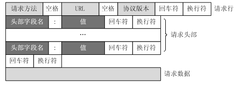
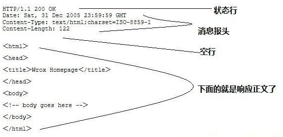
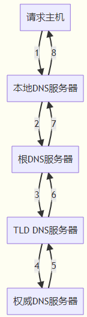
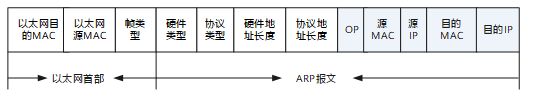
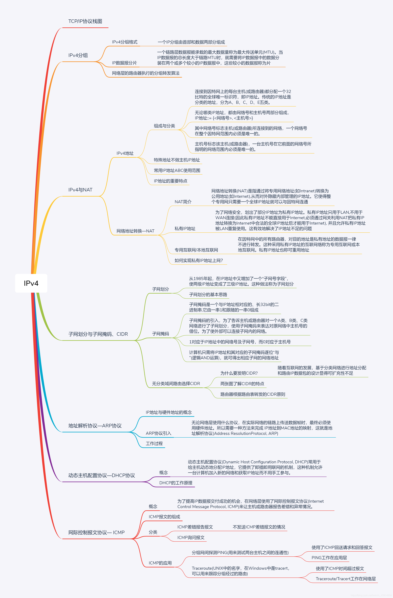
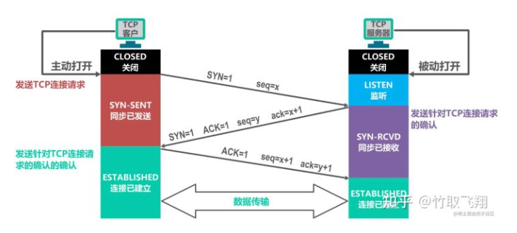
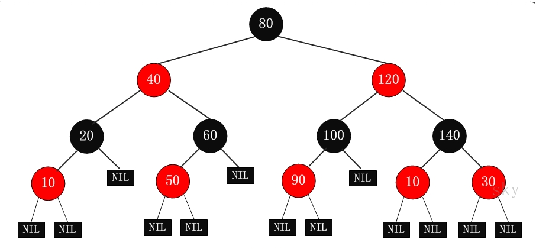

- [计算机网络](#计算机网络)
  - [七层网络体系结构OSI](#七层网络体系结构osi)
  - [http协议](#http协议)
  - [输入一个网址到显示一个页面的过程](#输入一个网址到显示一个页面的过程)
  - [HTTPS](#https)
  - [TCP头](#tcp头)
  - [DNS](#dns)
  - [ARP协议](#arp协议)
  - [IP协议(IPv4)](#ip协议ipv4)
  - [TCP建立连接：三次握手+四次挥手](#tcp建立连接三次握手四次挥手)
  - [TCP拥塞避免策略](#tcp拥塞避免策略)
  - [Cookie和Session](#cookie和session)
- [Java相关知识](#java相关知识)
  - [Java访问权限](#java访问权限)
  - [面向对象的三大特征：封装、继承、多态](#面向对象的三大特征封装继承多态)
  - [说一说StringBuffer和StringBuilder有什么区别](#说一说stringbuffer和stringbuilder有什么区别)
  - [Java异常](#java异常)
  - [接口和抽象类有什么区别？](#接口和抽象类有什么区别)
  - [static和final有什么区别？](#static和final有什么区别)
  - [Java反射](#java反射)
  - [hashmap](#hashmap)
  - [ConcurrentHashMap](#concurrenthashmap)
  - [线程生命周期](#线程生命周期)
  - [线程同步](#线程同步)
  - [线程安全](#线程安全)
  - [进程之间通信方式](#进程之间通信方式)
  - [线程池](#线程池)
  - [进程、线程、协程](#进程线程协程)
  - [IO多路复用（select、poll、epoll）](#io多路复用selectpollepoll)
  - [乐观锁、悲观锁](#乐观锁悲观锁)
  - [类加载器以及双亲委派机制](#类加载器以及双亲委派机制)
  - [介绍一下Java的垃圾回收机制](#介绍一下java的垃圾回收机制)
  - [垃圾收集器](#垃圾收集器)
  - [Java中的四种引用](#java中的四种引用)
  - [AOP与IOC](#aop与ioc)
  - [死锁定义](#死锁定义)
  - [单例模式](#单例模式)
  - [工厂模式](#工厂模式)
  - [内存泄漏](#内存泄漏)
- [数据库](#数据库)
  - [SQL表的连接](#sql表的连接)
  - [事务特性](#事务特性)
  - [超大分页处理](#超大分页处理)
  - [优化数据库的方法](#优化数据库的方法)
  - [聚簇索引和非聚簇索引](#聚簇索引和非聚簇索引)
  - [数据库为什么不用红黑树而用B+树？](#数据库为什么不用红黑树而用b树)
  - [事务隔离级别](#事务隔离级别)
  - [主从同步](#主从同步)
  - [MySQL中的锁](#mysql中的锁)
  - [InnoDB 锁模式](#innodb-锁模式)

---
# 计算机网络
## 七层网络体系结构OSI
物理层、数据链路层、网络层、传输层、会话层、表示层和应用层。  


## http协议
1. Http协议是对客户端和服务器端之间数据之间实现可靠性的传输文字、图片、音频、视频等超文本数据的规范，格式简称为“超文本传输协议”，属于应用层。
2. Http协议运行在TCP之上，明文传输，客户端与服务器端都无法验证对方的身份；Https是身披SSL(Secure Socket Layer)外壳的Http，运行于SSL上，SSL运行于TCP之上，是添加了加密和认证机制的HTTP。二者之间存在如下不同：  
+ 端口不同：Http与Http使用不同的连接方式，用的端口也不一样，前者是80，后者是443；  
+ 资源消耗：和HTTP通信相比，Https通信会由于加减密处理消耗更多的CPU和内存资源；  
+ 开销：Https通信需要证书，而证书一般需要向认证机构购买；  
Https的加密机制是一种共享密钥加密和公开密钥加密并用的混合加密机制。
3. HTTP使用统一资源标识符（Uniform Resource Identifiers, URI）来传输数据和建立连接。以下面这个URL为例：> http://www.aspxfans.com:8080/news/index.asp?boardID=5&ID=24618&page=1#name
+ 协议部分：该URL的协议部分为“http：”，这代表网页使用的是HTTP协议。在Internet中可以使用多种协议，如HTTP，FTP等等本例中使用的是HTTP协议。在"HTTP"后面的“//”为分隔符；
+ 域名部分：该URL的域名部分为“www.aspxfans.com”。一个URL中，也可以使用IP地址作为域名使用；
+ 端口部分：：跟在域名后面的是端口，域名和端口之间使用“:”作为分隔符。端口不是一个URL必须的部分，如果省略端口部分，将采用默认端口；
+ 虚拟目录部分：从域名后的第一个“/”开始到最后一个“/”为止，是虚拟目录部分。虚拟目录也不是一个URL必须的部分。本例中的虚拟目录是“/news/”；
+ 文件名部分：从域名后的最后一个“/”开始到“？”为止，是文件名部分，如果没有“?”,则是从域名后的最后一个“/”开始到“#”为止，是文件部分，如果没有“？”和“#”，那么从域名后的最后一个“/”开始到结束，都是文件名部分。本例中的文件名是“index.asp”。文件名部分也不是一个URL必须的部分，如果省略该部分，则使用默认的文件名；
+ 锚部分：从“#”开始到最后，都是锚部分。本例中的锚部分是“name”。锚部分也不是一个URL必须的部分；
+ 参数部分：从“？”开始到“#”为止之间的部分为参数部分，又称搜索部分、查询部分。本例中的参数部分为“boardID=5&ID=24618&page=1”。参数可以允许有多个参数，参数与参数之间用“&”作为分隔符。
4. 请求消息request：   
     
+ Get请求例子：
> GET /562f25980001b1b106000338.jpg HTTP/1.1  
> Host    img.mukewang.com  
> User-Agent    Mozilla/5.0 (Windows NT 10.0; WOW64) AppleWebKit/537.36 (KHTML, like Gecko)   
> Chrome/51.0.2704.106 Safari/537.36    
> Accept    image/webp,image/*,*/*;q=0.8  
> Referer    http://www.imooc.com/  
> Accept-Encoding    gzip, deflate, sdch  
> Accept-Language    zh-CN,zh;q=0.8  
+ post请求例子：  
> POST / HTTP1.1  
> Host:www.wrox.com  
User-Agent:Mozilla/4.0 (compatible; MSIE 6.0; Windows NT 5.1; SV1; .NET CLR 2.0.50727; .NET CLR 3.0.04506.648; .NET CLR 3.5.21022)  
Content-Type:application/x-www-form-urlencoded  
Content-Length:40  
Connection: Keep-Alive  
> 
> name=Professional%20Ajax&publisher=Wiley  


+ GET提交的数据会放在URL之后，以?分割URL和传输数据，参数之间以&相连，如EditPosts.aspx?name=test1&id=123456. POST方法是把提交的数据放在HTTP包的Body中.

+ GET提交的数据大小有限制（因为浏览器对URL的长度有限制），而POST方法提交的数据没有限制.

+ GET方式需要使用Request.QueryString来取得变量的值，而POST方式通过Request.Form来获取变量的值。

+ GET方式提交数据，会带来安全问题，比如一个登录页面，通过GET方式提交数据时，用户名和密码将出现在URL上，如果页面可以被缓存或者其他人可以访问这台机器，就可以从历史记录获得该用户的账号和密码
5. 响应消息response  
 
6. 状态码  
    1xx：指示信息--表示请求已接收，继续处理  
    2xx：成功--表示请求已被成功接收、理解、接受  
    3xx：重定向--要完成请求必须进行更进一步的操作  
    4xx：客户端错误--请求有语法错误或请求无法实现  
    5xx：服务器端错误--服务器未能实现合法的请求  
7. 工作原理  
1、客户端连接到Web服务器：一个HTTP客户端，通常是浏览器，与Web服务器的HTTP端口（默认为80）建立一个TCP套接字连接。例如，http://www.oakcms.cn。  
2、发送HTTP请求：通过TCP套接字，客户端向Web服务器发送一个文本的请求报文，一个请求报文由请求行、请求头部、空行和请求数据4部分组成。  
3、服务器接受请求并返回HTTP响应：Web服务器解析请求，定位请求资源。服务器将资源复本写到TCP套接字，由客户端读取。一个响应由状态行、响应头部、空行和响应数据4部分组成。  
4、释放连接TCP连接：若connection 模式为close，则服务器主动关闭TCP连接，客户端被动关闭连接，释放TCP连接;若connection 模式为keepalive，则该连接会保持一段时间，在该时间内可以继续接收请求;  
5、客户端浏览器解析HTML内容：客户端浏览器首先解析状态行，查看表明请求是否成功的状态代码。然后解析每一个响应头，响应头告知以下为若干字节的HTML文档和文档的字符集。客户端浏览器读取响应数据HTML，根据HTML的语法对其进行格式化，并在浏览器窗口中显示  
8. 常用的http方法
GET：用于请求访问已经被URI（统一资源标识符）识别的资源，可以通过URL传参给服务器  
POST：用于传输信息给服务器，主要功能与GET方法类似，但一般推荐使用POST方式。  
PUT：传输文件，报文主体中包含文件内容，保存到对应URI位置。  
HEAD：获得报文首部，与GET方法类似，只是不返回报文主体，一般用于验证URI是否有效。  
DELETE：删除文件，与PUT方法相反，删除对应URI位置的文件。  
OPTIONS：查询相应URI支持的HTTP方法。 

## 输入一个网址到显示一个页面的过程

+ DNS解析——解析域名，获取对应的ip地址
+ TCP连接——TCP三次握手
+ 浏览器发送http请求
+ 服务器处理请求并返回http报文
+ 浏览器解析返回的数据并渲染页面
+ 断开连接：TCP四次挥手

## HTTPS
HTTPS在传输数据之前需要客户端（浏览器）与服务端（网站）之间进行一次握手，在握手过程中将确立双方加密传输数据的密码信息。TLS/SSL协议不仅仅是一套加密传输的协议，更是一件经过艺术家精心设计的艺术品，TLS/SSL中使用了非对称加密，对称加密以及HASH算法。握手过程的具体描述如下：

1）浏览器将自己支持的一套加密规则发送给网站。   
2）网站从中选出一组加密算法与HASH算法，并将自己的身份信息以证书的形式发回给浏览器。证书里面包含了网站地址，加密公钥，以及证书的颁发机构等信息。    
3）浏览器获得网站证书之后浏览器要做以下工作： 
a) 验证证书的合法性（颁发证书的机构是否合法，证书中包含的网站地址是否与正在访问的地址一致等），如果证书受信任，则浏览器栏里面会显示一个小锁头，否则会给出证书不受信的提示。 
b) 如果证书受信任，或者是用户接受了不受信的证书，浏览器会生成一串随机数的密码，并用证书中提供的公钥加密。 
c) 使用约定好的HASH算法计算握手消息，并使用生成的随机数对消息进行加密，最后将之前生成的所有信息发送给网站。   
4）网站接收浏览器发来的数据之后要做以下的操作： a) 使用自己的私钥将信息解密取出密码，使用密码解密浏览器发来的握手消息，并验证HASH是否与浏览器发来的一致。 b) 使用密码加密一段握手消息，发送给浏览器。   
5）浏览器解密并计算握手消息的HASH，如果与服务端发来的HASH一致，此时握手过程结束，之后所有的通信数据将由之前浏览器生成的随机密码并利用对称加密算法进行加密。 
这里浏览器与网站互相发送加密的握手消息并验证，目的是为了保证双方都获得了一致的密码，并且可以正常的加密解密数据，为后续真正数据的传输做一次测试。另外，HTTPS一般使用的加密与HASH算法如下：

非对称加密算法：RSA，DSA/DSS  
对称加密算法：AES，RC4，3DES  
HASH算法：MD5，SHA1，SHA256  


## TCP头


## DNS
DNS(Domain Name System)域名系统，主要实现的功能是将域名转换成ip地址的一个服务。它是由一个分层的DNS服务器实现的分布式数据库,同时。他也是一个使得主机能够查询分布式数据库的应用层协议。DNS服务器通常是一个运行BIND(Berkeley Internet Name Domain)软件的UNIX机器。DNS协议运行在UDP之上，使用53号端口。 DNS是一个应用层协议。-0  
DNS分层：


迭代查询：  
迭代查询的核心是所有的请求都是直接返回给本地的DNS服务器，然后本地DNS服务器去对应的权威服务器等请求解析地址。整个过程中，只有请求主机到本地DNS服务器的查询时递归的，其余都是迭代的。


递归查询：  


## ARP协议
网络层的ARP协议完成了IP地址与物理地址的映射。首先，每台主机都会在自己的ARP缓冲区中建立一
个ARP列表，以表示IP地址和MAC地址的对应关系。当源主机需要将一个数据包要发送到目的主机时，
会首先检查自己ARP列表中是否存在该IP地址对应的MAC地址：如果有，就直接将数据包发送到这个
MAC地址；如果没有，就向本地网段发起一个ARP请求的广播包，查询此目的主机对应的MAC地址。此
ARP请求数据包里包括源主机的IP地址、硬件地址、以及目的主机的IP地址。网络中所有的主机收到这个
ARP请求后，会检查数据包中的目的IP是否和自己的IP地址一致。如果不相同就忽略此数据包；如果相
同，该主机首先将发送端的MAC地址和IP地址添加到自己的ARP列表中，如果ARP表中已经存在该IP的
信息，则将其覆盖，然后给源主机发送一个ARP响应数据包，告诉对方自己是它需要查找的MAC地址；
源主机收到这个ARP响应数据包后，将得到的目的主机的IP地址和MAC地址添加到自己的ARP列表中，
并利用此信息开始数据的传输。如果源主机一直没有收到ARP响应数据包，表示ARP查询失败。  
ARP报文格式：  
  
  

## IP协议(IPv4)
  
字段含义：  
1)版本。占4位。指IP的版本，目前广泛使用的版本号为4。  
2)首部长度。占4位。以4B为单位，最大值为60B (15*4B)。最常用的首部长度是20B,此时不使用任何选项(即可选字段)。  
3)总长度。占16位。指首部和数据之和的长度，单位为B，因此数据报的最大长度为216-1= 65535B。以太网帧的最大传送单元(MTU)为1500B，因此当一个IP数据报封装成帧时，数据报的总长度(首部加数据) 一定不能超过下面数据链路层的MTU值。  
4)标识。占16位。它是一个计数器，每产生一个数据报就加1,并赋值给标识字段。但它并不是“序号”(因为IP是无连接服务)。当一个数据报的长度超过网络的MTU时，必须分片，此时每个数据报片都复制一次标识号， 以便能正确重装成原来的数据报。  
5)标志。占3位。标志字段的最低位为MF, MF= 1表示后面还有分片，MF= 0表示最后一个分片。” 标志字段中间的一位是DF,只有当DF =0时才允许分片。  
6)片偏移。占13位。它指出较长的分组在分片后，某片在原分组中的相对位置。片偏移以8个字节为偏移单位,8B，即每个分片的长度一定是8B (64 位)的整数倍。  
7)首部校验和。占16位。IP数据报的首部校验和只校验分组的首部，而不校验数据部分 。  
8)生存时间(TTL)。占8位。数据报在网络中可通过的路由器数的最大值，标识分组在网络中的寿命，以确保分组不会永远在网络中循环。路由器在转发分组前，先把TTL减1。若TTL被减为0，则该分组必须丢弃。  
9)协议。占8位。指出此分组携带的数据使用何种协议，即分组的数据部分应交给哪个传输层协议，如TCP、UDP等。其中值为6表示TCP,值为17表示UDP。  
10)源地址字段。占4B，标识发送方的IP地址。  
11)目的地址字段。占4B，标识接收方的IP地址。    

IP地址：  
1)每个IP地址都由网络号和主机号两部分组成，因此IP地址是–种分等级的地址结构。分等级的好处是:①IP地址管理机构在分配IP地址时只分配网络号(第一级)， 而主机号(第二级)则由得到该网络的单位自行分配，方便了IP 地址的管理;②路由器仅根据目的主机所连接的网络号来转发分组(而不考虑目标主机号)，从而减小了路由表所占的存储空间。  
2）IP 地址是标志一台主机(或路由器)和一条链路的接口。当一台主机同时连接到两个网络时，该主机就必须同时具有两个相应的IP地址，每个IP地址的网络号必须与所在网络的网络号相同，且这两个IP地址的网络号是不同的。因此IP网络上的一一个路由器必然至少应具有两个IP地址(路由器每个端口必须至少分配一个IP地址)。  
3)用转发器或桥接器(网桥等)连接的若干LAN仍然是同一个网络(同一个广播域)，因此该LAN中所有主机的IP地址的网络号必须相同，但主机号必须不同。  
4)在IP地址中，所有分配到网络号的网络(无论是LAN还是WAN)都是平等的。  
5)在同一个局域网上的主机或路由器的IP地址中的网络号必须是一样的。路由器总是具有两个或两个以上的IP地址，路由器的每个端口都有一个不同网络号的IP地址。  




## TCP建立连接：三次握手+四次挥手
1. 三次握手（我要和你建立链接，你真的要和我建立链接么，我真的要和你建立链接，成功）

+ 第一次握手：Client将标志位SYN置为1，随机产生一个值seq=J，并将该数据包发送给Server，
Client进入SYN_SENT状态，等待Server确认。
+ 第二次握手：Server收到数据包后由标志位SYN=1知道Client请求建立连接，Server将标志位SYN
和ACK都置为1，ack=J+1，随机产生一个值seq=K，并将该数据包发送给Client以确认连接请求，
Server进入SYN_RCVD状态。
+ 第三次握手：Client收到确认后，检查ack是否为J+1，ACK是否为1，如果正确则将标志位ACK置为
1，ack=K+1，并将该数据包发送给Server，Server检查ack是否为K+1，ACK是否为1，如果正确则
连接建立成功，Client和Server进入ESTABLISHED状态，完成三次握手，随后Client与Server之间
可以开始传输数据了。
2. 四次挥手（我要和你断开链接；好的，断吧。我也要和你断开链接；好的，断吧）  

+ 第一次挥手：客户端发送一个 FIN 报文，报文中会指定一个序列号。此时客户端处于 FIN_WAIT1 状态。即发出连接释放报文段（FIN=1，序号seq=u），并停止再发送数据，主动关闭TCP连接，进入FIN_WAIT1（终止等待1）状态，等待服务端的确认。  
+ 第二次挥手：服务端收到 FIN 之后，会发送 ACK 报文，且把客户端的序列号值 +1 作为 ACK 报文的序列号值，表明已经收到客户端的报文了，此时服务端处于 CLOSE_WAIT 状态。即服务端收到连接释放报文段后即发出确认报文段（ACK=1，确认号ack=u+1，序号seq=v），服务端进入CLOSE_WAIT（关闭等待）状态，此时的TCP处于半关闭状态，客户端到服务端的连接释放。客户端收到服务端的确认后，进入FIN_WAIT2（终止等待2）状态，等待服务端发出的连接释放报文段。  
+ 第三次挥手：如果服务端也想断开连接了，和客户端的第一次挥手一样，发给 FIN 报文，且指定一个序列号。此时服务端处于 LAST_ACK 的状态。即服务端没有要向客户端发出的数据，服务端发出连接释放报文段（FIN=1，ACK=1，序号seq=w，确认号ack=u+1），服务端进入LAST_ACK（最后确认）状态，等待客户端的确认。  
+ 第四次挥手：客户端收到 FIN 之后，一样发送一个 ACK 报文作为应答，且把服务端的序列号值 +1 作为自己 ACK 报文的序列号值，此时客户端处于 TIME_WAIT 状态。需要过一阵子以确保服务端收到自己的 ACK 报文之后才会进入 CLOSED 状态，服务端收到 ACK 报文之后，就处于关闭连接了，处于 CLOSED 状态。即客户端收到服务端的连接释放报文段后，对此发出确认报文段（ACK=1，seq=u+1，ack=w+1），客户端进入TIME_WAIT（时间等待）状态。此时TCP未释放掉，需要经过时间等待计时器设置的时间2MSL后，客户端才进入CLOSED状态。  
  
## TCP拥塞避免策略
（1）慢开始

慢开始算法的思路就是，不要一开始就发送大量的数据，先探测一下网络的拥塞程度，也就是说由小到大逐渐增加拥塞窗口的大小。这里用报文段的个数的拥塞窗口大小举例说明慢开始算法，实时拥塞窗口大小是以字节为单位的。刚开始发送数据时，先把拥塞窗口（congestion window，cwnd）设置为一个最大报文段MSS的数值，每收到一个新的确认报文之后，就把拥塞窗口加1MSS。这样每经过一个传输轮次（或者说是每经过一个往返时间RTT），拥塞窗口的大小就会加倍（指数增长）。比如，第一轮传一个，收到一个加一个，cwnd变为2MSS。第二轮传两个，收到两个加两个，cwnd变为4MSS。

（2）拥塞避免

当拥塞窗口的大小达到慢开始门限(slow start threshold)时，拥塞避免算法让拥塞窗口缓慢增长，即每经过一个往返时间RTT就把发送方的拥塞窗口cwnd加1，而不是加倍。这样拥塞窗口按线性规律缓慢增长。

无论是在慢开始阶段还是在拥塞避免阶段，只要发送方判断网络出现拥塞（其根据就是没有收到确认，虽然没有收到确认可能是其他原因的分组丢失，但是因为无法判定，所以都当做拥塞来处理），就把慢开始门限设置为出现拥塞时的发送窗口大小的一半。然后把拥塞窗口设置为1，执行慢开始算法。

（3）快重传

快重传要求接收方在收到一个失序的报文段后就立即发出重复确认（为的是使发送方及早知道有报文段没有到达对方）而不要等到自己发送数据时捎带确认。快重传算法规定，发送方只要一连收到三个重复确认就应当立即重传对方尚未收到的报文段，而不必继续等待设置的重传计时器时间到期。

（4）快恢复

当发送方连续收到三个重复确认时，就把慢开始门限和拥塞窗口减半，然后执行拥塞避免算法。不执行慢开始算法的原因：因为如果网络出现拥塞的话就不会收到好几个重复的确认，所以发送方认为现在网络可能没有出现拥塞。

## Cookie和Session
+ Cookie   
cookie是由Web服务器保存在用户浏览器上的文件（key-value格式），可以包含用户相关的信息。客户
端向服务器发起请求，就提取浏览器中的用户信息由http发送给服务器.
+ Session  
session 是浏览器和服务器会话过程中，服务器会分配的一块储存空间给session。
服务器默认为客户浏览器的cookie中设置 sessionid，这个sessionid就和cookie对应，浏览器在向服务
器请求过程中传输的cookie 包含 sessionid ，服务器根据传输cookie 中的 sessionid 获取出会话中存储
的信息，然后确定会话的身份信息.  
 
1、Cookie数据存放在客户端上，安全性较差，Session数据放在服务器上，安全性相对更高.  
2、单个cookie保存的数据不能超过4K，session无此限制.  
3、session一定时间内保存在服务器上，当访问增多，占用服务器性能，考虑到服务器性能方面，应当
使用cookie。  

# Java相关知识

## Java访问权限
private：该成员可以被该类内部成员访问；  
default：该成员可以被该类内部成员访问，也可以被同一包下其他的类访问；  
protected：该成员可以被该类内部成员访问，也可以被同一包下其他的类访问，还可以被它的子类访问；  
public：该成员可以被任意包下，任意类的成员进行访问； 
## 面向对象的三大特征：封装、继承、多态
面向对象的程序设计方法具有三个基本特征：封装、继承、多态。  
其中，封装指的是将对象的实现细节隐藏起来，然后通过一些公用方法来暴露该对象的功能；  
继承是面向对象实现软件复用的重要手段，当子类继承父类后，子类作为一种特殊的父类，将直接获得父类的属性和方法；  
多态指的是子类对象可以直接赋给父类变量，但运行时依然表现出子类的行为特征，这意味着同一个类型的对象在执行同一个方
法时，可能表现出多种行为特征。
## 说一说StringBuffer和StringBuilder有什么区别
StringBuffer、StringBuilder都代表可变的字符串对象，它们有共同的父类AbstractStringBuilder ，并且两个类的构造方法和成员方法也基本相同。不同的是，StringBuffer
是线程安全的，而StringBuilder是非线程安全的，所以StringBuilder性能略高。一般情况下，要创建一个内容可变的字符串，建议优先考虑StringBuilder类。
## Java异常
在Java中，处理异常的语句由try、catch、finally三部分组成。其中，try块用于包裹业务代码，catch块用于捕获并处理某个类型的异常，finally块则用于回收资源。当业务代码发生异常时，系统会创建一个异常对象，然后由JVM寻找可以处理这个异常的catch块，并将异常对象交给这个catch块处理。若业务代码打开了某项资源，则可以在finally块中关闭这项资源，因为无论是否发生异常，finally块一定会执行。

当程序出现错误时，系统会自动抛出异常。除此以外，Java也允许程序主动抛出异常。当业务代码中，
判断某项错误的条件成立时，可以使用throw关键字向外抛出异常。在这种情况下，如果当前方法不知
道该如何处理这个异常，可以在方法签名上通过throws关键字声明抛出异常，则该异常将交给JVM处
理。

Throwable是异常的顶层父类，代表所有的非正常情况。它有两个直接子类，分别是Error、
Exception。Error是错误，一般是指与虚拟机相关的问题，如系统崩溃、虚拟机错误、动态链接失败等，这种错误无法恢复或不可能捕获，将导致应用程序中断。通常应用程序无法处理这些错误，因此应用程序不应该试图使用catch块来捕获Error对象。在定义方法时，也无须在其throws子句中声明该方法可能抛出Error及其任何子类。

Exception是异常，它被分为两大类，分别是Checked异常和Runtime异常。所有的RuntimeException
类及其子类的实例被称为Runtime异常；不是RuntimeException类及其子类的异常实例则被称为
Checked异常。Java认为Checked异常都是可以被处理（修复）的异常，所以Java程序必须显式处理
Checked异常。如果程序没有处理Checked异常，该程序在编译时就会发生错误，无法通过编译。
Runtime异常则更加灵活，Runtime异常无须显式声明抛出，如果程序需要捕获Runtime异常，也可以
使用try...catch块来实现。
## 接口和抽象类有什么区别？
接口里只能包含抽象方法、静态方法、默认方法和私有方法，不能为普通方法提供方法实现；抽象类则完全可以包含普通方法。  
接口里只能定义静态常量，不能定义普通成员变量；抽象类里则既可以定义普通成员变量，也可以定义静态常量。  
接口里不包含构造器；抽象类里可以包含构造器，抽象类里的构造器并不是用于创建对象，而是让其子类调用这些构造器来完成属于抽象类的初始化操作。  
接口里不能包含初始化块；但抽象类则完全可以包含初始化块。  
一个类最多只能有一个直接父类，包括抽象类；但一个类可以直接实现多个接口，通过实现多个接口可以弥补Java单继承的不足。  
## static和final有什么区别？
static关键字可以修饰成员变量、成员方法、初始化块、内部类，被static修饰的成员是类的成员，它属于类、不属于单个对象。以下是static修饰这4种成员时表现出的特征：  
类变量：被static修饰的成员变量叫类变量（静态变量）。类变量属于类，它随类的信息存储在方法区，并不随对象存储在堆中，类变量可以通过类名来访问，也可以通过对象名来访问，但建议通过类名访问它。  
类方法：被static修饰的成员方法叫类方法（静态方法）。类方法属于类，可以通过类名访问，也可以通过对象名访问，建议通过类名访问它。  
静态块：被static修饰的初始化块叫静态初始化块。静态块属于类，它在类加载的时候被隐式调用一次，之后便不会被调用了。  
静态内部类：被static修饰的内部类叫静态内部类。静态内部类可以包含静态成员，也可以包含非静态成员。静态内部类不能访问外部类的实例成员，只能访问外部类的静态成员。外部类的所有方法、初始化块都能访问其内部定义的静态内部类。  

final关键字可以修饰类、方法、变量，以下是final修饰这3种目标时表现出的特征：  
final类：final关键字修饰的类不可以被继承。  
final方法：final关键字修饰的方法不可以被重写。  
final变量：final关键字修饰的变量，一旦获得了初始值，就不可以被修改。  
## Java反射
Java反射就是在运行状态中，对于任意一个类，都能够知道这个类的所有属性和方法；对于任意一个对象，都能够调用它的任意方法和属性；并且能改变它的属性。

程序运行时，可以通过反射获得任意一个类的Class对象，并通过这个对象查看这个类的信息；程序运行时，可以通过反射创建任意一个类的实例，并访问该实例的成员；程序运行时，可以通过反射机制生成一个类的动态代理类或动态代理对象。

使用JDBC时，如果要创建数据库的连接，则需要先通过反射机制加载数据库的驱动程序；
多数框架都支持注解/XML配置，从配置中解析出来的类是字符串，需要利用反射机制实例化；
面向切面编程（AOP）的实现方案，是在程序运行时创建目标对象的代理类，这必须由反射机制来实现。
## hashmap
扩容操作：
1. 首次扩容：先判断数组是否为空，若数组为空则进行第一次扩容（resize）；
2. 计算索引：通过hash算法，计算键值对在数组中的索引；
3. 插入数据：
如果当前位置元素为空，则直接插入数据；
如果当前位置元素非空，且key已存在，则直接覆盖其value；
如果当前位置元素非空，且key不存在，则将数据链到链表末端；
若链表长度达到8，则将链表转换成红黑树，并将数据插入树中；
4. 再次扩容：如果数组中元素个数（size）超过threshold，则再次进行扩容操作。


JDK7中的HashMap，是基于数组+链表来实现的，它的底层维护一个Entry数组。它会根据计算的hashCode将对应的KV键值对存储到该数组中，一旦发生hashCode冲突，那么就会将该KV键值对放到对应的已有元素的后面， 此时便形成了一个链表式的存储结构。

JDK8中的HashMap，是基于数组+链表+红黑树来实现的，它的底层维护一个Node数组。当链表的存储的数据个数大于等于8的时候，不再采用链表存储，而采用了红黑树存储结构。这么做主要是在查询的时间复杂度上进行优化，链表为O(N)，而红黑树一直是O(logN)，可以大大的提高查找性能。

红黑树：
1. 节点不是黑色，就是红色（非黑即红）
2. 根节点为黑色
3. 叶节点为黑色（叶节点是指末梢的空节点 Nil或Null）
4. 一个节点为红色，则其两个子节点必须是黑色的（根到叶子的所有路径，不可能存在两个连续的红色节点）
5. 每个节点到叶子节点的所有路径，都包含相同数目的黑色节点（相同的黑色高度）



1. Hashtable是一个线程安全的Map实现，但HashMap是线程不安全的实现，所以HashMap比
Hashtable的性能高一点。
2. Hashtable不允许使用null作为key和value，如果试图把null值放进Hashtable中，将会引发空指针异常，但HashMap可以使用null作为key或value。
## ConcurrentHashMap
ConcurrentHashMap的底层数据结构与HashMap一样,也是采用“数组+链表+红黑树”的形式。同时,它又采用锁定头节点的方式降低了锁粒度,以较低的性能代价实现了线程安全。底层数据结构的逻辑可以参考HashMap的实现,下面我重点介绍它的线程安全的实现机制。 
1. 初始化数组或头节点时,ConcurrentHashMap并没有加锁,而是CAS的方式进行原子替换（原子操作,基于Unsafe类的原子操作API）。 
2. 插入数据时会进行加锁处理,但锁定的不是整个数组,而是槽中的头节点。所以,ConcurrentHashMap中锁的粒度是槽,而不是整个数组,并发的性能很好。 
3. 扩容时会进行加锁处理,锁定的仍然是头节点。并且,支持多个线程同时对数组扩容,提高并发能力。每个线程需先以CAS操作抢任务,争抢一段连续槽位的数据转移权。抢到任务后,该线程会锁定槽内的头节点,然后将链表或树中的数据迁移到新的数组里。 
4. 查找数据时并不会加锁,所以性能很好。另外,在扩容的过程中,依然可以支持查找操作。如果某个槽还未进行迁移,则直接可以从旧数组里找到数据。如果某个槽已经迁移完毕,但是整个扩容还没结束,则扩容线程会创建一个转发节点存入旧数组,届时查找线程根据转发节点的提示,从新数组中找到目标数据。 


加分回答 ConcurrentHashMap实现线程安全的难点在于多线程并发扩容,即当一个线程在插入数据时,若发现数组正在扩容,那么它就会立即参与扩容操作,完成扩容后再插入数据到新数组。在扩容的时候,多个线程共同分担数据迁移任务,每个线程负责的迁移数量是 `(数组长度 >>> 3) / CPU核心数`。 也就是说,为线程分配的迁移任务,是充分考虑了硬件的处理能力的。多个线程依据硬件的处理能力,平均分摊一部分槽的迁移工作。另外,如果计算出来的迁移数量小于16,则强制将其改为16,这是考虑到目前服务器领域主流的CPU运行速度,每次处理的任务过少,对于CPU的算力也是一种浪费。
## 线程生命周期
在线程的生命周期中，它要经过新建（New）、就绪（Ready）、运行（Running）、阻塞
（Blocked）和死亡（Dead）5种状态。

当程序使用new关键字创建了一个线程之后，该线程就处于新建状态，此时它和其他的Java对象一样，仅仅由Java虚拟机为其分配内存，并初始化其成员变量的值。此时的线程对象没有表现出任何线程的动态特征，程序也不会执行线程的线程执行体。

当线程对象调用了start()方法之后，该线程处于就绪状态，Java虚拟机会为其创建方法调用栈和程序计数器，处于这个状态中的线程并没有开始运行，只是表示该线程可以运行了。至于该线程何时开始运行，取决于JVM里线程调度器的调度。

如果处于就绪状态的线程获得了CPU，开始执行run()方法的线程执行体，则该线程处于运行状态，如果计算机只有一个CPU，那么在任何时刻只有一个线程处于运行状态。当然，在一个多处理器的机器上，将会有多个线程并行执行；当线程数大于处理器数时，依然会存在多个线程在同一个CPU上轮换的现象。

当一个线程开始运行后，它不可能一直处于运行状态，线程在运行过程中需要被中断，目的是使其他线程获得执行的机会，线程调度的细节取决于底层平台所采用的策略。对于采用抢占式策略的系统而言，系统会给每个可执行的线程一个小时间段来处理任务。当该时间段用完后，系统就会剥夺该线程所占用的资源，让其他线程获得执行的机会。当发生如下情况时，线程将会进入阻塞状态：
1、线程调用sleep()方法主动放弃所占用的处理器资源。
2、线程调用了一个阻塞式IO方法，在该方法返回之前，该线程被阻塞。
3、线程试图获得一个同步监视器，但该同步监视器正被其他线程所持有。
4、线程在等待某个通知（notify）。
5、程序调用了线程的suspend()方法将该线程挂起。但这个方法容易导致死锁，所以应该尽量避免使用该方法。

## 线程同步
1. 同步方法
即有synchronized关键字修饰的方法，由于java的每个对象都有一个内置锁，当用此关键字修饰方法时， 内置锁会保护整个方法。在调用该方法前，需要获得内置锁，否则就处于阻塞状态。需要注意， synchronized关键字也可以修饰静态方法，此时如果调用该静态方法，将会锁住整个类。
2. 同步代码块
即有synchronized关键字修饰的语句块，被该关键字修饰的语句块会自动被加上内置锁，从而实现同步。需值得注意的是，同步是一种高开销的操作，因此应该尽量减少同步的内容。通常没有必要同步整个方法，使用synchronized代码块同步关键代码即可。
3. ReentrantLock
Java 5新增了一个java.util.concurrent包来支持同步，其中ReentrantLock类是可重入、互斥、实现了Lock接口的锁，它与使用synchronized方法和快具有相同的基本行为和语义，并且扩展了其能力。需要注意的是，ReentrantLock还有一个可以创建公平锁的构造方法，但由于能大幅度降低程序运行效率，因此不推荐使用。
4. volatile
volatile关键字为域变量的访问提供了一种免锁机制，使用volatile修饰域相当于告诉虚拟机该域可能会被其他线程更新，因此每次使用该域就要重新计算，而不是使用寄存器中的值。需要注意的是，volatile不会提供任何原子操作，它也不能用来修饰final类型的变量。
5. 原子变量
在java的util.concurrent.atomic包中提供了创建了原子类型变量的工具类，使用该类可以简化线程同步。例如AtomicInteger 表可以用原子方式更新int的值，可用在应用程序中（如以原子方式增加的计数器），但不能用于替换Integer。可扩展Number，允许那些处理机遇数字类的工具和实用工具进行统一访问。
## 线程安全
执行控制的目的是控制代码执行（顺序）及是否可以并发执行。内存可见控制的是线程执行结果在内存中对其它线程的可见性。根据Java内存模型的实现，线程在具体执行时，会先拷贝主存数据到线程本地（CPU缓存），操作完成后再把结果从线程本地刷到主存。

synchronized关键字解决的是执行控制的问题，它会阻止其它线程获取当前对象的监控锁，这样就使得当前对象中被synchronized关键字保护的代码块无法被其它线程访问，也就无法并发执行。更重要的是，synchronized还会创建一个内存屏障，内存屏障指令保证了所有CPU操作结果都会直接刷到主存中，从而保证了操作的内存可见性，同时也使得先获得这个锁的线程的所有操作，都happens-before于随后获得这个锁的线程的操作。

volatile关键字解决的是内存可见性的问题，会使得所有对volatile变量的读写都会直接刷到主存，即保证了变量的可见性。这样就能满足一些对变量可见性有要求而对读取顺序没有要求的需求。

按照资源占用情况由轻到重排列,这三种保证线程安全的方式分别是**原子类、volatile、锁**。 
+ JDK从1.5开始提供了java.util.concurrent.atomic包,这个包中的原子操作类提供了一种用法简单、性能高效、线程安全地更新一个变量的方式。在atomic包里一共提供了17个类,按功能可以归纳为4种类型的原子更新方式,分别是原子更新基本类型、原子更新引用类型、原子更新属性、原子更新数组。无论原子更新哪种类型,都要遵循“比较和替换”规则,即比较要更新的值是否等于期望值,如果是则更新,如果不是则失败。
+ volatile是轻量级的synchronized,它在多处理器开发中保证了共享变量的“可见性”,从而可以保证单个变量读写时的线程安全。可见性问题是由处理器核心的缓存导致的,每个核心均有各自的缓存,而这些缓存均要与内存进行同步。volatile具有如下的内存语义：当写一个volatile变量时,该线程本地内存中的共享变量的值会被立刻刷新到主内存；当读一个volatile变量时,该线程本地内存会被置为无效,迫使线程直接从主内存中读取共享变量。 
+ 原子类和volatile只能保证单个共享变量的线程安全,锁则可以保证临界区内的多个共享变量的线程安全,Java中加锁的方式有两种,分别是synchronized关键字和Lock接口。synchronized是比较早期的API,在设计之初没有考虑到超时机制、非阻塞形式,以及多个条件变量。若想通过升级的方式让它支持这些相对复杂的功能,则需要大改它的语法结构,不利于兼容旧代码。因此,JDK的开发团队在1.5新增了Lock接口,并通过Lock支持了上述的功能,即：支持响应中断、支持超时机制、支持以非阻塞的方式获取锁、支持多个条件变量（阻塞队列）。 
+ 加分回答 实现线程安全的方式有很多,除了上述三种方式之外,还有如下几种方式： 1. 无状态设计 线程安全问题是由多线程并发修改共享变量引起的,如果在并发环境中没有设计共享变量,则自然就不会出现线程安全问题了。这种代码实现可以称作“无状态实现”,所谓状态就是指共享变量。 2. 不可变设计 如果在并发环境中不得不设计共享变量,则应该优先考虑共享变量是否为只读的,如果是只读场景就可以将共享变量设计为不可变的,这样自然也不会出现线程安全问题了。具体来说,就是在变量前加final修饰符,使其不可被修改,如果变量是引用类型,则将其设计为不可变类型（参考String类）。 3. 并发工具 java.util.concurrent包提供了几个有用的并发工具类,一样可以保证线程安全： - Semaphore：就是信号量,可以控制同时访问特定资源的线程数量。 - CountDownLatch：允许一个或多个线程等待其他线程完成操作。 - CyclicBarrier：让一组线程到达一个屏障时被阻塞,直到最后一个线程到达屏障时,屏障才会打开,所有被屏障拦截的线程才会继续运行。 4. 本地存储 我们也可以考虑使用ThreadLocal存储变量,ThreadLocal可以很方便地为每一个线程单独存一份数据,也就是将需要并发访问的资源复制成多份。这样一来,就可以避免多线程访问共享变量了,它们访问的是自己独占的资源,它从根本上隔离了多个线程之间的数据共享。
  
## 进程之间通信方式
管道、命名管道、信号、消息队列、共享内存、内存映射、信号量、Socket：
 1. 管道 管道也叫无名（匿名）管道,它是是 UNIX 系统 IPC（进程间通信）的最古老形式,所有的 UNIX 系统都支持这种通信机制。管道本质其实是内核中维护的一块内存缓冲区,Linux 系统中通过 pipe() 函数创建管道,会生成两个文件描述符,分别对应管道的读端和写端。无名管道只能用于具有亲缘关系的进程间的通信。 
 2. 命名管道 匿名管道,由于没有名字,只能用于亲缘关系的进程间通信。为了克服这个缺点,提出了有名管道（FIFO）,也叫命名管道、FIFO文件。有名管道（FIFO）不同于匿名管道之处在于它提供了一个路径名与之关联,以 FIFO 的文件形式存在于文件系统中,并且其打开方式与打开一个普通文件是一样的,这样即使与 FIFO 的创建进程不存在亲缘关系的进程,只要可以访问该路径,就能够彼此通过 FIFO 相互通信,因此,通过 FIFO 不相关的进程也能交换数据。 
 3. 信号 信号是 Linux 进程间通信的最古老的方式之一,是事件发生时对进程的通知机制,有时也称之为软件中断,它是在软件层次上对中断机制的一种模拟,是一种异步通信的方式。信号可以导致一个正在运行的进程被另一个正在运行的异步进程中断,转而处理某一个突发事件。 
 4. 消息队列 消息队列就是一个消息的链表,可以把消息看作一个记录,具有特定的格式以及特定的优先级,对消息队列有写权限的进程可以向消息队列中按照一定的规则添加新消息,对消息队列有读权限的进程则可以从消息队列中读走消息,消息队列是随内核持续的。 
 5. 共享内存 共享内存允许两个或者多个进程共享物理内存的同一块区域（通常被称为段）。由于一个共享内存段会称为一个进程用户空间的一部分,因此这种 IPC 机制无需内核介入。所有需要做的就是让一个进程将数据复制进共享内存中,并且这部分数据会对其他所有共享同一个段的进程可用。与管道等要求发送进程将数据从用户空间的缓冲区复制进内核内存和接收进程将数据从内核内存复制进用户空间的缓冲区的做法相比,这种 IPC 技术的速度更快。 
 6. 内存映射 内存映射（Memory-mapped I/O）是将磁盘文件的数据映射到内存,用户通过修改内存就能修改磁盘文件。 
 7. 信号量 信号量主要用来解决进程和线程间并发执行时的同步问题,进程同步是并发进程为了完成共同任务采用某个条件来协调它们的活动。对信号量的操作分为 P 操作和 V 操作,P 操作是将信号量的值减 1,V 操作是将信号量的值加 1。当信号量的值小于等于 0 之后,再进行 P 操作时,当前进程或线程会被阻塞,直到另一个进程或线程执行了 V 操作将信号量的值增加到大于 0 之时。 
 8. Socket 套接字（Socket）,就是对网络中不同主机上的应用进程之间进行双向通信的端点的抽象。一个套接字就是网络上进程通信的一端,提供了应用层进程利用网络协议交换数据的机制。Socket 一般用于网络中不同主机上的进程之间的通信。
## 线程池
线程池是一种多线程处理形式，处理过程中将任务提交到线程池，任务的执行交由线程池来管理。如果每个请求都创建一个线程去处理，那么服务器的资源很快就会被耗尽，使用线程池可以减少创建和销毁线程的次数，每个工作线程都可以被重复利用，可执行多个任务。线程池作用就是限制系统中执行线程的数量。1、提高效率 创建好一定数量的线程放在池中，等需要使用的时候就从池中拿一个，这要比需要的时候创建一个线程对象要快的多。2、方便管理 可以编写线程池管理代码对池中的线程同一进行管理，比如说启动时有该程序创建100个线程，每当有请求的时候，就分配一个线程去工作，如果刚好并发有101个请求，那多出的这一个请求可以排队等候，避免因无休止的创建线程导致系统崩溃。  

常用的几种线程池：  
1、newSingleThreadExecutor创建一个单线程化的线程池，它只会用唯一的工作线程来执行任务，保证所有任务按照指定顺序(FIFO, LIFO, 优先级)执行。  
2、newFixedThreadPool创建一个定长线程池，可控制线程最大并发数，超出的线程会在队列中等待。  
3、newCachedThreadPool创建一个可缓存线程池，如果线程池长度超过处理需要，可灵活回收空闲线程，若无可回收，则新建线程。  
4、newScheduledThreadPool创建一个定长线程池，支持定时及周期性任务执行。

线程池的参数：  
+ corePoolSize就是线程池中的核心线程数量，这几个核心线程，只是在没有用的时候，也不会被回收
+ maximumPoolSize就是线程池中可以容纳的最大线程的数量
+ keepAliveTime，就是线程池中除了核心线程之外的其他的最长可以保留的时间，因为在线程池中，除了核心线程即使在无任务的情况下也不能被清除，其余的都是有存活时间的，意思就是非核心线程可以保留的最长的空闲时间，
+ util，就是计算这个时间的一个单位。
+ workQueue，就是等待队列，任务可以储存在任务队列中等待被执行，执行的是FIFIO原则（先进先出）。
+ threadFactory，就是创建线程的线程工厂。
+ handler,是一种拒绝策略，我们可以在任务满了之后，拒绝执行某些任务。
   
线程池的拒绝策略：  
当请求任务不断的过来，而系统此时又处理不过来的时候，我们需要采取的策略是拒绝服务RejectedExecutionHandler接口提供了拒绝任务处理的自定义方法的机会。在ThreadPoolExecutor中已经包含四种处理策略。  
AbortPolicy策略：该策略会直接抛出异常，阻止系统正常工作。  
CallerRunsPolicy 策略：只要线程池未关闭，该策略直接在调用者线程中，运行当前的被丢弃的任务。  
DiscardOleddestPolicy策略： 该策略将丢弃最老的一个请求，也就是即将被执行的任务，并尝试再次提交当前任务。  
DiscardPolicy策略：该策略默默的丢弃无法处理的任务，不予任何处理。  

## 进程、线程、协程
- 进程——资源分配的最小单位  
- 线程——程序执行的最小单位    
- 协程是一种用户态的轻量级线程，协程的调度完全由用户控制。协程拥有自己的寄存器上下文和栈。协程调度切换时，将寄存器上下文和栈保存到其他地方，在切回来的时候，恢复先前保存的寄存器上下文和栈，直接操作栈则基本没有内核切换的开销，可以不加锁的访问全局变量，所以上下文的切换非常快。
协程与线程主要区别是它将不再被内核调度，而是交给了程序自己而线程是将自己交给内核调度。


## IO多路复用（select、poll、epoll）
 I/O 多路复用是一种使得程序能同时监听多个文件描述符的技术,从而提高程序的性能。I/O 多路复用能够在单个线程中,通过监视多个 I/O 流的状态来同时管理多个 I/O 流,一旦检测到某个文件描述符上我们关心的事件发生（就绪）,能够通知程序进行相应的处理（读写操作）。 Linux 下实现 I/O 复用的系统调用主要有 select、poll 和 epoll。 
 1. select   
   select 的主旨思想： 
     - 首先要构造一个关于文件描述符的列表,将要监听的文件描述符添加到该列表中,这个文件描述符的列表数据类型为 fd_set,它是一个整型数组,总共是 1024 个比特位,每一个比特位代表一个文件描述符的状态。比如当需要 select 检测时,这一位为 0 就表示不检测对应的文件描述符的事件,为 1 表示检测对应的文件描述符的事件。 
     - 调用 select() 系统调用,监听该列表中的文件描述符的事件,这个函数是阻塞的,直到这些描述符中的一个或者多个进行 I/O 操作时,该函数才返回,并修改文件描述符的列表中对应的值,0 表示没有检测到该事件,1 表示检测到该事件。函数对文件描述符的检测的操作是由内核完成的。 
  
     - select() 返回时,会告诉进程有多少描述符要进行 I/O 操作,接下来遍历文件描述符的列表进行 I/O 操作。  
       select 的缺点： 
       1. 每次调用select,都需要把 fd 集合从用户态拷贝到内核态,这个开销在 fd 很多时会很大； 
       2. 同时每次调用 select 都需要在内核遍历传递进来的所有 fd,这个开销在 fd 很多时也很大； 
       3.  select 支持的文件描述符数量太小了,默认是 1024（由 fd_set 决定）； 
       4.  文件描述符集合不能重用,因为内核每次检测到事件都会修改,所以每次都需要重置； 
       5. 每次 select 返回后,只能知道有几个 fd 发生了事件,但是具体哪几个还需要遍历文件描述符集合进一步判断。 

2. poll   
 poll 的原理和 select 类似,poll 支持的文件描述符没有限制。 
2. epoll   
   epoll 是一种更加高效的 IO 复用技术,epoll 的使用步骤及原理如下： 
   - 调用 epoll_create() 会在内核中创建一个 eventpoll 结构体数据,称之为 epoll 对象,在这个结构体中有 2 个比较重要的数据成员,一个是需要检测的文件描述符的信息 struct_root rbr（红黑树）,还有一个是就绪列表struct list_head rdlist,存放检测到数据发送改变的文件描述符信息（双向链表）； 
   - 调用 epoll_ctrl() 可以向 epoll 对象中添加、删除、修改要监听的文件描述符及事件； 
   - 调用 epoll_wt() 可以让内核去检测就绪的事件,并将就绪的事件放到就绪列表中并返回,通过返回的事件数组做进一步的事件处理。 
   - epoll 的两种工作模式： 
     - LT 模式（水平触发） LT（Level - Triggered）是缺省的工作方式,并且同时支持 Block 和 Nonblock Socket。在这种做法中,内核检测到一个文件描述符就绪了,然后可以对这个就绪的 fd 进行 IO 操作,如果不作任何操作,内核还是会继续通知。 
     - ET 模式（边沿触发） ET（Edge - Triggered）是高速工作方式,只支持 Nonblock socket。在这种模式下,当描述符从未就绪变为就绪时,内核通过 epoll 检测到。然后它会假设你知道文件描述符已经就绪,并且不会再为那个文件描述符发送更多的就绪通知,直到你做了某些操作导致那个文件描述符不再为就绪状态了。但是请注意,如果一直不对这个 fd 进行 IO 操作（从而导致它再次变成未就绪）,内核不会发送更多的通知（only once）。 ET 模式在很大程度上减少了 epoll 事件被重复触发的次数,因此效率要比 LT 模式高。epoll 工作在 ET 模式的时候,必须使用非阻塞套接口,以避免由于一个文件描述符的阻塞读/阻塞写操作把处理多个文件描述符的任务饿死。

## 乐观锁、悲观锁
悲观锁：总是假设最坏的情况，每次去拿数据的时候都认为别人会修改，所以每次在拿数据的时候都会上锁，这样别人想拿这个数据就会阻塞直到它拿到锁。Java中悲观锁是通过synchronized关键字或Lock接口来实现的。

乐观锁：顾名思义，就是很乐观，每次去拿数据的时候都认为别人不会修改，所以不会上锁，但是在更新的时候会判断一下在此期间别人有没有去更新这个数据。主要是CAS：CAS操作包含三个操作数—— 内存位置的值（V）、预期原值（A）和新值（B）。如果内存位置的值与预期原值相匹配，那么处理器会自动将该位置更新为新值。否则，处理器不做任何操作。无论哪种情况，它都会在CAS指令之前返回该位置的值。CAS有效地说明了“我认为位置V应该包含值A；如果包含该值，则将B放到这个位置；否则，不要更改该位置，只告诉我这个位置现在的值即可。

## 类加载器以及双亲委派机制
对于任意一个类，都必须由加载它的类加载器和这个类本身一起共同确立其在Java虚拟机中的唯一性，每一个类加载器，都拥有一个独立的类名称空间。  


双亲委派模型的工作过程是：如果一个类加载器收到了类加载的请求，它首先不会自己去尝试加载这个类，而是把这个请求委派给父类加载器去完成，每一个层次的类加载器都是如此，因此所有的加载请求最终都应该传送到最顶层的启动类加载器中，只有当父加载器反馈自己无法完成这个加载请求（它的搜索范围中没有找到所需的类）时，子加载器才会尝试自己去完成加载。

双亲委派机制的优点：
+ Java类随着它的类加载器一起具备了一种带有优先级的层次关系，通过这种层级关可以避免类的重复加载，当父亲已经加载了该类时，就没有必要子ClassLoader再加载一次。
+ 其次是考虑到安全因素，java核心api中定义类型不会被随意替换，假设通过网络传递一个名为java.lang.Integer的类，通过双亲委托模式传递到启动类加载器，而启动类加载器在核心Java API发现这个名字的类，发现该类已被加载，并不会重新加载网络传递的过来的java.lang.Integer，而直接返回已加载过的Integer.class，这样便可以防止核心API库被随意篡改。

## 介绍一下Java的垃圾回收机制
1、哪些内存需要回收  
在Java内存运行时区域的各个部分中，堆和方法区这两个区域则有着很显著的不确定性。  
2、怎么定义垃圾  
a)引用计数算法：在对象中添加一个引用计数器，每当有一个地方引用它时，计数器值就加一；当引用失效时，计数器值就减一；任何时刻计数器为零的对象就是不可能再被使用的。  
b)可达性分析：这个算法的基本思路就是通过一系列称为“GC Roots”的根对象作为起始节点集，从这些节点开始，根据引用关系向下搜索，搜索过程所走过的路径称为“引用链”（Reference Chain），如果某个对象到GC Roots间没有任何引用链相连，或者用图论的话来说就是从GC Roots到这个对象不可达时，则证明此对象是不可能再被使用的。

可以当作根对象的：  
在虚拟机栈（栈帧中的本地变量表）中引用的对象，譬如各个线程被调用的方法堆栈中使用到的参数、局部变量、临时变量等。    
在方法区中类静态属性引用的对象，譬如Java类的引用类型静态变量。  
在方法区中常量引用的对象，譬如字符串常量池（String Table）里的引用。    
在本地方法栈中JNI（即通常所说的Native方法）引用的对象。   
Java虚拟机内部的引用，如基本数据类型对应的Class对象，一些常驻的异常对象（比如
NullPointExcepiton、OutOfMemoryError）等，还有系统类加载器。    
所有被同步锁（synchronized关键字）持有的对象。    
反映Java虚拟机内部情况的JMXBean、JVMTI中注册的回调、本地代码缓存等。  

回收方法区：方法区的垃圾收集主要回收两部分内容：废弃的常量和不再使用的类型。回收废弃常量与回收Java堆中的对象非常类似。举个常量池中字面量回收的例子，假如一个字符串“java”曾经进入常量池中，但是当前系统又没有任何一个字符串对象的值是“java”，换句话说，已经没有任何字符串对象引用常量池中的“java”常量，且虚拟机中也没有其他地方引用这个字面量。如果在这时发生内存回收，而且垃圾收集器判断确有必要的话，这个“java”常量就将会被系统清理出常量池。常量池中其他类（接口）、方法、字段的符号引用也与此类似。

3、垃圾回收算法（分代）
对象只会存在于 Eden 区和名为“From” 的Survivor 区， Survivor 区“To” 是空的。 紧接着进行 GC， Eden 区中所有存活的对象都会被复制到“To” ， 而在“From” 区中， 仍存活的对象会根据他们的年龄值来决定去向。 年龄达到一定值(年龄阈值， 可以通过
-XX:MaxTenuringThreshold 来设置)的对象会被移动到年老代中， 没有达到阈值的对象会被复制到“To” 区域。 经过这次 GC 后， Eden 区和 From 区已经被清空。 这个时候， “From” 和“To” 会交换他们的角色， 也就是新的“To” 就是上次 GC 前的“From” ， 新的“From”就是上次 GC 前的“To”。 不管怎样， 都会保证名为 To 的 Survivor 区域是空的。 Minor GC 会一直重复这样的过程， 直到“To”区被填满， “To”区被填满之后， 会将所有对象移动到年老代中。
## 垃圾收集器

1. Serial  
   Serial收集器是Hotspot运行在Client模式下的默认新生代收集器, 它在进行垃圾收集时，会暂停所有的工作进程，用一个线程去完成GC工作。  
   
2. Parnew  
   ParNew收集器其实是Serial的多线程版本，回收策略完全一样。
   
3. CMS  
   CMS(Concurrent Mark Sweep)收集器是一款具有划时代意义的收集器, 一款真正意义上的并发收集器,它是基于标记-清除算法实现的。整个过程分4个步骤：1. 初始标记(CMS initial mark):仅只标记一下GC Roots能直接关联到的对象, 速度很快  2. 并发标记(CMS concurrent mark: GC Roots Tracing过程)  3. 重新标记(CMS remark):修正并发标记期间因用户程序继续运行而导致标记产生变动的那一部分对象的标记记录  4. 并发清除(CMS concurrent sweep: 已死对象将会就地释放)
   
4. G1  
   G1最大的特点是引入分区的思路，弱化分代的概念，合理利用垃圾收集各个周期的资源，解决了其他收集器甚至CMS的众多缺陷。
   1) 新生代收集：G1的新生代收集跟ParNew类似，如果存活时间超过某个阈值，就会被转移到S/O区。年轻代内存由一组不连续的heap区组成, 这种方法使得可以动态调整各代区域的大小。  
   2) 老年代收集：1. **初始标记** (Initial Mark: Stop the World Event)在G1中, 该操作附着一次年轻代GC, 以标记Survivor中有可能引用到老年代对象的Regions.2. **扫描根区域** (Root Region Scanning: 与应用程序并发执行)扫描Survivor中能够引用到老年代的references. 但必须在Minor GC触发前执行完3. **并发标记** (Concurrent Marking : 与应用程序并发执行)在整个堆中查找存活对象, 但该阶段可能会被Minor GC中断4. **重新标记** (Remark : Stop the World Event)完成堆内存中存活对象的标记. 使用snapshot-at-the-beginning(SATB, 起始快照)算法, 比CMS所用算法要快得多(空Region直接被移除并回收, 并计算所有区域的活跃度).5. **清理** (Cleanup : Stop the World Event and Concurrent)在含有存活对象和完全空闲的区域上进行统计(STW)、擦除Remembered Sets(使用RememberedSet来避免扫描全堆，每个区都有对应一个Set用来记录引用信息、读写操作记录)(STW)、重置空regions并将他们返还给空闲列表(free list)(Concurrent)。
   
   
## Java中的四种引用
1. 强引用  
   强引用是平常中使用最多的引用，强引用在程序内存不足（OOM）的时候也不会被回收，使用方式：String str = new String("str");
2. 软引用
   软引用在程序内存不足时，会被回收，使用方式：  
   // 注意：wrf这个引用也是强引用，它是指向SoftReference这个对象的，  
   // 这里的软引用指的是指向new String("str")的引用，也就是SoftReference类中T  
   SoftReference<String> wrf = new SoftReference<String>(new String("str"));
3. 弱引用
   弱引用就是只要JVM垃圾回收器发现了它，就会将之回收，使用方式：WeakReference<String> wrf = new WeakReference<String>(str);
4. 虚引用
   虚引用的回收机制跟弱引用差不多，但是它被回收之前，会被放入 ReferenceQueue 中。注意哦，其它引用是被JVM回收后才被传入 ReferenceQueue 中的。由于这个机制，所以虚引用大多被用于引用销毁前的处理工作。
   PhantomReference<String> prf = new PhantomReference<String>(new String("str"),new ReferenceQueue<>());


## AOP与IOC
1. AOP是一种编程思想,是通过预编译方式和运行期动态代理的方式实现不修改源代码的情况下给程序动态统一添加功能的技术。面向对象编程将程序抽象成各个层次的对象,而面向切面编程是将程序抽象成各个切面。所谓切面,相当于应用对象间的横切点,我们可以将其单独抽象为单独的模块。 AOP技术利用一种称为“横切”的技术,剖解开封装对象的内部,将影响多个类的公共行为封装到一个可重用的模块中,并将其命名为切面。所谓的切面,简单来说就是与业务无关,却为业务模块所共同调用的逻辑,将其封装起来便于减少系统的重复代码,降低模块的耦合度,有利用未来的可操作性和可维护性。 利用AOP可以对业务逻辑各个部分进行隔离,从而使业务逻辑各部分之间的耦合度降低,提高程序的可重用性,同时提高开发效率。  

2. IoC是控制反转的意思,是一种面向对象编程的设计思想。在不采用这种思想的情况下,我们需要自己维护对象与对象之间的依赖关系,很容易造成对象之间的耦合度过高,在一个大型的项目中这十分的不利于代码的维护。IoC则可以解决这种问题,它可以帮我们维护对象与对象之间的依赖关系,并且降低对象之间的耦合度。 说到IoC就不得不说DI,DI是依赖注入的意思,它是IoC实现的实现方式。由于IoC这个词汇比较抽象而DI比较直观,所以很多时候我们就用DI来代替它,在很多时候我们简单地将IoC和DI划等号,这是一种习惯。实现依赖注入的关键是IoC容器,它的本质就是一个工厂。 
## 死锁定义
1. 死锁 两个或两个以上的进程在执行过程中,因争夺共享资源而造成的一种互相等待的现象,若无外力作用,它们都将无法推进下去。此时称系统处于死锁状态或系统产生了死锁。这些永远在互相等待的进程称为死锁进程。 
2. 产生死锁的必要条件 虽然进程在运行过程中,可能发生死锁,但死锁的发生也必须具备一定的条件,死锁的发生必须具备以下四个必要条件： 
- 互斥条件：指进程对所分配到的资源进行排它性使用,即在一段时间内某资源只由一个进程占用。如果此时还有其它进程请求资源,则请求者只能等待,直至占有资源的进程用毕释放； 
- 请求和保持条件：指进程已经保持至少一个资源,但又提出了新的资源请求,而该资源已被其它进程占有,此时请求进程阻塞,但又对自己已获得的其它资源保持不放； 
- 不剥夺条件：指进程已获得的资源,在未使用完之前,不能被剥夺,只能在使用完时由自己释放； 
- 环路等待条件：指在发生死锁时,必然存在一个进程——资源的环形链,即进程集合 {P0,P1,P2,···,Pn} 中的 P0 正在等待一个 P1 占用的资源；P1 正在等待 P2 占用的资源,……,Pn 正在等待已被 P0 占用的资源。

## 单例模式
单例模式（Singleton Pattern）是最简单的创建型设计模式。它会确保一个类只有一个实例存在。单例模式最重要的特点就是构造函数私有,从而避免外界直接使用构造函数直接实例化该类的对象。 单例模式在Java种通常有两种表现形式： - 饿汉式：类加载时就进行对象实例化 - 懒汉式：第一次引用类时才进行对象实例化 
``` java
//饿汉式单例模式： 在类被加载时就会初始化静态变量instance,这时候类的私有构造函数就会被调用,创建唯一的实例。 
public class Singleton{ 
    private static Singleton instance = new Singleton(); // 构造方法私有,确保外界不能直接实例化 
    private Singleton(){ } //通过公有的静态方法获取对象实例 
    public static Singleton getInstance(){ 
        return instance; 
    } 
} 
//懒汉式单例模式： 类在加载时不会初始化静态变量instance,而是在第一次被调用时将自己初始化 
public class Singleton { 
    private static Singleton instance = null; // 私有构造方法,确保外界不能直接实例化。 
    private Singleton() {} // 通过公有的静态方法获取对象实例 
    public static Singleton getInstace() { 
        if (instance == null) { 
            instance = new Singleton(); } 
        return instance; 
    } 
} 
//但这时有一个问题,如果线程A和B同时调用此方法,会出现执行if (instance == null)`语句时都为真的情况,那么线程AB都会创建一个对象,那内存中就会出现两个对象,这违反了单例模式的定义。为解决这一问题,可以使用synchronized关键字对静态方法 getInstance()进行同步,线程安全的的懒汉式单例模式代码如下： 
public class Singleton { private static Singleton instance = null; 
// 私有构造方法,确保外界不能直接实例化。
    private Singleton() {} // 通过公有的静态方法获取对象实例 
    synchronized public static Singleton getInstace() { 
        if (instance == null) { 
            instance = new Singleton(); } 
        return instance; 
    } 
} 
```

饿汉式单例类在资源利用效率上不如懒汉式单例类,但从速度和反应时间来看,饿汉式单例类要优于懒汉式单例类。 

加分回答 单例模式的优点： 
- 在一个对象需要频繁的销毁、创建,而销毁、创建性能又无法优化时,单例模式的优势尤其明显 
- 在一个对象的产生需要比较多资源时,如读取配置、产生其他依赖对象时,则可以通过在启用时直接产生一个单例对象,然后用永久驻留内存的方式来解决 
- 单例模式可以避免对资源的多重占用,因为只有一个实例,避免了对一个共享资源的并发操作 - 单例模式可以在系统设置全局的访问点,优化和共享资源访问 

单例模式的缺点： 
- 单例模式无法创建子类,扩展困难,若要扩展,除了修改代码基本上没有第二种途径可以实现 
- 单例模式对测试不利。在并行开发环境中,如果采用单例模式的类没有完成,是不能进行测试的 
- 单例模式与单一职责原则有冲突。一个类应该只实现一个逻辑,而不关心它是否是单例的,是不是要用单例模式取决于环境

## 工厂模式
工厂模式（Factory Method Pattern）也叫虚拟构造函数模式或多态性工厂模式,其用意是定义一个创建产品对象的工厂接口,将实际创建性工作推迟到子类中。 工厂模式可以分为简单工厂、工厂方法和抽象工厂模式 简单工厂模式严格来讲并不算是一种设计模式,更多的时候是一种编程习惯。
1. 简单工厂的实现思路是,定义一个工厂类,根据传入的参数不同返回不同的实例,被创建的实例具有共同的父类或接口。简单工厂适用于需要创建的对象较少或客户端不关心对象的创建过程的情况。 
示例： 创建一个可以绘制不同形状的绘图工具,可以绘制圆形,正方形,三角形,每个图形都会有一个draw()方法用于绘图,首先可以定义一个接口或者抽象类,作为这三个图像的公共父类,并在其中声明一个公共的draw方法： 
```java
public interface Shape { 
    void draw();
} 
//下面就是编写具体的图形,每种图形都实现Shape接口： 
// 圆形 
class CircleShape implements Shape { 
    public CircleShape() { 
        System.out.println("CircleShape: created");
    } 
    @Override 
    public void draw() {
        System.out.println("draw: CircleShape");
    }
} 
// 正方形 
class RectShape implements Shape { 
    public RectShape() { 
        System.out.println("RectShape: created"); 
    } 
    @Override 
    public void draw() { 
        System.out.println("draw: RectShape"); 
    } 
} 
// 三角形 
public class TriangleShape implements Shape { 
    public TriangleShape() { 
        System.out.println("TriangleShape: created"); 
    } 
    @Override public void draw() { 
        System.out.println("draw: TriangleShape"); 
    } 
} 
//下面是工厂类的具体实现： 
class ShapeFactory { 
    public static Shape getShape(String type) { 
        Shape shape = null; 
        if (type.equalsIgnoreCase("circle")) { 
            shape = new CircleShape(); 
        } else if (type.equalsIgnoreCase("rect")) { 
            shape = new RectShape(); 
        } else if (type.equalsIgnoreCase("triangle")) { 
            shape = new TriangleShape(); 
        } 
        return shape; 
    } 
} 
```
为工厂类传入不同的type可以new不同的形状,返回结果为Shape 类型,这个就是简单工厂核心的地方了。 

2. 工厂方法模式 工厂方法模式具有良好的封装性,代码结构清晰,一个对象创建是有条件约束的,如果一个调用者需要一个具体的产品对象,只要知道这个产品的类名或约束字符串即可,不用知道创建对象的过程如何,降低了模块间的耦合。工厂模式还拥有优秀的可扩展性,在增加产品类的情况下,只要适当地修改具体的工厂类或扩展一个工厂类,就可以适应变化。工厂方法模式是典型的解耦框架,高层模块只需要知道产品的抽象类或接口,其他的实现类都不用关心。
 ```java
 //举个例子,通过汽车工厂来演示工厂模式： 首先创建一个Car的接口： 
 public interface Car {
     //品牌 
     public void brand(); 
     //速度 
     public void speed(); 
     //价格 
     public void price(); } 
//再创建一个Car的抽象工厂： 
public interface CarFactory { 
    public Car factory(); 
} 
//奥迪Audi类实现Car接口,是一个具体的产品： 
public class Audi implements Car { 
    @Override 
    public void brand() { 
        System.out.println("一台奥迪"); 
    } 
    @Override 
    public void speed() { 
        System.out.println("快"); 
    } 
    @Override 
    public void price() { 
        System.out.println("贵"); 
    } 
} 
//奥拓Auto类实现Car接口,是一个具体的产品： 
public class Auto implements Car{ 
    @Override 
    public void brand() { System.out.println("一台奥拓"); } 
    @Override 
    public void speed() { System.out.println("慢"); } 
    @Override 
    public void price() { System.out.println("便宜"); } 
} 
//奥迪工厂AudiFactory实现CarFactory接口,专门用于生产奥迪： 
public class AudiFactory implements CarFactory { 
    @Override 
    public Car factory() { return new Audi(); } 
} 
//奥拓工厂AutoFactory实现CarFactory接口,专门用于生产奥拓： 
public class AutoFactory implements CarFactory { 
    @Override 
    public Car factory() { return new Auto(); } 
} 
//应用场景代码： 
public class ClientDemo { 
    public static void mn(String[] args) { 
        CarFactory carFactory= new AudiFactory(); 
        Car audi = carFactory.factory(); 
        audi.brand(); 
        audi.speed(); 
        audi.price(); 
        carFactory=new AutoFactory(); 
        Car auto = carFactory.factory(); 
        auto.brand(); 
        auto.speed(); 
        auto.price(); 
    } 
} 
//运行结果为： 一台奥迪 快 贵 一台奥拓 慢 便宜 
```
3. 抽象工厂模式（Abstract Factory Pattern）是一种比较常用的模式。为创建一组相关或相互依赖的对象提供一个接口,而且无须指定它们的具体类。抽象工厂模式是工厂方法模式的升级版本。在有多个业务品种、业务分类时,通过抽象工厂模式产生需要的对象是一种非常好的解决方式,抽象方法适用于下和工厂方法一样客户端不需要知道它所创建的对象的类,需要一组对象共同完成某种功能,可能存在多组对象完成不同功能以及系统结构稳定,不会频繁的增加对象的情况。
```java 
//这里举个例子： 现在需要做一款跨平台的游戏,需要兼容Android,Ios,Wp三个移动操作系统,该游戏针对每个系统都设计了一套操作控制器（OperationController）和界面控制器（UIController）,下面通过抽闲工厂方式完成这款游戏的架构设计。 由题可知,游戏里边的各个平台的UIController和OperationController应该是我们最终生产的具体产品。所以新建两个抽象产品接口。 
//抽象操作控制器： 
interface OperationController { void control(); }
// 抽象界面控制器： 
interface UIController { void display(); } 
//然后完成各个系统平台的具体操作控制器和界面控制器。 
//Android： 
class AndroidOperationController implements OperationController { 
    @Override 
    public void control() { System.out.println("AndroidOperationController"); } 
} 
class AndroidUIController implements UIController { 
    @Override 
    public void display() { System.out.println("AndroidInterfaceController"); } 
} 
//IOS： 
class IosOperationController implements OperationController { 
    @Override 
    public void control() { System.out.println("IosOperationController"); } 
} 
class IosUIController implements UIController { 
    @Override 
    public void display() { System.out.println("IosInterfaceController"); } 
} 
//WP： 
class WpOperationController implements OperationController { 
    @Override 
    public void control() { System.out.println("WpOperationController"); } 
} 
class WpUIController implements UIController { 
    @Override 
    public void display() { System.out.println("WpInterfaceController"); } 
} 
//下面定义一个抽闲工厂,该工厂需要可以创建OperationController和UIController。 
public interface SystemFactory { 
    public OperationController createOperationController(); 
    public UIController createInterfaceController(); 
} 
//在各平台具体的工厂类中完成操作控制器和界面控制器的创建过程。 
//Android： 
public class AndroidFactory implements SystemFactory { 
    @Override 
    public OperationController createOperationController() { 
        return new AndroidOperationController(); } 
    @Override 
    public UIController createInterfaceController() { 
        return new AndroidUIController(); }
} 
//IOS： 
public class IosFactory implements SystemFactory { 
    @Override 
    public OperationController createOperationController() { 
        return new IosOperationController();
         } 
    @Override 
    public UIController createInterfaceController() { 
        return new IosUIController(); } 
} 
//WP： 
public class WpFactory implements SystemFactory { 
    @Override 
    public OperationController createOperationController() { 
        return new WpOperationController(); }
    @Override 
    public UIController createInterfaceController() { 
        return new WpUIController(); 
    } 
} 
```
加分回答 简单工厂模式其实并不算是一种设计模式,更多的时候是一种编程习惯。简单工厂的实现思路是,定义一个工厂类,根据传入的参数不同返回不同的实例,被创建的实例具有共同的父类或接口。 工厂方法模式是简单工厂的进一步深化, 在工厂方法模式中,我们不再提供一个统一的工厂类来创建所有的对象,而是针对不同的对象提供不同的工厂。也就是说每个对象都有一个与之对应的工厂。工厂方法的实现思路是,定义一个用于创建对象的接口,让子类决定将哪一个类实例化。工厂方法模式让一个类的实例化延迟到其子类。 抽象工厂模式是工厂方法的进一步深化,在这个模式中的工厂类不单单可以创建一个对象,而是可以创建一组对象。这是和工厂方法最大的不同点。抽象工厂的实现思路是,提供一个创建一系列相关或相互依赖对象的接口,而无须指定它们具体的类。
## 内存泄漏
内存泄漏的根本原因是长生命周期的对象持有短生命周期对象的引用，尽管短生命周期的对象已经不再需要，但由于长生命周期对象持有它的引用而导致不能被回收。避免内存泄漏：1. 尽早释放无用对象的引用。2. 避免在循环中创建对象。3. 使用字符串处理时避免使用String，应使用StringBuffer。4. 尽量少使用静态变量，因为静态变量存放在永久代，基本不参与垃圾回收。

# 数据库
## SQL表的连接
内连接：内连接通过INNER JOIN来实现，它将返回两张表中满足连接条件的数据，不满足条件的数据不会查询出来。  
外连接：外连接通过OUTER JOIN来实现，它会返回两张表中满足连接条件的数据，同时返回不满足连接条件的数据。外连接有两种形式：左外连接（LEFT OUTER JOIN）、右外连接（RIGHT OUTER JOIN）。  
左外连接：可以简称为左连接（LEFT JOIN），它会返回左表中的所有记录和右表中满足连接条件的记录。  
右外连接：可以简称为右连接（RIGHT JOIN），它会返回右表中的所有记录和左表中满足连接条件的记录。  

## 事务特性
原子性实现原理：  
实现原子性的关键，是当事务回滚时能够撤销所有已经成功执行的sql语句。InnoDB实现回滚靠的是undo log，当事务对数据库进行修改时，InnoDB会生成对应的undo log。如果事务执行失败或调用了rollback，导致事务需要回滚，便可以利用undo log中的信息将数据回滚到修改之前的样子。undo log属于逻辑日志，它记录的是sql执行相关的信息。当发生回滚时，InnoDB会根据undo log的内容做与之前相反的工作。对于insert，回滚时会执行delete。对于delete，回滚时会执行insert。对于update，回滚时则会执行相反的update，把数据改回去。

持久性实现原理：  
InnoDB作为MySQL的存储引擎，数据是存放在磁盘中的，但如果每次读写数据都需要磁盘IO，效率会很低。为此，InnoDB提供了缓存(Buffer Pool)，Buffer Pool中包含了磁盘中部分数据页的映射，作为访问数据库的缓冲。当从数据库读取数据时，会首先从Buffer Pool中读取，如果Buffer Pool中没有，则从磁盘读取后放入Buffer Pool。当向数据库写入数据时，会首先写入Buffer Pool，Buffer Pool中修改的数据会定期刷新到磁盘中（这一过程称为刷脏）。Buffer Pool的使用大大提高了读写数据的效率，但是也带了新的问题：如果MySQL宕机，而此时Buffer Pool中修改的数据还没有刷新到磁盘，就会导致数据的丢失，事务的持久性无法保证。于是，redo log被引入来解决这个问题。当数据修改时，除了修改Buffer Pool中的数据，还会在redolog记录这次操作。当事务提交时，会调用fsync接口对redo log进行刷盘。如果MySQL宕机，重启时可以读取redo log中的数据，对数据库进行恢复。redo log采用的是WAL（Write-ahead logging，预写式日志），所有修改先写入日志，再更新到Buffer Pool，保证了数据不会因MySQL宕机而丢失，从而满足了持久性要求。既然redo log也需要在事务提交时将日志写入磁盘，为什么它比直接将Buffer Pool中修改的数据写入磁盘(即刷脏)要快呢？主要有以下两方面的原因：刷脏是随机IO，因为每次修改的数据位置随机，但写redo log是追加操作，属于顺序IO。刷脏是以数据页（Page）为单位的，MySQL默认页大小是16KB，一个Page上一个小修改都要整页写入。而redo log中只包含真正需要写入的部分，无效IO大大减少。

隔离性实现原理：  
隔离性追求的是并发情形下事务之间互不干扰。简单起见，我们主要考虑最简单的读操作和写操作(加锁读等特殊读操作会特殊说明)，那么隔离性的探讨，主要可以分为两个方面。第一方面，(一个事务)写操作对(另一个事务)写操作的影响：锁机制保证隔离性。隔离性要求同一时刻只能有一个事务对数据进行写操作，InnoDB通过锁机制来保证这一点。锁机制的基本原理可以概括为：事务在修改数据之前，需要先获得相应的锁。获得锁之后，事务便可以修改数据。该事务操作期间，这部分数据是锁定的，其他事务如果需要修改数据，需要等待当前事务提交或回滚后释放锁。
按照粒度，锁可以分为表锁、行锁以及其他位于二者之间的锁。表锁在操作数据时会锁定整张表，并发性能较差。行锁则只锁定需要操作的数据，并发性能好。但是由于加锁本身需要消耗资源，因此在锁定数据较多情况下使用表锁可以节省大量资源。MySQL中不同的存储引擎支持的锁是不一样的，例如MyIsam只支持表锁，而InnoDB同时支持表锁和行锁，且出于性能考虑，绝大多数情况下使用的都是行锁。
第二方面，(一个事务)写操作对(另一个事务)读操作的影响：MVCC保证隔离性。InnoDB默认的隔离级别是RR（REPEATABLE READ），RR解决脏读、不可重复读、幻读等问题，使用的是MVCC。MVCC全称Multi-Version Concurrency Control，即多版本的并发控制协议。它最大的优点是读不加锁，因此读写不冲突，并发性能好。InnoDB实现MVCC，多个版本的数据可以共存，主要基于以下技术及数据结构：
1. 隐藏列：InnoDB中每行数据都有隐藏列，隐藏列中包含了本行数据的事务id、指向undo log的指针等。
2. 基于undo log的版本链：每行数据的隐藏列中包含了指向undo log的指针，而每条undo log也会指向更早版本的undo log，从而形成一条版本链。
3. ReadView：通过隐藏列和版本链，MySQL可以将数据恢复到指定版本。但是具体要恢复到哪个版本，则需要根据ReadView来确定。所谓ReadView，是指事务（记做事务A）在某一时刻给整个事务系统（trx_sys）打快照，之后再进行读操作时，会将读取到的数据中的事务id与trx_sys快照比较，从而判断数据对该ReadView是否可见，即对事务A是否可见。

一致性实现原理：  
可以说，一致性是事务追求的最终目标。前面提到的原子性、持久性和隔离性，都是为了保证数据库状态的一致性。此外，除了数据库层面的保障，一致性的实现也需要应用层面进行保障。实现一致性的措施包括：保证原子性、持久性和隔离性，如果这些特性无法保证，事务的一致性也无法保证。数据库本身提供保障，例如不允许向整形列插入字符串值、字符串长度不能超过列的限制等。应用层面进行保障，例如如果转账操作只扣除转账者的余额，而没有增加接收者的余额，无论数据库实现的多么完美，也无法保证状态的一致。

## 超大分页处理
- 数据库层面,这也是我们主要集中关注的(虽然收效没那么大),类似于 select * from table where
age > 20 limit 1000000,10 这种查询其实也是有可以优化的余地的. 这条语句需要
load1000000数据然后基本上全部丢弃,只取10条当然比较慢. 当时我们可以修改为 select * from
table where id in (select id from table where age > 20 limit 1000000,10) .这样虽
然也load了一百万的数据,但是由于索引覆盖,要查询的所有字段都在索引中,所以速度会很快. 同时如
果ID连续的好,我们还可以 select * from table where id > 1000000 limit 10 ,效率也是不
错的,优化的可能性有许多种,但是核心思想都一样,就是减少load的数据.
- 从需求的角度减少这种请求….主要是不做类似的需求(直接跳转到几百万页之后的具体某一页.只允
许逐页查看或者按照给定的路线走,这样可预测,可缓存)以及防止ID泄漏且连续被人恶意攻击.

## 优化数据库的方法
1、选取最适用的字段属性，尽可能减少定义字段宽度，尽量把字段设置 NOTNULL， 例如’ 省份’、’ 性
别’ 最好适用 ENUM；  
2、使用连接(JOIN)来代替子查询  
3、适用联合(UNION)来代替手动创建的临时表  
4、事务处理  
5、锁定表、优化事务处理  
6、适用外键， 优化锁定表  
7、建立索引  
8、优化查询语句  

## 聚簇索引和非聚簇索引
聚簇索引是将数据与索引存储到一起,找到索引也就找到了数据；而非聚簇索引是将数据和索引存储分离开,索引树的叶子节点存储了数据行的地址。 
在InnoDB中,一个表有且仅有一个聚簇索引（因为原始数据只留一份,而数据和聚簇索引在一起）,并且该索引是建立在主键上的,即使没有指定主键,也会特殊处理生成一个聚簇索引；其他索引都是辅助索引,使用辅助索引访问索引外的其他字段时都需要进行二次查找。 而在MyISAM中,所有索引都是非聚簇索引,叶子节点存储着数据的地址,对于主键索引和普通索引在存储上没有区别。 

加分回答 在InnoDB存储引擎中,可以将B+树索引分为聚簇索引和辅助索引（非聚簇索引）。无论是何种索引,每个页的大小都为16KB,且不能更改。 聚簇索引是根据主键创建的一棵B+树,聚簇索引的叶子节点存放了表中的所有记录。辅助索引是根据索引键创建的一棵B+树,与聚簇索引不同的是,其叶子节点仅存放索引键值,以及该索引键值指向的主键。也就是说,如果通过辅助索引来查找数据,那么当找到辅助索引的叶子节点后,很有可能还需要根据主键值查找聚簇索引来得到数据,这种查找方式又被称为书签查找。因为辅助索引不包含行记录的所有数据,这就意味着每页可以存放更多的键值,因此其高度一般都要小于聚簇索引。

## 数据库为什么不用红黑树而用B+树？
红黑树是一种近似平衡二叉树（不完全平衡）,结点非黑即红的树,它的树高最高不会超过 2*log(n),因此查找的时间复杂度为 O(log(n)),无论是增删改查,它的性能都十分稳定； 但是,红黑树本质还是二叉树,在数据量非常大时,需要访问+判断的节点数还是会比较多,同时数据是存在磁盘上的,访问需要进行磁盘IO,导致效率较低；  
而B+树是多叉的,可以有效减少磁盘IO次数；同时B+树增加了叶子结点间的连接,能保证范围查询时找到起点和终点后快速取出需要的数据。
在 B-Tree 中，越靠近根节点的记录查找时间越快，只要找到关键字即可确定记录的存在；而B+Tree 中每个记录的查找时间基本是一样的，都需要从根节点走到叶子节点，而且在叶子节点中还要再比较关键字。
## 事务隔离级别
SQL 标准定义了四种隔离级别,这四种隔离级别分别是： 
- 读未提交（READ UNCOMMITTED）； 
- 读提交 （READ COMMITTED）； 
- 可重复读 （REPEATABLE READ）； 
- 串行化 （SERIALIZABLE）。   

事务隔离是为了解决脏读、不可重复读、幻读问题,下表展示了 4 种隔离级别对这三个问题的解决程度：     
| 隔离级别 | 脏读 | 不可重复读 | 幻读 |  
| ------------------- | -------  | ------------- | ------ |  
| READ UNCOMMITTED  | 可能 | 可能 | 可能 |   
| READ COMMITTED  | 不可能 | 可能 | 可能 |   
| REPEATABLE READ | 不可能 | 不可能 | 可能 |  
| SERIALIZABLE | 不可能 | 不可能 | 不可能 |   

上述4种隔离级别MySQL都支持,并且InnoDB存储引擎默认的支持隔离级别是REPEATABLE READ,但是与标准SQL不同的是,InnoDB存储引擎在REPEATABLE READ事务隔离级别下,使用Next-Key Lock的锁算法,因此避免了幻读的产生。所以,InnoDB存储引擎在默认的事务隔离级别下已经能完全保证事务的隔离性要求,即达到SQL标准的SERIALIZABLE隔离级别； 

加分回答 READ UNCOMMITTED： 它是性能最好、也最野蛮的方式,因为它压根儿就不加锁,所以根本谈不上什么隔离效果,可以理解为没有隔离。 SERIALIZABLE： 读的时候加共享锁,其他事务可以并发读,但是不能写。写的时候加排它锁,其他事务不能并发写也不能并发读。 REPEATABLE READ & READ COMMITTED： 为了解决不可重复读,MySQL 采用了 MVVC (多版本并发控制) 的方式。 我们在数据库表中看到的一行记录可能实际上有多个版本,每个版本的记录除了有数据本身外,还要有一个表示版本的字段,记为 row trx_id,而这个字段就是使其产生的事务的 id,事务 ID 记为 transaction id,它在事务开始的时候向事务系统申请,按时间先后顺序递增。

## 主从同步
1、主：binlog线程——记录下所有改变了数据库数据的语句，放进master上的binlog中；  
2、从：io线程——在使用start slave 之后，负责从master上拉取 binlog 内容，放进 自己的relay log中；  
3、从：sql执行线程——执行relay log中的语句；

## MySQL中的锁
- 共享锁（读锁）：其他事务可以读，但不能写。
- 排他锁（写锁） ：其他事务不能读取，也不能写。

粒度锁：
1. 表级锁：开销小，加锁快；不会出现死锁；锁定粒度大，发生锁冲突的概率最高，并发度最低。这些存储引擎通过总是一次性同时获取所有需要的锁以及总是按相同的顺序获取表锁来避免死锁。表级锁更适合于以查询为主，并发用户少，只有少量按索引条件更新数据的应用，如Web 应用；  
2. 行级锁：开销大，加锁慢；会出现死锁；锁定粒度最小，发生锁冲突的概率最低，并发度也最高。最大程度的支持并发，同时也带来了最大的锁开销。在 InnoDB 中，除单个 SQL 组成的事务外，锁是逐步获得的，这就决定了在InnoDB 中发生死锁是可能的。行级锁只在存储引擎层实现，而Mysql服务器层没有实现。 行级锁更适合于有大量按索引条件并发更新少量不同数据，同时又有并发查询的应用，如一些在线事务处理（OLTP）系统。
3. 页面锁：开销和加锁时间界于表锁和行锁之间；会出现死锁；锁定粒度界于表锁和行锁之间，并发度一般。

## InnoDB 锁模式
InnoDB 实现了以下两种类型的行锁：

- 共享锁（S）：允许一个事务去读一行，阻止其他事务获得相同数据集的排他锁。  
- 排他锁（X）：允许获得排他锁的事务更新数据，阻止其他事务取得相同数据集的共享读锁和排他写锁。  

为了允许行锁和表锁共存，实现多粒度锁机制，InnoDB 还有两种内部使用的意向锁（Intention Locks），这两种意向锁都是表锁：

- 意向共享锁（IS）：事务打算给数据行加行共享锁，事务在给一个数据行加共享锁前必须先取得该表的 IS 锁。  
- 意向排他锁（IX）：事务打算给数据行加行排他锁，事务在给一个数据行加排他锁前必须先取得该表的 IX 锁。


InnoDB 行锁实现方式：  
+ InnoDB 行锁是通过给索引上的索引项加锁来实现的，这一点 MySQL 与 Oracle 不同，后者是通过在数据块中对相应数据行加锁来实现的。InnoDB 这种行锁实现特点意味着：只有通过索引条件检索数据，InnoDB 才使用行级锁，否则，InnoDB 将使用表锁！  
+ 不论是使用主键索引、唯一索引或普通索引，InnoDB 都会使用行锁来对数据加锁。  
+ 只有执行计划真正使用了索引，才能使用行锁：即便在条件中使用了索引字段，但是否使用索引来检索数据是由 MySQL 通过判断不同执行计划的代价来决定的，如果 MySQL 认为全表扫描效率更高，比如对一些很小的表，它就不会使用索引，这种情况下 InnoDB 将使用表锁，而不是行锁。因此，在分析锁冲突时，别忘了检查 SQL 的执行计划（可以通过 explain 检查 SQL 的执行计划），以确认是否真正使用了索引。
+ 由于 MySQL 的行锁是针对索引加的锁，不是针对记录加的锁，所以虽然多个session是访问不同行的记录， 但是如果是使用相同的索引键， 是会出现锁冲突的（后使用这些索引的session需要等待先使用索引的session释放锁后，才能获取锁）。
  
InnoDB GAP锁和next-key锁  
Gap Lock：间隙锁，锁定一个范围，但不包含记录本身；  
Next-Key Lock：Gap Lock+Record Lock，锁定一个范围，并且锁定记录本身。行的查询采用这种锁定算法。


