# 计算机网络
## 七层网络体系结构OSI
物理层、数据链路层、网络层、传输层、会话层、表示层和应用层。  
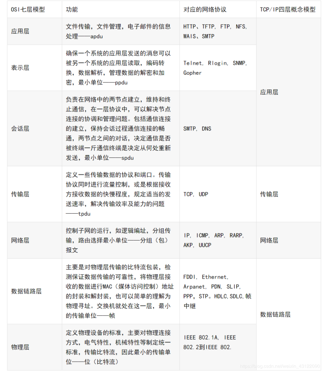
- 物理层
任务：透明地传输比特流。  
功能：为数据段设备提供传送数据通路。  
传输单位：比特 。  
所实现的硬件：集线器，中继器。  
- 数据链路层
任务：将网络层传输下来的IP数据报组装成帧  
功能：a. 链路连接的建立、拆除和分离 b. 帧定界和帧同步c.差错检测传输单位：帧 所实现的硬件：交换机、网桥
协议：PPP,HDLC、SDLC、STP、ARQ
- 网络层
任务：a. 将传输层传下来的报文段封装成分组 b.选择合适的路由，使得传输层传下来的分组能够交付到目的主机  
功能：a. 为传输层提供服务 b. 组包和拆包c. 路由选择 d.拥塞控制  
传输单位：数据段  
所实现的硬件：路由器  
协议：ICMP、ARP、RARP、IP、IGMP、OSPF  
- 传输层
任务：负责主机中两个进程之间的通信  
功能： a. 为端到端连接提供可靠的服务b. 为端到端连接提供流量控制、差错控制、服务质量等管理服务  
传输单位：报文段（TCP）或用户数据报（UDP）  
协议：TCP、UDP  
- 会话层
任务：不同主机上各进程间的对话  
功能：管理主机间的会话进程，包括建立、管理以及终止进程间的会话。是一种端到端的服务  
- 表示层
负责处理在两个内部数据表示结构不同的通信系统之间交换信息的表示格式，为数据加密和解密以及为提高传输效率提供必需的数据压缩以及解压等功能。  
- 应用层
任务：提供系统与用户的接口 
功能：a.文件传输 b. 访问和管理c. 电子邮件服务  
协议：FTP、SMTP、POP3、HTTP、DNS、TELnet  
- 五层模型
应用层、传输层、网络层、数据链路层、物理层

## HTTP协议
1. Http协议是对客户端和服务器端之间数据之间实现可靠性的传输文字、图片、音频、视频等超文本数据的规范，格式简称为“超文本传输协议”，属于应用层。 
   
2. Http协议运行在TCP之上，明文传输，客户端与服务器端都无法验证对方的身份；Https是身披SSL(Secure Socket Layer)外壳的Http，运行于SSL上，SSL运行于TCP之上，是添加了加密和认证机制的HTTP。二者之间存在如下不同：  
+ 端口不同：Http与Http使用不同的连接方式，用的端口也不一样，前者是80，后者是443；  
+ 资源消耗：和HTTP通信相比，Https通信会由于加减密处理消耗更多的CPU和内存资源；  
+ 开销：Https通信需要证书，而证书一般需要向认证机构购买；  
Https的加密机制是一种共享密钥加密和公开密钥加密并用的混合加密机制。
3. HTTP使用统一资源标识符（Uniform Resource Identifiers, URI）来传输数据和建立连接。以下面这个URL为例：> http://www.aspxfans.com:8080/news/index.asp?boardID=5&ID=24618&page=1#name
   + 协议部分：该URL的协议部分为“http：”，这代表网页使用的是HTTP协议。在Internet中可以使用多种协议，如HTTP，FTP等等本例中使用的是HTTP协议。在"HTTP"后面的“//”为分隔符；
   + 域名部分：该URL的域名部分为“www.aspxfans.com”。一个URL中，也可以使用IP地址作为域名使用；
   + 端口部分：：跟在域名后面的是端口，域名和端口之间使用“:”作为分隔符。端口不是一个URL必须的部分，如果省略端口部分，将采用默认端口；
   + 虚拟目录部分：从域名后的第一个“/”开始到最后一个“/”为止，是虚拟目录部分。虚拟目录也不是一个URL必须的部分。本例中的虚拟目录是“/news/”；
   + 文件名部分：从域名后的最后一个“/”开始到“？”为止，是文件名部分，如果没有“?”,则是从域名后的最后一个“/”开始到“#”为止，是文件部分，如果没有“？”和“#”，那么从域名后的最后一个“/”开始到结束，都是文件名部分。本例中的文件名是“index.asp”。文件名部分也不是一个URL必须的部分，如果省略该部分，则使用默认的文件名；
   + 锚部分：从“#”开始到最后，都是锚部分。本例中的锚部分是“name”。锚部分也不是一个URL必须的部分；
   + 参数部分：从“？”开始到“#”为止之间的部分为参数部分，又称搜索部分、查询部分。本例中的参数部分为“boardID=5&ID=24618&page=1”。参数可以允许有多个参数，参数与参数之间用“&”作为分隔符。
4. 请求消息request：   
   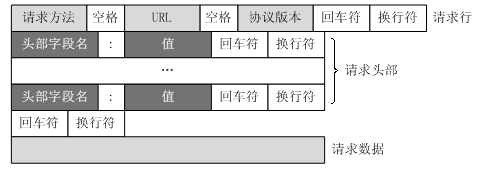  
+ Get请求例子：
> GET /562f25980001b1b106000338.jpg HTTP/1.1  
> Host    img.mukewang.com  
> User-Agent    Mozilla/5.0 (Windows NT 10.0; WOW64) AppleWebKit/537.36 (KHTML, like Gecko)   
> Chrome/51.0.2704.106 Safari/537.36    
> Accept    image/webp,image/*,*/*;q=0.8  
> Referer    http://www.imooc.com/  
> Accept-Encoding    gzip, deflate, sdch  
> Accept-Language    zh-CN,zh;q=0.8  
+ post请求例子：  
> POST / HTTP1.1  
> Host:www.wrox.com  
User-Agent:Mozilla/4.0 (compatible; MSIE 6.0; Windows NT 5.1; SV1; .NET CLR 2.0.50727; .NET CLR 3.0.04506.648; .NET CLR 3.5.21022)  
Content-Type:application/x-www-form-urlencoded  
Content-Length:40  
Connection: Keep-Alive  
> 
> name=Professional%20Ajax&publisher=Wiley  

+ GET提交的数据会放在URL之后，以?分割URL和传输数据，参数之间以&相连，如EditPosts.aspx?name=test1&id=123456. POST方法是把提交的数据放在HTTP包的Body中.

+ GET提交的数据大小有限制（因为浏览器对URL的长度有限制），而POST方法提交的数据没有限制.

+ GET方式需要使用Request.QueryString来取得变量的值，而POST方式通过Request.Form来获取变量的值。

+ GET方式提交数据，会带来安全问题，比如一个登录页面，通过GET方式提交数据时，用户名和密码将出现在URL上，如果页面可以被缓存或者其他人可以访问这台机器，就可以从历史记录获得该用户的账号和密码
5. 响应消息response  
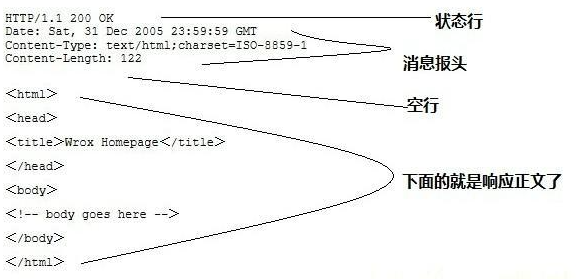 
6. 状态码  
    1xx：指示信息--表示请求已接收，继续处理  
    2xx：成功--表示请求已被成功接收、理解、接受  
    3xx：重定向--要完成请求必须进行更进一步的操作  
    4xx：客户端错误--请求有语法错误或请求无法实现  
    5xx：服务器端错误--服务器未能实现合法的请求  
    301 Permanently Moved 被请求的资源已永久移动到新位置，新的URL在Location头中给出，浏览器应该自动地访问新的URL。

    302 Found 请求的资源现在临时从不同的URL响应请求。301是永久重定向，而302是临时重定向。

    200 OK 表示从客户端发来的请求在服务器端被正确处理

    304 Not Modified 304状态码是告诉浏览器可以从缓存中获取所请求的资源。

    400 bad request 请求报文存在语法错误

    403 forbidden 表示对请求资源的访问被服务器拒绝

    404 not found 表示在服务器上没有找到请求的资源

    500 internal sever error 表示服务器端在执行请求时发生了错误

    503 service unavailable 表明服务器暂时处于超负载或正在停机维护，无法处理请求
7. 工作原理  
1、客户端连接到Web服务器：一个HTTP客户端，通常是浏览器，与Web服务器的HTTP端口（默认为80）建立一个TCP套接字连接。例如，http://www.oakcms.cn。  
2、发送HTTP请求：通过TCP套接字，客户端向Web服务器发送一个文本的请求报文，一个请求报文由请求行、请求头部、空行和请求数据4部分组成。  
3、服务器接受请求并返回HTTP响应：Web服务器解析请求，定位请求资源。服务器将资源复本写到TCP套接字，由客户端读取。一个响应由状态行、响应头部、空行和响应数据4部分组成。  
4、释放连接TCP连接：若connection 模式为close，则服务器主动关闭TCP连接，客户端被动关闭连接，释放TCP连接;若connection 模式为keepalive，则该连接会保持一段时间，在该时间内可以继续接收请求;  
5、客户端浏览器解析HTML内容：客户端浏览器首先解析状态行，查看表明请求是否成功的状态代码。然后解析每一个响应头，响应头告知以下为若干字节的HTML文档和文档的字符集。客户端浏览器读取响应数据HTML，根据HTML的语法对其进行格式化，并在浏览器窗口中显示  
8. 常用的http方法
GET：用于请求访问已经被URI（统一资源标识符）识别的资源，可以通过URL传参给服务器  
POST：用于传输信息给服务器，主要功能与GET方法类似，但一般推荐使用POST方式。  
PUT：传输文件，报文主体中包含文件内容，保存到对应URI位置。  
HEAD：获得报文首部，与GET方法类似，只是不返回报文主体，一般用于验证URI是否有效。  
DELETE：删除文件，与PUT方法相反，删除对应URI位置的文件。  
OPTIONS：查询相应URI支持的HTTP方法。 

### HTTP1.1，HTTP2.0 新特性
- Http1.1
    1）缓存策略：HTTP 1.1 中引入更多的缓存头来控制缓存策略；

    2）带宽和连接优化：引入 range 头域来请求资源的一部分，返回 206 状态码，支持断点续传；

    3）错误通知管理：新增 24 个错误状态响应码，如 409（Conflict）、410（Gone）；

    4）Host头处理：1.1 的请求和响应消息都应支持 Host（主机名）头域，且请求消息中如果没有会报一个 400 错误；

    5）长连接：默认开启keep-alive，支持长连接和请求的流水线（流水线未实现）。

- Http2.0
    1）二进制分帧；

    2）多路复用；（与Http1.1长连接（流水线）区别：1.x依旧是串行，会阻塞后续请求。）

    3）首部压缩：通过缓存表避免重复header的传输；

    4）优先级和依赖性：请求时告知服务器资源分配权重，优先加载重要资源；

    5）服务端推送。

## HTTPS
HTTPS在传输数据之前需要客户端（浏览器）与服务端（网站）之间进行一次握手，在握手过程中将确立双方加密传输数据的密码信息。TLS/SSL协议不仅仅是一套加密传输的协议，更是一件经过艺术家精心设计的艺术品，TLS/SSL中使用了非对称加密，对称加密以及HASH算法。握手过程的具体描述如下：

1）浏览器将自己支持的一套加密规则发送给网站。   
2）网站从中选出一组加密算法与HASH算法，并将自己的身份信息以证书的形式发回给浏览器。证书里面包含了网站地址，加密公钥，以及证书的颁发机构等信息。    
3）浏览器获得网站证书之后浏览器要做以下工作： 
a) 验证证书的合法性（颁发证书的机构是否合法，证书中包含的网站地址是否与正在访问的地址一致等），如果证书受信任，则浏览器栏里面会显示一个小锁头，否则会给出证书不受信的提示。 
b) 如果证书受信任，或者是用户接受了不受信的证书，浏览器会生成一串随机数的密码，并用证书中提供的公钥加密。 
c) 使用约定好的HASH算法计算握手消息，并使用生成的随机数对消息进行加密，最后将之前生成的所有信息发送给网站。   
4）网站接收浏览器发来的数据之后要做以下的操作： a) 使用自己的私钥将信息解密取出密码，使用密码解密浏览器发来的握手消息，并验证HASH是否与浏览器发来的一致。 b) 使用密码加密一段握手消息，发送给浏览器。   
5）浏览器解密并计算握手消息的HASH，如果与服务端发来的HASH一致，此时握手过程结束，之后所有的通信数据将由之前浏览器生成的随机密码并利用对称加密算法进行加密。 
这里浏览器与网站互相发送加密的握手消息并验证，目的是为了保证双方都获得了一致的密码，并且可以正常的加密解密数据，为后续真正数据的传输做一次测试。另外，HTTPS一般使用的加密与HASH算法（详情见：https://blog.csdn.net/qq_41701363/article/details/115876339）如下：
非对称加密算法：RSA，DSA/DSS  
对称加密算法：AES，RC4，3DES  
HASH算法：MD5，SHA1，SHA256  

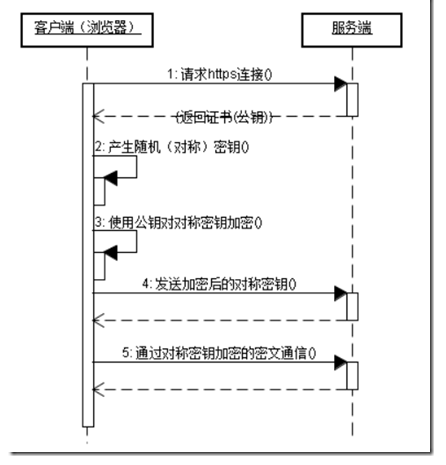

Http和Https的区别：
http：是互联网上应用最为广泛的一种网络协议，是一个客户端和服务器端请求和应答的标准（TCP），用于从www服务器传输超文本到本地浏览器的传输协议，它可以使浏览器更加高效，使网络传输减少；
https：是以安全为目标的http通道，简单讲是http的安全版，即http下加入SSL层，https的安全基础是SSL，因此加密的详细内容就需要SSL；
https协议的主要作用可以分为两种：一种是简历一个信息安全通道，来保证数据传输的安全；另一种是确认网站的真实性。
SSL/TLS：安全套接字（Secure Socket Layer，SSL）协议是Web浏览器与Web服务器之间安全交换信息的协议，提供两个基本的安全服务：鉴别和保密。这里TLS是SSL的一种实现。

## DNS
DNS(Domain Name System)域名系统，主要实现的功能是将域名转换成ip地址的一个服务。它是由一个分层的DNS服务器实现的分布式数据库,同时。他也是一个使得主机能够查询分布式数据库的应用层协议。DNS服务器通常是一个运行BIND(Berkeley Internet Name Domain)软件的UNIX机器。DNS协议运行在UDP之上，使用53号端口。 DNS是一个应用层协议。
DNS分层：
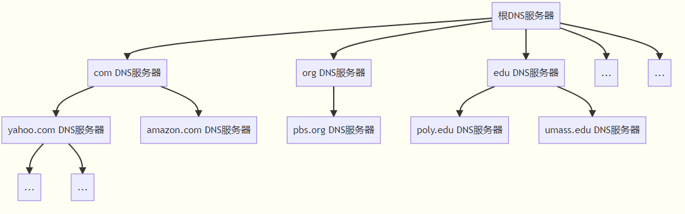

迭代查询：  
迭代查询的核心是所有的请求都是直接返回给本地的DNS服务器，然后本地DNS服务器去对应的权威服务器等请求解析地址。整个过程中，只有请求主机到本地DNS服务器的查询时递归的，其余都是迭代的。
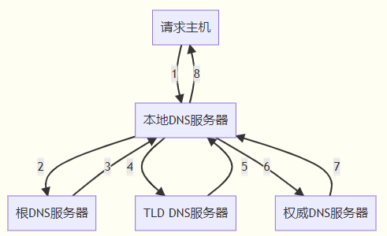

递归查询：  
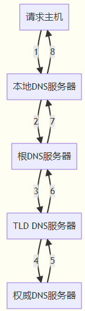

## Cookie和Session
+ Cookie   
cookie是由Web服务器保存在用户浏览器上的文件（key-value格式），可以包含用户相关的信息。客户端向服务器发起请求，就提取浏览器中的用户信息由http发送给服务器.
+ Session  
session 是浏览器和服务器会话过程中，服务器会分配的一块储存空间给session。
服务器默认为客户浏览器的cookie中设置 sessionid，这个sessionid就和cookie对应，浏览器在向服务器请求过程中传输的cookie 包含 sessionid ，服务器根据传输cookie 中的 sessionid 获取出会话中存储的信息，然后确定会话的身份信息.  

+ 区别
  1. Cookie数据存放在客户端上，安全性较差，Session数据放在服务器上，安全性相对更高.  
  2. 单个cookie保存的数据不能超过4K，session无此限制.  
  3. session一定时间内保存在服务器上，当访问增多，占用服务器性能，考虑到服务器性能方面，应当使用cookie。  

+ 客户端禁用cookie，还能用session吗？
  1. 通过url重写，把 sessionid 作为参数追加的原 url 中，后续的浏览器与服务器交互中携带 sessionid 参数。
  2. 服务器的返回数据中包含 sessionid，浏览器发送请求时，携带 sessionid 参数。
  3. 通过 Http 协议其他 header 字段，服务器每次返回时设置该 header 字段信息，浏览器中 js 读取该 header 字段，请求服务器时，js设置携带该 header 字段。

## TCP协议
TCP头
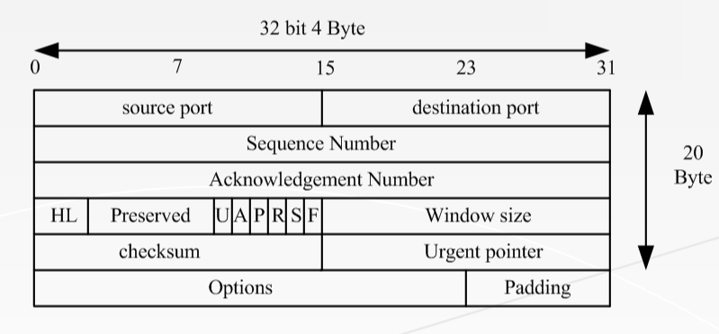

### TCP连接：三次握手+四次挥手
1. 三次握手（我要和你建立链接，你真的要和我建立链接么，我真的要和你建立链接，成功）
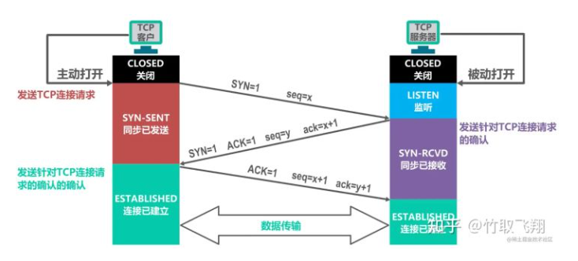
+ 第一次握手：Client将标志位SYN置为1，随机产生一个值seq=J，并将该数据包发送给Server，
Client进入SYN_SENT状态，等待Server确认。
+ 第二次握手：Server收到数据包后由标志位SYN=1知道Client请求建立连接，Server将标志位SYN
和ACK都置为1，ack=J+1，随机产生一个值seq=K，并将该数据包发送给Client以确认连接请求，
Server进入SYN_RCVD状态。
+ 第三次握手：Client收到确认后，检查ack是否为J+1，ACK是否为1，如果正确则将标志位ACK置为
1，ack=K+1，并将该数据包发送给Server，Server检查ack是否为K+1，ACK是否为1，如果正确则
连接建立成功，Client和Server进入ESTABLISHED状态，完成三次握手，随后Client与Server之间
可以开始传输数据了。

2. 四次挥手（我要和你断开链接；好的，断吧。我也要和你断开链接；好的，断吧）  
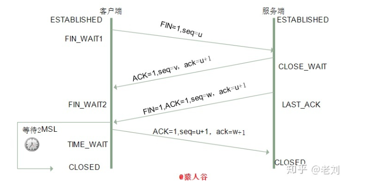
+ 第一次挥手：客户端发送一个 FIN 报文，报文中会指定一个序列号。此时客户端处于 FIN_WAIT1 状态。即发出连接释放报文段（FIN=1，序号seq=u），并停止再发送数据，主动关闭TCP连接，进入FIN_WAIT1（终止等待1）状态，等待服务端的确认。  
+ 第二次挥手：服务端收到 FIN 之后，会发送 ACK 报文，且把客户端的序列号值 +1 作为 ACK 报文的序列号值，表明已经收到客户端的报文了，此时服务端处于 CLOSE_WAIT 状态。即服务端收到连接释放报文段后即发出确认报文段（ACK=1，确认号ack=u+1，序号seq=v），服务端进入CLOSE_WAIT（关闭等待）状态，此时的TCP处于半关闭状态，客户端到服务端的连接释放。客户端收到服务端的确认后，进入FIN_WAIT2（终止等待2）状态，等待服务端发出的连接释放报文段。  
+ 第三次挥手：如果服务端也想断开连接了，和客户端的第一次挥手一样，发给 FIN 报文，且指定一个序列号。此时服务端处于 LAST_ACK 的状态。即服务端没有要向客户端发出的数据，服务端发出连接释放报文段（FIN=1，ACK=1，序号seq=w，确认号ack=u+1），服务端进入LAST_ACK（最后确认）状态，等待客户端的确认。  
+ 第四次挥手：客户端收到 FIN 之后，一样发送一个 ACK 报文作为应答，且把服务端的序列号值 +1 作为自己 ACK 报文的序列号值，此时客户端处于 TIME_WAIT 状态。需要过一阵子以确保服务端收到自己的 ACK 报文之后才会进入 CLOSED 状态，服务端收到 ACK 报文之后，就处于关闭连接了，处于 CLOSED 状态。即客户端收到服务端的连接释放报文段后，对此发出确认报文段（ACK=1，seq=u+1，ack=w+1），客户端进入TIME_WAIT（时间等待）状态。此时TCP未释放掉，需要经过时间等待计时器设置的时间2MSL后，客户端才进入CLOSED状态。  

TCP连接对应的socket版本：  https://blog.csdn.net/legend050709/article/details/39804519
### TCP拥塞避免策略
（1）慢开始

慢开始算法的思路就是，不要一开始就发送大量的数据，先探测一下网络的拥塞程度，也就是说由小到大逐渐增加拥塞窗口的大小。这里用报文段的个数的拥塞窗口大小举例说明慢开始算法，实时拥塞窗口大小是以字节为单位的。刚开始发送数据时，先把拥塞窗口（congestion window，cwnd）设置为一个最大报文段MSS的数值，每收到一个新的确认报文之后，就把拥塞窗口加1MSS。这样每经过一个传输轮次（或者说是每经过一个往返时间RTT），拥塞窗口的大小就会加倍（指数增长）。比如，第一轮传一个，收到一个加一个，cwnd变为2MSS。第二轮传两个，收到两个加两个，cwnd变为4MSS。

（2）拥塞避免

当拥塞窗口的大小达到慢开始门限(slow start threshold)时，拥塞避免算法让拥塞窗口缓慢增长，即每经过一个往返时间RTT就把发送方的拥塞窗口cwnd加1，而不是加倍。这样拥塞窗口按线性规律缓慢增长。

无论是在慢开始阶段还是在拥塞避免阶段，只要发送方判断网络出现拥塞（其根据就是没有收到确认，虽然没有收到确认可能是其他原因的分组丢失，但是因为无法判定，所以都当做拥塞来处理），就把慢开始门限设置为出现拥塞时的发送窗口大小的一半。然后把拥塞窗口设置为1，执行慢开始算法。

（3）快重传

快重传要求接收方在收到一个失序的报文段后就立即发出重复确认（为的是使发送方及早知道有报文段没有到达对方）而不要等到自己发送数据时捎带确认。快重传算法规定，发送方只要一连收到三个重复确认就应当立即重传对方尚未收到的报文段，而不必继续等待设置的重传计时器时间到期。

（4）快恢复

当发送方连续收到三个重复确认时，就把慢开始门限和拥塞窗口减半，然后执行拥塞避免算法。不执行慢开始算法的原因：因为如果网络出现拥塞的话就不会收到好几个重复的确认，所以发送方认为现在网络可能没有出现拥塞。

### TCP滑动窗口
滑动窗口协议用于网络数据传输时的流量控制，以避免拥塞的发生。该协议允许发送方在停止并等待确认前发送多个数据分组。由于发送方不必每发一个分组就停下来等待确认，因此该协议可以加速数据的传输，提高网络吞吐量。

它本质上是描述接收方数据报缓冲区大小的数据，发送方根据这个数据来计算自己最多能发送多长的数据。这个窗口大小为 0 时，发送方将停止发送数据。启动定时器，等待这个窗口变成非 0。

滑动窗口协议必须保证数据包的按序传输，发送窗口中的序列号代表已发送但尚未收到确认的数据包，发送窗口可持续地维持一系列未经确认的数据包，因为发送方窗口内的数据包可能在传输过程中丢失或损坏，所以发送过程必须把发送窗口中的所有数据包保存起来以备重传。发送窗口一旦达到最大值，发送过程就必须停止接收新的数据包，直到有空闲缓存区。

接收窗口外的数据包都要丢弃，当序列号等于接收窗口下限的数据包到达时，把它提交给应用程序并向发送端发送确认，接收窗口向前移动一位。发送窗口和接收窗口上下限无需相同，大小也无需相同，但接收窗口大小需保持固定，发送窗口大小可随着数据包而改变。

## UDP协议
UDP头部：
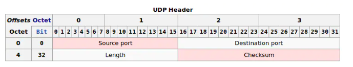

它是无连接的协议，发送数据前不需要建立连接，是没有可靠性的协议。因为不需要建立连接所以可以在在网络上以任何可能的路径传输，因此能否到达目的地，到达目的地的时间以及内容的正确性都是不能被保证的。

### TCP和UDP的区别
1、TCP是面向连接的协议，发送数据前要先建立连接，TCP提供可靠的服务，也就是说，通过TCP连接
传输的数据不会丢失，没有重复，并且按顺序到达；
2、UDP是无连接的协议，发送数据前不需要建立连接，是没有可靠性；
3、TCP通信类似于于要打个电话，接通了，确认身份后，才开始进行通行；
4、UDP通信类似于学校广播，靠着广播播报直接进行通信。
5、TCP只支持点对点通信，UDP支持一对一、一对多、多对一、多对多；
6、TCP是面向字节流的，UDP是面向报文的； 面向字节流是指发送数据时以字节为单位，一个数据包可以拆分成若干组进行发送，而UDP一个报文只能一次发完。
7、TCP首部开销（20字节）比UDP首部开销（8字节）要大
8、UDP 的主机不需要维持复杂的连接状态表

## 基于TCP和UDP的协议

TCP/UDP都是传输层的协议 （上面是应用层，下面是网络层IP层）
 
1. 基于TCP的应用层协议有：HTTP、FTP、SMTP、TELNET、SSH
协议	全称	默认端口
HTTP （ 用的最多）	HyperText Transfer Protocol（超文本传输协议）	80
FTP	File Transfer Protocol (文件传输协议)	20用于传输数据，21用于传输控制信息
SMTP	Simple Mail Transfer Protocol (简单邮件传输协议)	25
TELNET	Teletype over the Network (网络电传)	23
SSH	Secure Shell	22
2. 基于UDP的应用层协议：DNS、TFTP（简单文件传输协议）、SNMP：简单网络管理协议
协议	全称	默认端口
DNS	Domain Name Service (域名服务)	53
TFTPTrivial File Transfer Protocol (简单文件传输协议)	69
SNMP	Simple Network Management Protocol (简单网络管理协议)	通过UDP端口161接收,只有Trap信息采用UDP端口162。
NTP	Network Time Protocol (网络时间协议)	123
RADIUS是Remote Authentication Dial In User Service的简称,即远程验证拨入用户服务.
RADIUS协议的认证端口号为1812(1645端口由于冲突已经不再使用),计费端口号为1813或(1646端口由于冲突已经
不再使用).

## DDOS攻击
+ SYN 攻击：
    在三次握手过程中，Server发送SYN-ACK之后，收到Client的ACK之前的TCP连接称为半连接（half-open connect），此时Server处于SYN_RCVD状态，当收到ACK后，Server转入ESTABLISHED状态。SYN攻击就是Client在短时间内伪造大量不存在的IP地址，并向Server不断地发送SYN包，Server回复确认包，并等待Client的确认，由于源地址是不存在的，因此，Server需要不断重发直至超时，这些伪造的SYN包将产时间占用未连接队列，导致正常的SYN请求因为队列满而被丢弃，从而引起网络堵塞甚至系统瘫痪。

    防范措施：
    1. 限制同时打开SYN半链接的数目
    2. 缩短SYN半链接的Time out 时间
    3. 关闭不必要的服务

## IP协议(IPv4)
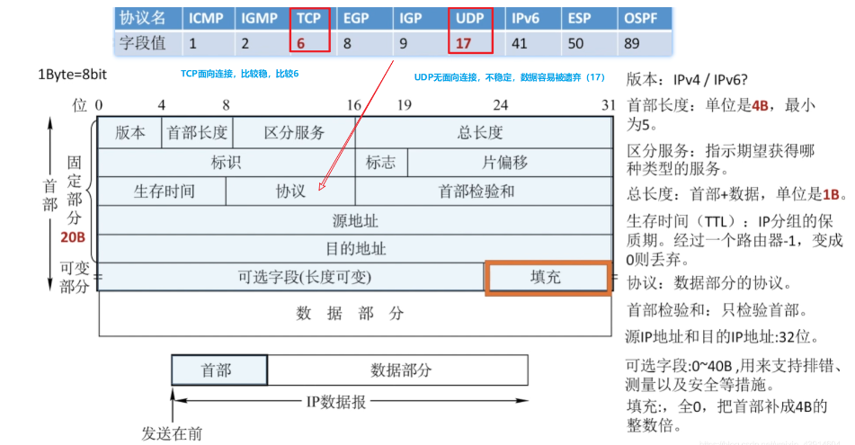  
字段含义：  
1)版本。占4位。指IP的版本，目前广泛使用的版本号为4。  
2)首部长度。占4位。以4B为单位，最大值为60B (15*4B)。最常用的首部长度是20B,此时不使用任何选项(即可选字段)。  
3)总长度。占16位。指首部和数据之和的长度，单位为B，因此数据报的最大长度为216-1= 65535B。以太网帧的最大传送单元(MTU)为1500B，因此当一个IP数据报封装成帧时，数据报的总长度(首部加数据) 一定不能超过下面数据链路层的MTU值。  
4)标识。占16位。它是一个计数器，每产生一个数据报就加1,并赋值给标识字段。但它并不是“序号”(因为IP是无连接服务)。当一个数据报的长度超过网络的MTU时，必须分片，此时每个数据报片都复制一次标识号， 以便能正确重装成原来的数据报。  
5)标志。占3位。标志字段的最低位为MF, MF= 1表示后面还有分片，MF= 0表示最后一个分片。” 标志字段中间的一位是DF,只有当DF =0时才允许分片。  
6)片偏移。占13位。它指出较长的分组在分片后，某片在原分组中的相对位置。片偏移以8个字节为偏移单位,8B，即每个分片的长度一定是8B (64 位)的整数倍。  
7)首部校验和。占16位。IP数据报的首部校验和只校验分组的首部，而不校验数据部分 。  
8)生存时间(TTL)。占8位。数据报在网络中可通过的路由器数的最大值，标识分组在网络中的寿命，以确保分组不会永远在网络中循环。路由器在转发分组前，先把TTL减1。若TTL被减为0，则该分组必须丢弃。  
9)协议。占8位。指出此分组携带的数据使用何种协议，即分组的数据部分应交给哪个传输层协议，如TCP、UDP等。其中值为6表示TCP,值为17表示UDP。  
10)源地址字段。占4B，标识发送方的IP地址。  
11)目的地址字段。占4B，标识接收方的IP地址。    

IP地址：  
1)每个IP地址都由网络号和主机号两部分组成，因此IP地址是–种分等级的地址结构。分等级的好处是:①IP地址管理机构在分配IP地址时只分配网络号(第一级)， 而主机号(第二级)则由得到该网络的单位自行分配，方便了IP 地址的管理;②路由器仅根据目的主机所连接的网络号来转发分组(而不考虑目标主机号)，从而减小了路由表所占的存储空间。  
2）IP 地址是标志一台主机(或路由器)和一条链路的接口。当一台主机同时连接到两个网络时，该主机就必须同时具有两个相应的IP地址，每个IP地址的网络号必须与所在网络的网络号相同，且这两个IP地址的网络号是不同的。因此IP网络上的一一个路由器必然至少应具有两个IP地址(路由器每个端口必须至少分配一个IP地址)。  
3)用转发器或桥接器(网桥等)连接的若干LAN仍然是同一个网络(同一个广播域)，因此该LAN中所有主机的IP地址的网络号必须相同，但主机号必须不同。  
4)在IP地址中，所有分配到网络号的网络(无论是LAN还是WAN)都是平等的。  
5)在同一个局域网上的主机或路由器的IP地址中的网络号必须是一样的。路由器总是具有两个或两个以上的IP地址，路由器的每个端口都有一个不同网络号的IP地址。  
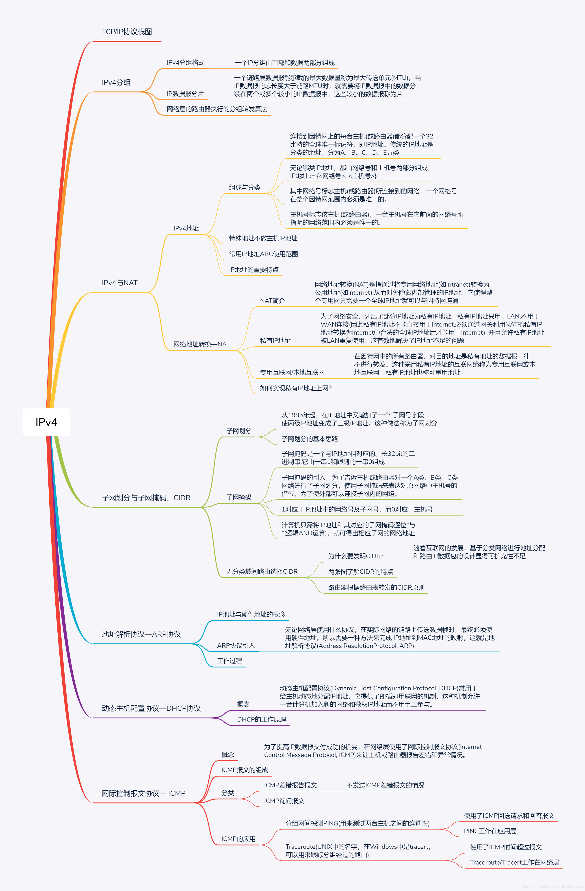

### CIDR
CIDR（Classless Inter-Domain Routing，无类域间路由选择）它消除了传统的A类、B类和C类地址以及划分子网的概念，因而可以更加有效地分配IPv4的地址空间。它可以将好几个IP网络结合在一起，使用一种无类别的域际路由选择算法，使它们合并成一条路由从而较少路由表中的路由条目减轻Internet路由器的负担。
IP地址={<网络前缀>，<主机号>}
CIDR将网络前缀都相同的连续的IP地址组成“CIDR地址块”,网络前缀越短，其地址块所包含的地址数就越多.CIDR使用“斜线记法”（slash notation），地址格式：a.b.c.d/x，x表示地址中网络部分的位数，32-x表示主机的位数.

## NAT协议
NAT英文全称是“Network Address Translation”，中文意思是“网络地址转换”，它是一个IETF(Internet Engineering Task Force, Internet工程任务组)标准，允许一个整体机构以一个公用IP（Internet Protocol）地址出现在Internet上。顾名思义，它是一种把内部私有网络地址（IP地址）翻译成合法网络IP地址的技术。

网络被分为私网和公网两个部分，NAT网关设置在私网到公网的路由出口位置，双向流量必须都要经过NAT网关网络访问只能先由私网侧发起，公网无法主动访问私网主机；
NAT网关在两个访问方向上完成两次地址的转换或翻译，出方向做源信息替换，入方向做目的信息替换；NAT网关的存在对通信双方是保持透明的；NAT网关为了实现双向翻译的功能，需要维护一张关联表，把会话的信息保存下来。
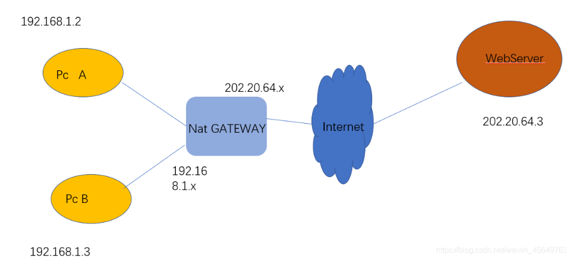

+ 静态NAT
  指将内部网络的==私有IP地址转换为公有IP地址，IP地址对是一对一的，是一成不变的，某个私有IP地址只转换为某个公有IP地址
+ 动态NAT
  指将内部网络的私有IP地址转换为公用IP地址时，IP地址是不确定的，是随机的，所有被授权访问上Internet的私有IP地址可随机转换为任何指定的合法IP地址。也就是说，只要指定哪些内部地址可以进行转换，以及用哪些合法地址作为外部地址时，就可以进行动态转换
+ 端口多路复用
  改变外出数据包的源端口并进行端口转换，即端口地址转换（PAT，Port Address Translation).采用端口多路复用方式。内部网络的所有主机均可共享一个合法外部IP地址实现对Internet的访问，从而可以最大限度地节约IP地址资源。同时，又可隐藏网络内部的所有主机，有效避免来自internet的攻击。因此，目前网络中应用最多的就是端口多路复用方式。

## ARP协议
网络层的ARP协议完成了IP地址与物理地址的映射。
首先，每台主机都会在自己的ARP缓冲区中建立一个ARP列表，以表示IP地址和MAC地址的对应关系。当源主机需要将一个数据包要发送到目的主机时，会首先检查自己ARP列表中是否存在该IP地址对应的MAC地址：如果有，就直接将数据包发送到这个MAC地址；如果没有，就向本地网段发起一个ARP请求的广播包，查询此目的主机对应的MAC地址。此ARP请求数据包里包括源主机的IP地址、硬件地址、以及目的主机的IP地址。
网络中所有的主机收到这个ARP请求后，会检查数据包中的目的IP是否和自己的IP地址一致。如果不相同就忽略此数据包；如果相同，该主机首先将发送端的MAC地址和IP地址添加到自己的ARP列表中，如果ARP表中已经存在该IP的信息，则将其覆盖，然后给源主机发送一个ARP响应数据包，告诉对方自己是它需要查找的MAC地址；
源主机收到这个ARP响应数据包后，将得到的目的主机的IP地址和MAC地址添加到自己的ARP列表中，并利用此信息开始数据的传输。如果源主机一直没有收到ARP响应数据包，表示ARP查询失败。  
ARP报文格式：  
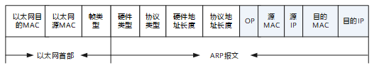  
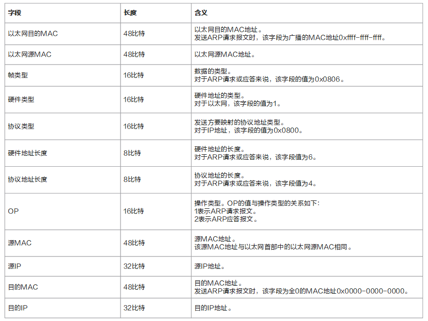  

## 输入一个网址到显示一个页面的过程

### DNS解析

DNS解析的过程就是寻找哪台机器上有你需要资源的过程。当你在浏览器中输入一个地址时，例如www.baidu.com，其实不是百度网站真正意义上的地址。互联网上每一台计算机的唯一标识是它的IP地址，但是IP地址并不方便记忆。就是一个网址到IP地址的转换，这个过程就是DNS解析。
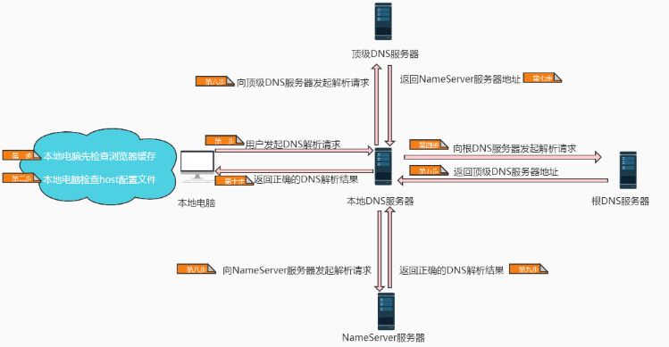

DSN优化  
1. DSN缓存  
   DNS存在着多级缓存，从离浏览器的距离排序的话，有以下几种: 浏览器缓存，系统缓存，路由器缓存，IPS服务器缓存，根域名服务器缓存，顶级域名服务器缓存，主域名服务器缓存。
2. DSN负载均衡
   DNS可以返回一个合适的机器的IP给用户，例如可以根据每台机器的负载量，该机器离用户地理位置的距离等等，这种过程就是DNS负载均衡，又叫做DNS重定向。大家耳熟能详的CDN(Content Delivery Network)就是利用DNS的重定向技术，DNS服务器会返回一个跟用户最接近的点的IP地址给用户，CDN节点的服务器负责响应用户的请求，提供所需的内容。

### TCP连接（三次握手）

1）第一次握手：建立连接时，客户端发送 syn 包（syn=x）到服务器，并进入 SYN_SENT 状态，等待服务器确认；

2）第二次握手：服务器收到 syn 包，须确认客户的 SYN（ack=x+1），同时自己也发送一个 SYN 包（syn=y），即 SYN+ACK 包，此时服务器进入 SYN_RECV 状态；

3）第三次握手：客户端收到服务器的 SYN+ACK 包，向服务器发送确认包 ACK(ack=y+1），此包发送完毕，客户端和服务器进入 ESTABLISHED（TCP连接成功）状态，完成三次握手。

为什么不能两次握手：

三次握手完成了两个重要的功能，既要双方做好发送数据的准备工作(双方都知道彼此已准备好)，也要允许双方就初始序列号进行协商，这个序列号在握手过程中被发送和确认。如果把三次握手改成仅需要两次握手，可能会造成死锁。

### 发送HTTP请求

发送HTTP请求的过程就是构建HTTP请求报文并通过TCP协议中发送到服务器指定端口(HTTP协议80/8080, HTTPS协议443)。HTTP请求报文是由三部分组成: 请求行, 请求报头和请求正文。

常用的请求方法：
GET： 请求指定的页面信息，并返回实体主体。
HEAD： 只请求页面的首部。
POST： 请求服务器接受所指定的文档作为对所标识的URI的新的从属实体。
PUT： 从客户端向服务器传送的数据取代指定的文档的内容。
DELETE： 请求服务器删除指定的页面。
OPTIONS： 允许客户端查看服务器的性能。
TRACE： 请求服务器在响应中的实体主体部分返回所得到的内容。
PATCH： 实体中包含一个表，表中说明与该URI所表示的原内容的区别。
MOVE： 请求服务器将指定的页面移至另一个网络地址。
COPY： 请求服务器将指定的页面拷贝至另一个网络地址。
LINK： 请求服务器建立链接关系。
UNLINK： 断开链接关系。
WRAPPED： 允许客户端发送经过封装的请求。

POST和GET的区别：
   + GET提交的数据会放在URL之后，以?分割URL和传输数据，参数之间以&相连，如EditPosts.aspx?name=test1&id=123456. POST方法是把提交的数据放在HTTP包的Body中.

   + GET提交的数据大小有限制（因为浏览器对URL的长度有限制），而POST方法提交的数据没有限制.

   + GET方式需要使用Request.QueryString来取得变量的值，而POST方式通过Request.Form来获取变量的值。

   + GET方式提交数据，会带来安全问题，比如一个登录页面，通过GET方式提交数据时，用户名和密码将出现在URL上，如果页面可以被缓存或者其他人可以访问这台机器，就可以从历史记录获得该用户的账号和密码

### 服务器处理请求并返回HTTP报文
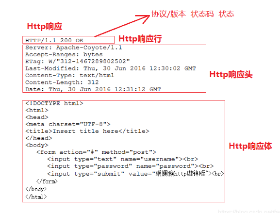

浏览器解析渲染页面

### 连接结束（四次挥手）

1）客户端进程发出连接释放报文，并且停止发送数据。释放数据报文首部，FIN=1，其序列号为seq=u（等于前面已经传送过来的数据的最后一个字节的序号加1），此时，客户端进入FIN-WAIT-1（终止等待1）状态。 TCP规定，FIN报文段即使不携带数据，也要消耗一个序号；

2）服务器收到连接释放报文，发出确认报文，ACK=1，ack=u+1，并且带上自己的序列号seq=v，此时，服务端就进入了CLOSE-WAIT（关闭等待）状态。TCP服务器通知高层的应用进程，客户端向服务器的方向就释放了，这时候处于半关闭状态，即客户端已经没有数据要发送了，但是服务器若发送数据，客户端依然要接受。这个状态还要持续一段时间，也就是整个CLOSE-WAIT状态持续的时间；

3）客户端收到服务器的确认请求后，此时，客户端就进入FIN-WAIT-2（终止等待2）状态，等待服务器发送连接释放报文（在这之前还需要接受服务器发送的最后的数据）；

4）服务器将最后的数据发送完毕后，就向客户端发送连接释放报文，FIN=1，ack=u+1，由于在半关闭状态，服务器很可能又发送了一些数据，假定此时的序列号为seq=w，此时，服务器就进入了LAST-ACK（最后确认）状态，等待客户端的确认；

5）客户端收到服务器的连接释放报文后，必须发出确认，ACK=1，ack=w+1，而自己的序列号是seq=u+1，此时，客户端就进入了TIME-WAIT（时间等待）状态。注意此时TCP连接还没有释放，必须经过2∗∗MSL（最长报文段寿命）的时间后，当客户端撤销相应的TCB后，才进入CLOSED状态；

6）服务器只要收到了客户端发出的确认，立即进入CLOSED状态。同样，撤销TCB后，就结束了这次的TCP连接。可以看到，服务器结束TCP连接的时间要比客户端早一些。

详细请点击网址：https://segmentfault.com/a/1190000006879700
